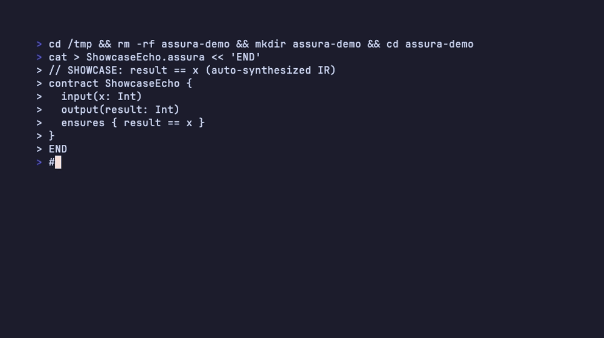

<div align="center">

# Assura

**Write what it should do. AI proves it does.**

A contract-first language for the AI era. You write behavioral contracts.
AI writes the implementation. An SMT solver proves it correct — or hands you
the exact input that breaks it. Ships as Rust.

[](https://github.com/assura-lang/assura/actions/workflows/ci.yml)
[](https://crates.io/crates/assura)
[](https://scorecard.dev/viewer/?uri=github.com/assura-lang/assura)
[](#)
[](LICENSE)

[Docs](https://assura-lang.github.io/assura/) ·
[Getting started](docs/GETTING-STARTED.md) ·
[Try in browser](#try-it-without-installing-anything) ·
[What we prove](docs/WHAT-WE-PROVE.md) ·
[Contributing](CONTRIBUTING.md)

</div>

---

## A test tells you it failed. Assura tells you why.

Here is a real invariant from the [`zip`](https://github.com/zip-rs/zip2) crate's
central-directory parser. The archive offset is computed as
`cd_offset - relative_cd_offset` — an unchecked subtraction on a `u64`:

```assura
contract FindCdSubtractSafe {
    input(cd_offset: Nat, relative_cd_offset: Nat, eocd_offset: Nat)

    requires { cd_offset <= 18446744073709551615 }
    requires { relative_cd_offset <= 18446744073709551615 }
    requires { eocd_offset <= 18446744073709551615 }
    requires { cd_offset <= eocd_offset }

    // archive_offset = cd_offset - relative_cd_offset (unchecked)
    ensures { cd_offset >= relative_cd_offset }
}
```

Run it:

```console
$ assura check demos/zip-crate-audit.assura

  FindCdSubtractSafe:
    ensures              ... COUNTEREXAMPLE
      | cd_offset = 0, eocd_offset = 0, relative_cd_offset = 1
```

No fuzzing. No sampling. The solver reasoned symbolically over **every input
allowed by those preconditions** and returned one that underflows — a crafted
archive whose central directory claims a relative offset larger than its
absolute one. A fuzzer might find this. A proof cannot miss it.

That is the whole idea: you get **Verified**, a **Counterexample**, or an honest
**Unknown**. Never a green check that means "we didn't look hard enough."



## Try it without installing anything

[](https://codespaces.new/assura-lang/assura?quickstart=1)

The devcontainer ships Rust and Z3, so there is nothing to install. The first
build takes a few minutes; after that:

```bash
cargo run -- check demos/zip-crate-audit.assura   # counterexamples (intentional)
cargo run -- check demos/heartbleed.assura        # a clean proof
```

## Install

```bash
cargo install assura --locked
```

Needs a [Rust toolchain](https://rustup.rs/) (edition 2024 / rustc 1.87+). Z3
comes prebuilt via the `z3` crate — no manual install.

Prefer a binary? Use the [shell installer](https://github.com/assura-lang/assura/releases/latest)
(Linux x86_64, macOS arm64/x64):

```bash
curl --proto '=https' --tlsv1.2 -LsSf \
  https://github.com/assura-lang/assura/releases/latest/download/assura-installer.sh | sh
```

Then:

```bash
assura init my-project          # scaffold a project
assura check contract.assura    # prove it (add --json for agents)
assura build contract.assura    # emit Rust
```

Full command reference, LSP, VS Code extension, and library embedding:
**[Getting started](docs/GETTING-STARTED.md)** · [Cheatsheet](docs/CHEATSHEET.md)

## Why this exists

AI writes a lot of new code, and reviewing it is the bottleneck. AI-generated
tests are especially weak here: they tend to mirror the implementation. If
`divide(10, 0)` returns `0` because of a bug, the generated test asserts `== 0`.
The test passes. The bug ships.

Assura replaces that trust with proof. Contracts state *what* must hold. The
compiler uses Z3/CVC5 to prove the implementation satisfies them for **all**
inputs, or returns a counterexample the AI can fix against — a loop that closes
without a human guessing at edge cases.

Property tests and fuzzing sample the input space. A solver reasons over all of
it, for the fragments it can model. Where it cannot, Assura says `Unknown`
rather than pretending. The honest map of that boundary is
[What we prove](docs/WHAT-WE-PROVE.md).

## How it works

```
contracts (.assura) ──► AI generates implementation
                              │
                              ▼
                     Assura verifies (Z3 / CVC5)
                              │
        ┌─────────────────────┴──────────────────────┐
        │                                            │
   counterexample ──► back to the AI            proof holds
        ▲                    │                       │
        └────────────────────┘                       ▼
                                          Rust source ──► rustc ──► binary / WASM
```

Three tiers, fastest first:

| Tier | Time | Checks |
|------|------|--------|
| Structural | < 10ms | Types, syntax, names |
| Decidable SMT | < 200ms | Refinement types, flow analysis, effects |
| Heavy SMT | < 10s | Full invariants, temporal properties |

## Real CVEs, as contracts

| Demo | Models |
|------|--------|
| [`heartbleed.assura`](demos/heartbleed.assura) | CVE-2014-0160 — TLS heartbeat over-read |
| [`libwebp-huffman.assura`](demos/libwebp-huffman.assura) | CVE-2023-4863 — CVSS 9.8 heap overflow that hit every major browser |
| [`zip-crate-audit.assura`](demos/zip-crate-audit.assura) | Offset arithmetic in a real Rust crate |

More in [`demos/`](demos/) and one worked example per feature in [`examples/`](examples/).
Case studies: [docs/CASE-STUDIES.md](docs/CASE-STUDIES.md).

## Contributing

**New here? [Good first issues](https://github.com/assura-lang/assura/labels/good%20first%20issue)
are kept stocked and scoped** — each one names the file to open and how to verify it.

Bug reports are just as valuable as patches. If `assura check` gives you a wrong
answer, a confusing counterexample, or an `Unknown` you think should verify,
[open an issue](https://github.com/assura-lang/assura/issues/new/choose) — those
reports are how the solver encoding gets better.

Start with [CONTRIBUTING.md](CONTRIBUTING.md). Architecture and crate map:
[docs/INTERNALS.md](docs/INTERNALS.md).

## Documentation

**Site:** [assura-lang.github.io/assura](https://assura-lang.github.io/assura/)
(not [assura.dev](https://assura.dev) — a different product)

| | |
|---|---|
| [Getting started](docs/GETTING-STARTED.md) | Install → check → build |
| [Tutorial](docs/TUTORIAL.md) | Your first contract |
| [Cheatsheet](docs/CHEATSHEET.md) | Types, clauses, effects, CLI on one page |
| [Cookbook](docs/COOKBOOK.md) | Ready-to-copy contract patterns |
| [What we prove](docs/WHAT-WE-PROVE.md) | The honesty map: Verified / Unknown / Counterexample |
| [Compared to other tools](docs/COMPARE.md) | Dafny, Verus, Liquid Haskell, tests |
| [For AI agents](docs/AI-AGENTS.md) | JSON output, IR acceptance, MCP server |
| [Scenarios](docs/SCENARIOS.md) | Greenfield, retrofit, audit, CI, onboarding |
| [FAQ](docs/FAQ.md) | Z3 timeouts, counterexamples, common errors |
| [Internals](docs/INTERNALS.md) | Architecture, crate map, SMT encoding |
| [Specification](docs/SPECIFICATION.md) | EBNF, 50 verification features, error codes |

<details>
<summary><b>The 50 verification features, by category</b></summary>

| Category | Features |
|----------|----------|
| **CORE** Verification Infrastructure | Ghost code, lemmas, frame conditions, axiomatic definitions, quantifier triggers, opaque functions, prophecy variables, liveness contracts |
| **MEM** Memory Safety | Memory regions, fixed-width integers, allocator contracts, circular buffer contracts |
| **TYPE** Types and Contracts | Interface contracts, recursive structural invariants, error propagation |
| **SEC** Trust and Security | Taint tracking, dependent types, constant-time execution, secure erasure, cryptographic spec conformance |
| **CONC** Concurrency | Shared memory protocols, callback re-entrancy, determinism, lock ordering, temporal deadlines, weak memory ordering |
| **NUM** Numerical and Precision | Numerical precision contracts, precomputed table verification |
| **PERF** Performance | Unsafe escape with proof obligation, complexity bounds |
| **FMT** Binary Formats | Binary/bit-level format contracts, string encoding, codec dispatch, checksum, protocol grammar |
| **STOR** Storage | Crash recovery, page cache, MVCC, rollback, monotonic state, failure models |
| **PLAT** Platform | Platform abstraction, feature flags, resource limits |
| **TEST** Testing | Test generation from contracts, behavioral equivalence, multi-pass refinement |
| **MISC** Miscellaneous | Incremental contracts, scoped invariant suspension |

A project activates only the categories it needs. CORE is always on.

</details>

## License

Dual-licensed under [MIT](LICENSE) or [Apache-2.0](LICENSE-APACHE), at your option.
