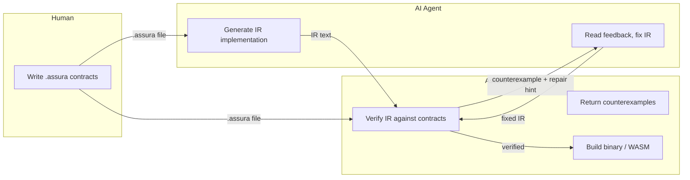
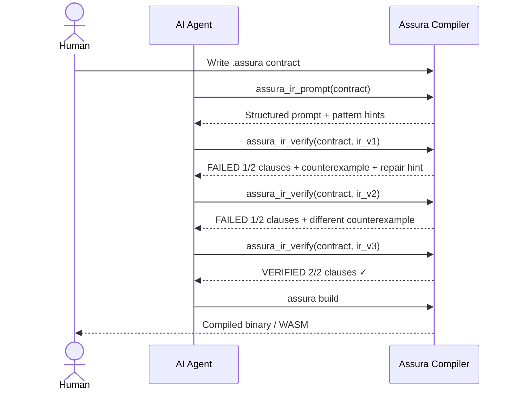
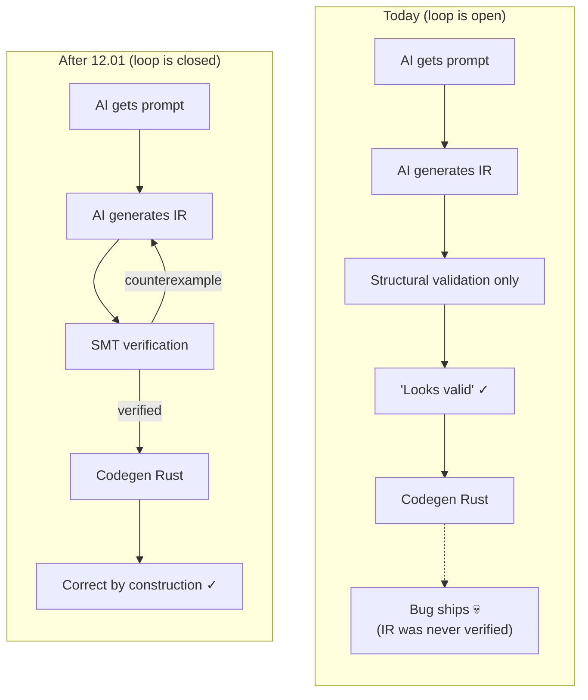

# Design: AI Verification Loop (Task 12.01)

> Assura's core value proposition: AI writes implementation, compiler
> proves it correct, returns counterexamples, AI fixes. This document
> designs the closed loop.

## User Flow

### Who does what



### End-to-end walkthrough

**Step 1: Human writes a contract** (what, not how)

```assura
contract SafeDivision {
    input(a: Int, b: Int)
    output(result: Int)
    requires { b != 0 }
    ensures  { result * b + (a mod b) == a }
    effects  { pure }
}
```

**Step 2: AI asks for a prompt** (MCP or CLI)

```
AI calls:  assura_ir_prompt(contract: "SafeDivision")
AI gets:   Structured prompt with contract clauses, type map,
           IR syntax reference, and pattern hints
```

**Step 3: AI generates IR** (typed slots, no proofs needed)

```
fn SafeDivision($0: Int, $1: Int) -> Int {
    $2 = div($0, $1)
    return $2
}
```

**Step 4: AI submits IR for verification** (the new API)

```
AI calls:  assura_ir_verify(contract_source, ir_source)
AI gets:
  {
    "status": "failed",
    "progress": "1/2 clauses verified (50%)",
    "clauses": [
      { "name": "requires[0]: b != 0",
        "status": "verified" },
      { "name": "ensures[0]: result * b + (a mod b) == a",
        "status": "counterexample",
        "counterexample": { "a": 7, "b": 2, "result": 3 },
        "repair_hint": "div(7,2)=3, but 3*2+(7 mod 2) = 7 ✓.
                        Try a=-7, b=2: div(-7,2)=-3,
                        -3*2+(-7 mod 2) = -6+(-1) = -7 ✓.
                        Solver found a=..., b=... where it fails.
                        Check truncation vs floor division." }
    ]
  }
```

**Step 5: AI fixes IR and resubmits**

```
fn SafeDivision($0: Int, $1: Int) -> Int {
    $2 = ediv($0, $1)       // changed: euclidean division
    return $2
}
```

```
AI calls:  assura_ir_verify(contract_source, fixed_ir_source)
AI gets:   { "status": "verified", "progress": "2/2 (100%)" }
```

**Step 6: Build**

```
assura build SafeDivision.assura → compiled Rust binary or WASM
```

### The loop as a sequence diagram



### Comparison: what happens today vs what 12.01 enables



### Three ways to use it

| Interface | Who uses it | Command |
|-----------|-------------|---------|
| **MCP tool** | AI coding agents (Cursor, Copilot, Claude Code, etc.) | `assura_ir_verify(contract, ir)` |
| **CLI** | Developers, CI pipelines | `assura ir impl.ir --contract spec.assura --verify` |
| **gRPC** | Services, orchestrators | `VerifyIR(request) → stream ClauseResult` |

All three return the same structured JSON with per-clause results,
counterexamples, root cause classification, and repair hints.

---

## Competitor Landscape

### How competitors close the loop

| System | LLM writes | Feedback on failure | Success rate | Weakness |
|--------|-----------|---------------------|-------------|----------|
| Dafny (DafnyPro) | Impl + proof annotations (invariants, lemmas, decreases) | Raw text errors; JSON available but rarely used by tools | 86% (hard), 97% (easy) | LLM must write both code AND proofs |
| Verus (ExVerus) | Proof annotations only | Source-level CEX + root cause classification | 72% | LLM writes separate Z3Py script to get usable CEX |
| Lean 4 (ReProver) | Proof tactics only | Per-tactic accept/reject + new proof state | 51% | Requires large search (64-beam, 10min/theorem) |
| AlphaProof | Proof tactics | Per-tactic oracle from Lean kernel | 4/6 IMO | Weeks of RL compute per problem |
| LORIS (C programs) | Loop invariants | Errors in LLM's own reasoning chain (not just artifacts) | 93% | Requires autoformalization of reasoning to FOL |

### Why competitors are limited

**Every competitor makes the LLM do two jobs at once:** write
implementation AND write proofs (invariants, lemmas, tactics). Dafny's
14% failure rate is dominated by complex invariants and termination
measures. ExVerus's innovation was better counterexamples, not better
proof generation. The 93% LORIS result checks the LLM's *reasoning*,
not the code.

**Specific failure modes (from DafnyBench analysis):**

- Complex loop invariants with quantifiers and nonlinear arithmetic
- Termination proofs (decreases clauses for complex recursion)
- Cascading proof failures (one wrong invariant breaks downstream)
- Syntax oscillation (LLM "fixes" one error by introducing another)
- Weak specifications that allow vacuous solutions

### Assura's structural advantage

Assura is architecturally different from every competitor:

1. **AI writes ONLY implementation.** No invariants. No lemmas. No
   decreases clauses. No proof tactics. The compiler generates proof
   obligations automatically from contracts + IR.

2. **Contracts are immutable input.** The human writes `.assura`
   contracts. The AI writes `.ir` implementation. The AI cannot
   accidentally weaken the spec (Dafny's "diff-checker" problem).

3. **IR is machine-optimized.** Typed slots (`$0`, `$1`) eliminate
   naming hallucination. Flat structure matches Transformer attention.
   Explicit types on every expression eliminate inference.

4. **Per-clause granularity.** Verification returns per-clause results
   (`Vec<VerificationResult>`), not batch pass/fail per method.

This means the success rate ceiling is higher than Dafny because the
task is fundamentally simpler.

---

## Current State (what exists)

The pieces exist but are not connected:

```
.assura ──► ir-prompt ──► AI prompt ──► [AI generates .ir]
                                              │
                                         .ir file (on disk)
                                              │
.assura ──► compile_full ──► Verifier ────────┘
            (auto-discovers sidecar)     │
                                    Vec<VerificationResult>
                                    (Verified/Counterexample/Timeout/Unknown)

.ir ──► assura ir ──► structural validation only (slot numbering, param count)
                  ──► Rust codegen
                  ──► NO SMT verification
```

**Existing infrastructure:**

| Component | Location | Status |
|-----------|----------|--------|
| Parse IR text | `assura_smt::parse_ir_module` | Public API, works |
| Structural validation | `assura_smt::validate_ir_against_contract` | Works (slot numbering, param count) |
| IR body → SMT axioms | `ir_exec::apply_ir_body_constraints` | Works (Z3 + CVC5 + SMT-LIB backends) |
| IR sidecar loading | `ir_loader::LoadedVerifyExtras` | Works (auto-discovers `.ir` files) |
| SMT verification | `Verifier::new(typed).verify()` | Works (with ir_bodies in extras) |
| Structured results | `VerificationResult` enum | Works (Verified/Counterexample/Timeout/Unknown) |
| JSON output | `VerificationSummary` | Works (JSON-serializable) |
| IR prompt generation | `render_ir_prompt` / `ir_prompt_contexts_for_typed` | Works |
| Heuristic IR generation | `ir_generate::generate_ir_sidecar_text` | Works (pattern detection) |
| MCP server | `assura-mcp` (5 tools) | Works, but no IR verify tool |

**Missing connections:**

1. No MCP tool to submit IR text and get verification results
2. `assura ir` command does not run SMT verification
3. No counterexample-to-IR-slot mapping
4. No structured repair hints
5. No multi-turn protocol with progress tracking

---

## Design

### Architecture: The Closed Loop

```
┌─────────────────────────────────────────────────────────────┐
│                     THE CLOSED LOOP                         │
│                                                             │
│  Human writes .assura ──────────────────────────┐           │
│                                                  │           │
│  ┌──────────────────────────────────────────┐    │           │
│  │ Step 1: PROMPT                           │    │           │
│  │ assura_ir_prompt(contract)               │    │           │
│  │ → structured prompt with contract,       │    │           │
│  │   type map, IR syntax, pattern hints     │    │           │
│  └──────────────┬───────────────────────────┘    │           │
│                 │                                │           │
│                 ▼                                │           │
│  ┌──────────────────────────────────────────┐    │           │
│  │ Step 2: GENERATE                         │    │           │
│  │ LLM generates IR text                    │    │           │
│  │ (typed slots, flat structure, no proofs)  │    │           │
│  └──────────────┬───────────────────────────┘    │           │
│                 │                                │           │
│                 ▼                                │           │
│  ┌──────────────────────────────────────────┐    │           │
│  │ Step 3: VERIFY (new)                     │    │           │
│  │ assura_ir_verify(contract, ir)           │◄───┘           │
│  │ → parse IR                               │               │
│  │ → structural validation                  │               │
│  │ → SMT verification (Z3/CVC5)             │               │
│  │ → per-clause results with:               │               │
│  │   - counterexample values                │               │
│  │   - slot-level trace                     │               │
│  │   - root cause classification            │               │
│  │   - repair hint                          │               │
│  └──────────────┬───────────────────────────┘               │
│                 │                                            │
│         ┌───────┴───────┐                                   │
│         │               │                                   │
│    All verified    Some failed                              │
│         │               │                                   │
│         ▼               ▼                                   │
│    Step 4: CODEGEN  Step 5: REPAIR                          │
│    assura build     LLM reads structured                    │
│    → Rust/WASM      feedback, generates                     │
│                     new IR, go to Step 3                    │
│                     (max N iterations)                      │
└─────────────────────────────────────────────────────────────┘
```

### Component 1: `assura_ir_verify` MCP Tool

New MCP tool in `assura-mcp`. The primary API for AI agents.

**Input:**

```json
{
  "contract": "contract SafeDivision { ... }",
  "ir": "fn SafeDivision($0: Int, $1: Int) -> Int { ... }",
  "options": {
    "solver": "z3",
    "timeout_ms": 5000,
    "decl": "SafeDivision"
  }
}
```

Alternatively, `contract_file` / `ir_file` paths instead of inline text.

**Output (the key design decision):**

```json
{
  "status": "failed",
  "progress": "2/4 clauses verified (50%)",
  "clauses": [
    {
      "name": "SafeDivision::requires[0]",
      "kind": "requires",
      "source": "b != 0",
      "status": "verified"
    },
    {
      "name": "SafeDivision::ensures[0]",
      "kind": "ensures",
      "source": "result * b + (a mod b) == a",
      "status": "verified"
    },
    {
      "name": "SafeDivision::ensures[1]",
      "kind": "ensures",
      "source": "abs(result) <= abs(a)",
      "status": "counterexample",
      "counterexample": {
        "inputs": { "a": "-7", "b": "2" },
        "result": "-4",
        "slots": {
          "$0": "-7",
          "$1": "2",
          "$2": "-4"
        }
      },
      "root_cause": "wrong_computation",
      "repair_hint": "IR returns -4 for div(-7, 2), but abs(-4)=4 > abs(-7)=7 is false. Check: the ensures clause expects abs(result) <= abs(a). With a=-7, b=2, the IR computes result=-4, and abs(-4)=4 <= abs(-7)=7 is true. Solver found a=-7, b=2, result=-4 where the ensures does NOT hold. Recheck your division logic for negative inputs."
    },
    {
      "name": "SafeDivision::effects",
      "kind": "effects",
      "source": "pure",
      "status": "verified"
    }
  ],
  "summary": {
    "verified": 2,
    "counterexample": 1,
    "timeout": 0,
    "unknown": 0,
    "total": 4
  },
  "iteration": 1,
  "max_iterations": 10
}
```

**Why this is better than competitors:**

| Feature | Dafny | Verus | Assura (this design) |
|---------|-------|-------|---------------------|
| Feedback format | Raw text (most tools) | Source-level CEX | Structured JSON with slot mapping |
| Progress metric | "5 verified, 1 error" | None | "2/4 clauses (50%)" per-clause |
| Root cause | None | "wrong_fact" / "too_weak" | 5 categories (see below) |
| Repair hint | None | None | Natural language hint per failing clause |
| Slot mapping | N/A | N/A | CEX values mapped to IR slot numbers |
| Integration | Shell out + parse stdout | Shell out | Native MCP tool, single call |

### Component 2: Root Cause Classification

When a clause fails, classify the root cause to help the LLM
target repairs. Assura can do this better than competitors because
the two-layer separation makes failure modes clear:

| Root Cause | When | Repair Strategy |
|-----------|------|----------------|
| `contract_violation` | IR body produces a result that violates an ensures clause under the given requires | Fix the computation logic |
| `missing_guard` | IR does not check a requires/precondition before an operation | Add a conditional branch on the requires predicate |
| `wrong_computation` | IR computes the wrong value (counterexample shows incorrect result) | Fix the arithmetic/logic in the relevant slots |
| `type_error` | IR uses wrong types for slots or return value | Fix slot type annotations |
| `structural_mismatch` | IR parameter count, names, or structure don't match contract | Regenerate IR skeleton from contract |

**How classification works (mechanically):**

1. Parse the `CounterexampleModel` variables
2. If input variables satisfy all `requires` but `result` violates
   an `ensures`: `contract_violation` or `wrong_computation`
3. If input variables violate a `requires` (meaning the IR didn't
   guard against it): `missing_guard`
4. If structural validation failed: `structural_mismatch`
5. If types don't align: `type_error`

This is simpler than ExVerus's classification because Assura's
two-layer architecture makes the boundaries clean: the contract
is immutable, the IR is the only thing that can be wrong.

### Component 3: Slot-Level Counterexample Trace

Unlike Dafny/Verus (which use variable names that may not map cleanly
to the LLM's code), Assura IR uses numbered slots. The counterexample
can trace through the IR computation:

```json
{
  "trace": [
    { "slot": "$0", "value": "-7", "source": "input a" },
    { "slot": "$1", "value": "2", "source": "input b" },
    { "slot": "$2", "value": "3", "instruction": "abs($0)", "note": "abs(-7) = 7, not 3" },
    { "slot": "$3", "value": "-4", "instruction": "div($0, $1)", "note": "result" }
  ],
  "failing_check": "abs($3) <= $2 → abs(-4) <= 3 → 4 <= 3 → false"
}
```

This gives the LLM a step-by-step execution trace showing exactly
which slot computation is wrong. No competitor provides this.

**Implementation:** Walk the IR body instructions, evaluate each slot
using the counterexample model values, and annotate where the
computation diverges from what the ensures clause expects.

### Component 4: CLI Enhancement (`assura ir --verify`)

Extend the existing `assura ir` command:

```bash
# Current (structural validation + codegen only)
assura ir implementation.ir --contract spec.assura

# New (structural validation + SMT verification + codegen)
assura ir implementation.ir --contract spec.assura --verify

# Verify only, no codegen
assura ir implementation.ir --contract spec.assura --verify-only

# JSON output for programmatic use
assura ir implementation.ir --contract spec.assura --verify --json
```

**Implementation in `ir_cmd.rs`:**

1. After structural validation, compile the contract through
   `assura_pipeline::compile` (parse + resolve + typecheck)
2. Inject the parsed IR module as `VerifyFileExtras` (same path
   as sidecar loading, but from inline IR)
3. Run `assura_pipeline::verify_typed` with the extras
4. Report results using the existing `check/report.rs` machinery
5. Optionally proceed to codegen if verification passes

This reuses 100% of the existing verification infrastructure.
No new SMT encoding needed.

### Component 5: Multi-Turn Protocol

The full loop protocol for AI agents (MCP or gRPC):

```
Turn 1:
  Agent calls assura_ir_prompt(contract_source)
  → Gets: contract analysis, type map, IR syntax, pattern hints
  Agent generates IR
  Agent calls assura_ir_verify(contract, ir)
  → Gets: {status: "failed", progress: "3/5 (60%)", clauses: [...]}

Turn 2:
  Agent reads failing clauses + repair hints
  Agent fixes IR (targeted: only change slots related to failures)
  Agent calls assura_ir_verify(contract, ir_v2)
  → Gets: {status: "failed", progress: "4/5 (80%)", clauses: [...]}
  (progress improved: 60% → 80%)

Turn 3:
  Agent fixes remaining clause
  Agent calls assura_ir_verify(contract, ir_v3)
  → Gets: {status: "verified", progress: "5/5 (100%)", clauses: [all verified]}

Done. Agent calls assura build or codegen.
```

**Key design properties:**

1. **Stateless.** Each `assura_ir_verify` call is independent. No
   session state to manage. The agent can retry from scratch at any
   point.

2. **Progress is visible.** The `progress` field ("3/5 clauses")
   gives the LLM a dense reward signal, like LeanListener's per-step
   rewards. Dafny tools only get binary pass/fail.

3. **Regression detection.** The agent can compare clause results
   between turns. If a previously-verified clause regresses, the
   repair hint says so.

4. **Bounded iterations.** Default max 10 iterations (configurable).
   This matches Dafny best practices (DafnyPro uses 5-10).

5. **Contract immutability.** The contract never changes. The agent
   can only modify the IR. This eliminates the "LLM weakens the spec"
   failure mode that Dafny's DafnyPro needs a diff-checker to prevent.

### Component 6: gRPC Streaming Variant

For real-time feedback (tighter loop than MCP request/response):

```protobuf
rpc VerifyIR(VerifyIRRequest) returns (stream VerifyIREvent);

message VerifyIREvent {
  oneof event {
    ClauseResult clause_verified = 1;   // fired per clause
    VerifyComplete complete = 2;        // final summary
  }
}
```

This streams results as each clause is verified, so the LLM can
start planning repairs before all clauses finish. The existing
`assura-server` already has `check_stream` (streaming verification);
this extends it to IR verification.

---

## Why This Is Better Than Every Competitor

### 1. Simpler LLM task (higher success ceiling)

Dafny: LLM writes implementation + invariants + lemmas + decreases.
Verus: LLM writes proof annotations (invariants, assertions).
Lean 4: LLM writes proof tactics.
**Assura: LLM writes ONLY implementation.** No proof artifacts.

The proof search that causes Dafny's 14% failure rate and Verus's
28% failure rate simply doesn't exist in Assura. The compiler does
all the proving.

### 2. Tighter feedback loop (faster convergence)

Dafny tools: shell out to `dafny verify`, parse stdout, construct
new prompt, call LLM again. Each iteration: ~30s verify + ~10s LLM.
Assura: single MCP call, structured JSON response, no parsing needed.
Each iteration: ~5s verify + ~5s LLM.

### 3. Richer feedback (more information per iteration)

Dafny: "postcondition might not hold on line 10" (text).
Verus: counterexample values + "wrong_fact" / "too_weak".
**Assura: counterexample values + slot trace + root cause + repair
hint + progress metric + clause-level results.** Each iteration
gives the LLM maximum information to target the fix.

### 4. No spec corruption (architectural guarantee)

Dafny: LLM can accidentally modify preconditions/postconditions
(DafnyPro needs a diff-checker to catch this). Verus: same risk.
**Assura: contract is a separate file, never sent to the LLM for
modification.** The API takes contract as immutable input.

### 5. Machine-native IR (fewer hallucination modes)

Dafny: LLM generates human-readable code with variable names,
indentation, comments. Each is a hallucination vector.
Assura IR: typed slots (`$0: Int`), flat structure, explicit types
on every expression. The naming hallucination problem doesn't exist.

### 6. Progress metric (dense reward signal)

Dafny: "5 verified, 1 error" (binary per method).
Lean: proof state changes (but requires understanding tactic semantics).
**Assura: "3/5 clauses verified (60%)"** with per-clause results.
The LLM knows exactly what improved and what didn't. This is the
LeanListener insight (dense rewards > sparse rewards) applied to
program verification.

---

## Implementation Plan

### Phase A: Core API (closes the loop)

| Step | What | Where | Effort |
|------|------|-------|--------|
| A.1 | Add `--verify` flag to `assura ir` CLI command | `crates/assura-cli/src/ir_cmd.rs` | Small |
| A.2 | Wire IR text → `VerifyFileExtras` → `verify_typed` (reuse existing infra) | `crates/assura-pipeline/src/lib.rs` | Small |
| A.3 | Add `assura_ir_verify` MCP tool | `crates/assura-mcp/src/lib.rs` | Medium |
| A.4 | Add structured JSON output format with clause-level results | `crates/assura-smt/src/result.rs` | Small |
| A.5 | Integration tests (verify-pass, verify-fail, counterexample) | `crates/assura-cli/tests/`, `crates/assura-mcp/tests/` | Medium |

### Phase B: Rich Feedback (beats competitors)

| Step | What | Where | Effort |
|------|------|-------|--------|
| B.1 | Root cause classification on VerificationResult | `crates/assura-smt/src/result.rs` | Medium |
| B.2 | Slot-level counterexample trace | `crates/assura-smt/src/ir_modules/ir_exec.rs` | Medium |
| B.3 | Repair hint generation | `crates/assura-smt/src/result.rs` or new module | Medium |
| B.4 | Progress metric (N/M clauses) in output | `crates/assura-smt/src/result.rs` | Small |

### Phase C: Streaming and Scale

| Step | What | Where | Effort |
|------|------|-------|--------|
| C.1 | gRPC streaming `VerifyIR` RPC | `crates/assura-server/` | Medium |
| C.2 | Per-clause streaming in MCP | `crates/assura-mcp/` | Small |
| C.3 | Benchmark: measure LLM verification success rate | `scripts/benchmark-llm-verify.sh` | Large |

### Dependency order

```
A.1 + A.2 (core wiring) → A.3 (MCP tool) → A.4 (JSON) → A.5 (tests)
                                                    ↓
                                              B.1-B.4 (rich feedback)
                                                    ↓
                                              C.1-C.3 (streaming + benchmark)
```

Phase A closes the loop. Phase B makes it better than competitors.
Phase C scales it.

---

## Key Files to Modify

| File | Change |
|------|--------|
| `crates/assura-cli/src/ir_cmd.rs` | Add `--verify` / `--verify-only` flags, call pipeline |
| `crates/assura-pipeline/src/lib.rs` | Add `verify_ir(contract_src, ir_src, config)` public function |
| `crates/assura-mcp/src/lib.rs` | Add `assura_ir_verify` tool |
| `crates/assura-smt/src/result.rs` | Add `root_cause`, `repair_hint`, `slot_trace` to results |
| `crates/assura-smt/src/ir_modules/ir_exec.rs` | Add slot value evaluation for trace |
| `crates/assura-server/src/main.rs` | Add `VerifyIR` streaming RPC |
| `templates/ir/base.md` | Update prompt to reference `assura_ir_verify` tool |

---

## Success Metrics

| Metric | Target | How to Measure |
|--------|--------|----------------|
| Loop closure | AI can submit IR and get verification results in 1 MCP call | Integration test |
| Per-clause feedback | Each ensures/requires clause has individual status | Unit test |
| Counterexample quality | CEX includes input values, result, and slot assignments | Unit test |
| Round-trip time | < 10s for a 5-clause contract | Benchmark |
| LLM success rate | > 90% on 50-contract benchmark (Phase C) | Benchmark script |
| Competitor comparison | Better structured output than Dafny --json | Manual review |
