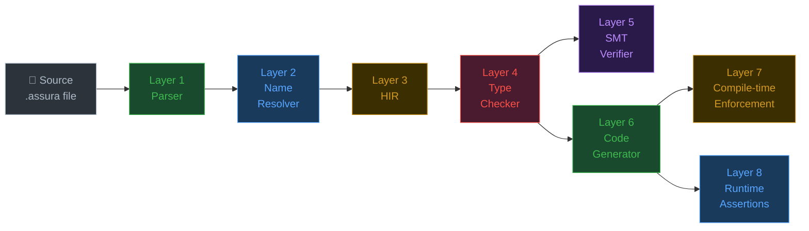
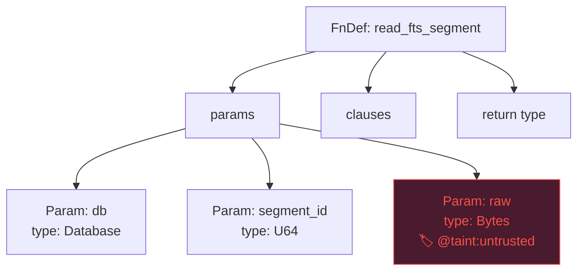
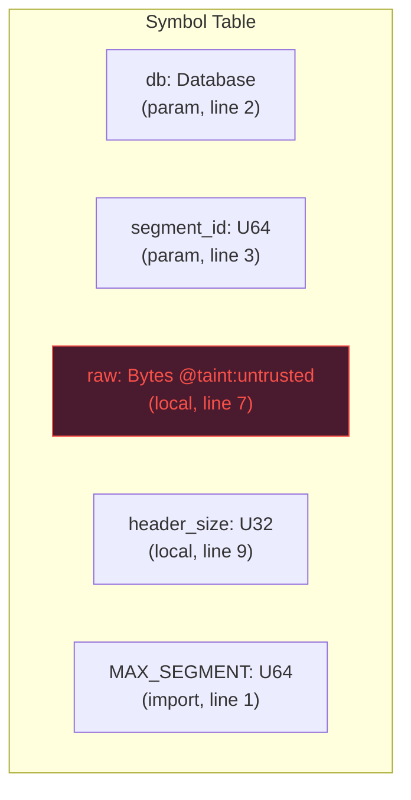
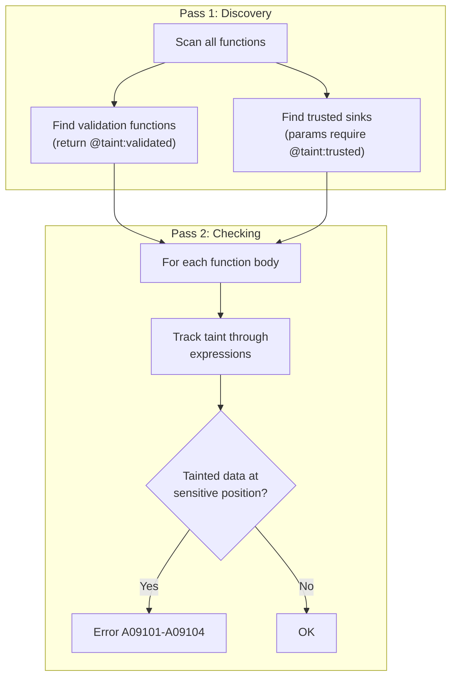
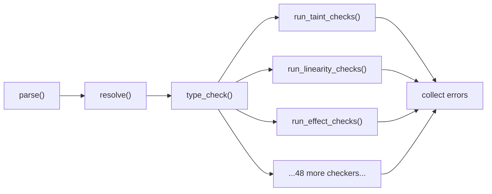
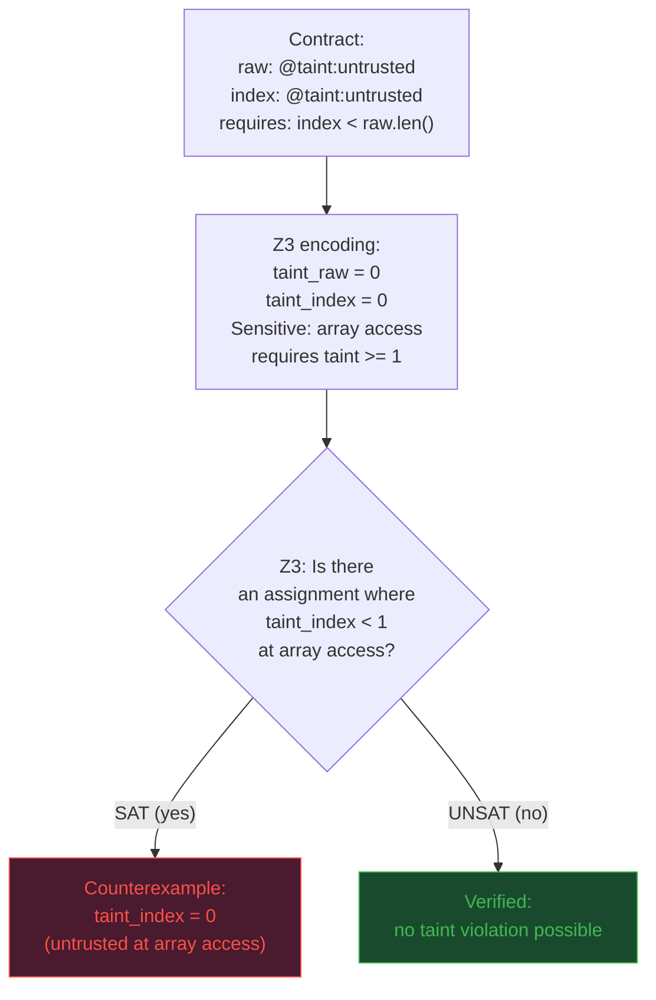
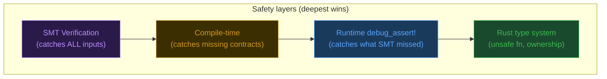
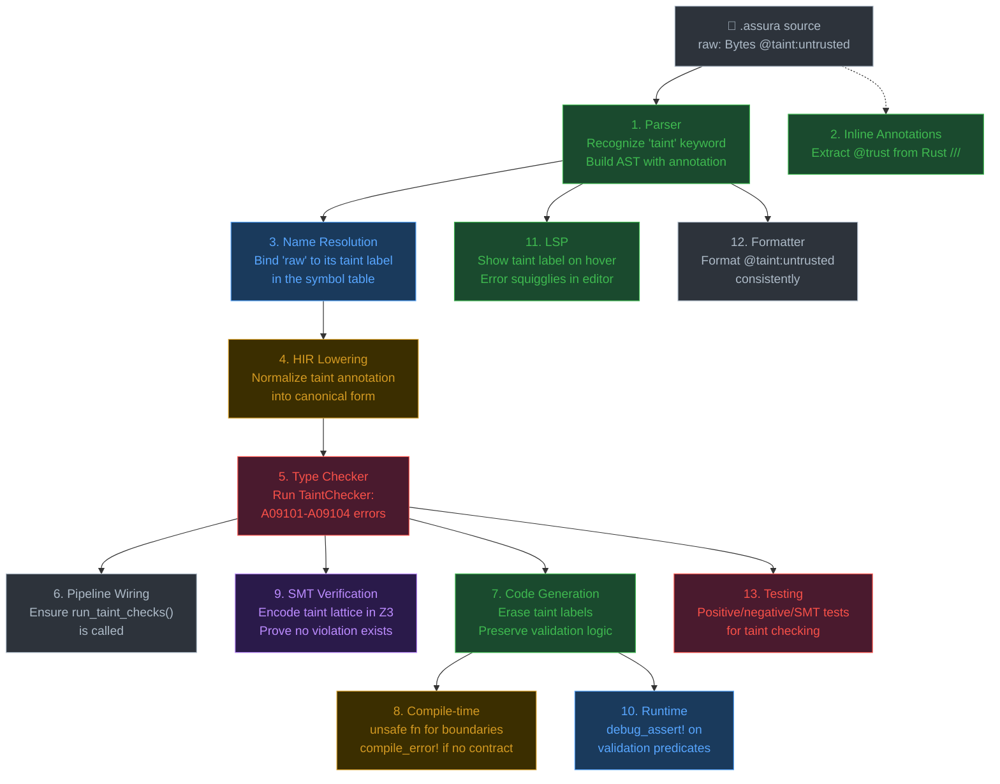

# How a Compiler Catches Bugs You Haven't Written Yet

### A guided tour through 13 compiler layers, told through one security feature

---

> **Who is this for?**
> Anyone curious about how a programming language compiler actually works.
> No compiler background needed. We start with a real vulnerability and
> end with a mathematical proof that it cannot happen.

---

## The Vulnerability

In 2017, researchers demonstrated "Many Birds, One Stone," a class of
attacks against SQLite. The root cause: SQLite reads binary data from
disk and *trusts it without validation*. Four CVEs shared the same
pattern:

```
User stores crafted data in database
    -> SQLite reads it back
    -> SQLite uses it as an array index
    -> Out-of-bounds memory access
    -> Code execution
```

The fix in every case was the same: **validate the data before using it.**
But the developers had no way to *enforce* that every code path validates
every piece of external data. They relied on code review and hope.

What if the compiler could enforce it?

---

## The Contract

Assura is a language where you write *contracts* (what code must do) and
the compiler *proves* they hold. Here is a contract that prevents the
SQLite vulnerability:

```assura
fn read_fts_segment(
    db: Database,
    segment_id: U64
) -> FtsSegment | CorruptionError
  effects: database.read
{
  let raw: Bytes @taint:untrusted = db.read_blob("fts_segments", segment_id)

  let header_size = validate { raw.len() >= 16 } raw.read_u32(0)
    or return CorruptionError("header too small")

  let segment_size = validate { header_size <= MAX_SEGMENT } header_size
    or return CorruptionError("segment too large")

  let content = validate { raw.len() >= segment_size } raw.slice(16, segment_size)
    or return CorruptionError("truncated segment")

  FtsSegment { header_size, content }
}
```

The key line: `@taint:untrusted`. It tells the compiler *"this data came
from outside; do not let it reach a sensitive operation unless it passes
through a `validate` block."*

This single annotation triggers checks in **13 different compiler layers.**
Let's walk through each one.

---

## The 13 Layers



Plus five supporting layers: Inline Annotations, Pipeline Wiring,
LSP (editor support), Formatter, and Testing. We will cover all 13.

---

## Layer 1: The Parser

### What it does

The parser reads your `.assura` source file and turns it into a tree
structure the compiler can work with. Think of it as the compiler
learning to *read*.

When you write `@taint:untrusted`, the parser must recognize `taint`
as a keyword, not a variable name. Assura's lexer (the sub-component
that identifies individual words) has explicit token definitions for
security keywords:

```rust
// From crates/assura-parser/src/lexer.rs

// --- SEC: trust and security (Section 14.SEC) ---
#[token("secret")]
Secret,
#[token("trust")]
Trust,
```

### What it produces

The parser outputs two things:

**CST (Concrete Syntax Tree)** preserves every character, including
whitespace and comments. It is "lossless" because you can reconstruct
the original source from it.

**AST (Abstract Syntax Tree)** strips away formatting and keeps only
the meaning. Our `@taint:untrusted` annotation ends up as structured
data:



> **Analogy:** The parser is like a mail clerk who opens envelopes,
> reads the address, and sorts mail into the right bins. It does not
> understand what the letters *say*; it just knows where they go.

### For taint tracking

The parser stores `@taint:untrusted` as tokens in the parameter's type
annotation. It does not *understand* taint. It just preserves the
annotation so later layers can use it.

---

## Layer 2: Inline Annotations (Rust `///`)

### What it does

Assura does not just compile `.assura` files. It can also read Rust
source code and extract contracts from `///` doc comments. This is
how you add verification to *existing* Rust projects without rewriting
them:

```rust
/// Reads a segment from the FTS shadow table.
///
/// @requires segment_id < MAX_SEGMENTS
/// @ensures result.len() <= MAX_SEGMENT
/// @trust untrusted
pub fn read_fts_segment(db: &Database, segment_id: u64) -> Vec<u8> {
    // ...existing Rust code...
}
```

The `@trust untrusted` annotation is parsed by `assura-rust-analyzer`,
which understands Rust syntax and extracts structured contract data
from doc comments.

### For taint tracking

This layer recognizes `@trust` as a taint-related annotation and stores
it alongside the function's other contract clauses (requires, ensures).
This means taint tracking works on both `.assura` contracts and
existing Rust code.

---

## Layer 3: Name Resolution

### What it does

When the parser sees `raw.len()`, it does not know what `raw` is.
Is it a local variable? A function parameter? Something imported from
another module?

The name resolver answers these questions. It builds a **symbol table**:
a directory of every name in the program, where it was defined, and
what it refers to.



### For taint tracking

The taint annotation `@taint:untrusted` is associated with the symbol
`raw` in the symbol table. When any later layer asks "what do we know
about `raw`?", the symbol table answers: "it is `Bytes`, it is tainted
as `untrusted`, and it was defined on line 7."

> **Analogy:** Name resolution is like a company directory. When someone
> says "ask Sarah about the budget," the directory tells you which Sarah,
> which department, and her extension number.

---

## Layer 4: HIR (High-level Intermediate Representation)

### What it does

The AST is a faithful mirror of what you wrote. But compilers need a
simplified, normalized form. The **HIR** (High-level Intermediate
Representation) is that form.

*Why "intermediate"?* Because it sits between your source code (which
humans read) and the final output (which machines execute). It is the
compiler's internal language.

*Why "high-level"?* Because there are also low-level IRs (like LLVM IR
or MIR) that are closer to machine code. HIR stays close to your intent.

The HIR simplifies things like:

| Source code | HIR |
|---|---|
| `x + y * z` | `BinOp(Add, x, BinOp(Mul, y, z))` |
| `if cond { a } else { b }` | `Branch(cond, a, b)` |
| `@taint:untrusted` | `TaintAnnotation(Untrusted)` on the binding |
| Syntactic sugar | Desugared form |

### For taint tracking

The HIR preserves taint annotations from the AST but in a normalized
form. This means every downstream layer sees taint information in the
same structure, regardless of how it was originally written (explicit
`@taint:untrusted`, shorthand `@untrusted`, or inferred from the
function signature).

---

## Layer 5: Type Checker

### What it does

This is where the compiler starts to *understand* your code. The type
checker asks: "does this program make sense?"

For ordinary types, it catches mistakes like adding a string to a number.
But Assura's type checker goes further. It runs **50 domain-specific
checkers**, each looking for a different class of bug. Taint tracking is
one of them.

### For taint tracking: the TaintChecker

The `TaintChecker` (in `crates/assura-types/src/checkers/taint.rs`)
implements a three-level **taint lattice**:

```
    Trusted          (internal data, known safe)
       ↑
    Validated        (external data that passed validation)
       ↑
    Untrusted        (external data, potentially malicious)
```

The key rule: **data flows UP the lattice, never down.** You cannot use
`Untrusted` data where `Validated` or `Trusted` is required.

The checker works in two passes:



### Concrete example

Given this code:

```assura
fn process(
    raw_input: Bytes @taint:untrusted,
    index: Int @taint:untrusted
)
  requires raw_input.len() > index
{
  let value = raw_input[index]    // <-- ERROR A09101!
}
```

The type checker produces:

```diff
- error[A09101]: tainted data used as array index without validation
-     --> example.assura:7:25
-     |
-   7 |   let value = raw_input[index]
-     |                         ^^^^^
-     |
-     = help: validate the index before using it to access an array
-     = note: `index` has taint label `untrusted`
```

The fix: wrap `index` in a `validate` block that bounds-checks it:

```assura
  let safe_index = validate { index >= 0 and index < raw_input.len() } index
    or return Error("index out of bounds")
  let value = raw_input[safe_index]   // OK: safe_index is @taint:validated
```

### What it catches

| Error Code | What it catches | Real-world analog |
|---|---|---|
| A09101 | Tainted array index | Buffer overflow (CVE-2023-4863) |
| A09102 | Tainted allocation size | Integer overflow in malloc |
| A09103 | Tainted data at trusted sink | SQL injection, command injection |
| A09104 | Incomplete validation | Partial sanitization bypass |

---

## Layer 6: Pipeline Wiring

### What it does

Each checker is a standalone component. Pipeline wiring is the code
that says: "run the taint checker after type checking, feed it the
resolved symbols, collect the errors."

This might sound trivial, but it is critical. A checker that exists but
is never called is dead code. Pipeline wiring ensures every checker
actually runs.



### For taint tracking

The function `run_taint_checks()` is called from the pipeline in
`crates/assura-types/src/pipeline.rs`. If this call did not exist, the
`TaintChecker` would compile and pass its own unit tests, but no real
`.assura` file would ever be checked for taint violations.

> **Analogy:** Pipeline wiring is like plugging appliances into outlets.
> A toaster sitting on the counter is useless until it is plugged in.

---

## Layer 7: Code Generation

### What it does

Once the compiler has verified your contracts, it generates Rust source
code. This is the output that actually gets compiled by `rustc` and
runs on your machine.

### For taint tracking

Taint labels **erase at runtime.** The generated Rust does not carry
taint metadata. Why? Because the compiler already *proved* that every
tainted value is validated before use. There is nothing left to check.

The code generator strips taint annotations from types:

```
Assura: raw: Bytes @taint:untrusted  →  Rust: raw: Vec<u8>
```

But it preserves the *validation logic* as runtime checks:

```rust
// Generated Rust from the contract above
pub fn read_fts_segment(db: &Database, segment_id: u64)
    -> Result<FtsSegment, CorruptionError>
{
    let raw = db.read_blob("fts_segments", segment_id)?;

    // From: validate { raw.len() >= 16 }
    if raw.len() < 16 {
        return Err(CorruptionError::new("header too small"));
    }
    let header_size = u32::from_be_bytes(raw[0..4].try_into().unwrap()) as usize;

    // From: validate { header_size <= MAX_SEGMENT }
    if header_size > MAX_SEGMENT {
        return Err(CorruptionError::new("segment too large"));
    }

    // From: validate { raw.len() >= segment_size }
    if raw.len() < header_size {
        return Err(CorruptionError::new("truncated segment"));
    }
    let content = &raw[16..header_size];

    Ok(FtsSegment { header_size, content: content.to_vec() })
}
```

Notice: no `@taint:untrusted` anywhere. The type system enforced it;
the generated code just has the validation checks.

---

## Layer 8: Compile-time Enforcement

### What it does

This layer uses *Rust's own type system* as a second line of defense.
The generated Rust code uses patterns that make certain mistakes
impossible to compile.

### For taint tracking

When an extern function handles tainted data, the code generator
produces `unsafe fn`:

```rust
/// Extern: read_blob [ffi_boundary: untrusted]
pub unsafe fn read_blob(table: &str, id: u64) -> Vec<u8> {
    // ...
}
```

The `unsafe` keyword forces every caller to acknowledge the trust
boundary with an `unsafe {}` block. Rust's compiler enforces this.
You cannot accidentally call an untrusted function in safe code.

For untrusted externs *without any contracts*, the generated code
will not compile at all:

```rust
pub unsafe fn read_blob(table: &str, id: u64) -> Vec<u8> {
    compile_error!("FFI boundary violation: untrusted extern `read_blob`
                    has no contract; add requires/ensures");
}
```

### How it differs from runtime checks

| | Compile-time | Runtime |
|---|---|---|
| **When** | Before the program runs | While the program runs |
| **What** | "You forgot to add a contract" | "The contract's predicate failed" |
| **Cost** | Zero (caught during build) | Small (one `if` check) |
| **Example** | `compile_error!("no contract")` | `debug_assert!(index < len)` |

They cover different failure modes. Compile-time catches *missing*
contracts. Runtime catches *violated* contracts.

---

## Layer 9: SMT Verification

### What it does

This is the most powerful layer and the hardest to explain simply.

**SMT** stands for **Satisfiability Modulo Theories**. It is a way to
ask a computer: *"Is there ANY possible input that breaks this contract?"*

Unlike testing (which checks specific inputs) or fuzzing (which checks
random inputs), SMT checks **all possible inputs at once.** It does
this by translating your contract into mathematical formulas and handing
them to a solver (Z3, developed by Microsoft Research).

### For taint tracking: the Z3 encoding

The SMT layer encodes the taint lattice as integers:

```
Untrusted = 0    Validated = 1    Trusted = 2
```

For each variable with a taint label, Z3 creates an integer variable.
The verification question becomes:

> *"Is there an assignment of taint values where an untrusted variable
> reaches a position that requires validated or trusted?"*



### Concrete Z3 encoding

Here is what the Assura compiler actually sends to Z3 (from
`crates/assura-smt/src/z3_backend/features.rs`):

```rust
// Create taint level variables for each labeled variable
let taint_raw = Int::new_const("taint_raw");
solver.assert(taint_raw.eq(&Int::from_i64(0)));  // raw is Untrusted (0)

let taint_index = Int::new_const("taint_index");
solver.assert(taint_index.eq(&Int::from_i64(0)));  // index is Untrusted (0)

// Array access requires taint >= Validated (1)
// Ask Z3: "can all sensitive uses be satisfied?"
let safe = taint_index.ge(&Int::from_i64(1));   // index must be >= Validated

// If UNSAT: the safety property cannot be satisfied -> violation exists
// If SAT: all taint flows are safe
```

### What makes this different from testing

| Approach | Inputs checked | Guarantee |
|---|---|---|
| Unit test | 5-10 specific values | "Works for these inputs" |
| Fuzzing | Thousands of random values | "No crash found in N hours" |
| SMT | **All possible values** | **"Mathematically impossible to violate"** |

The tradeoff: SMT can time out on complex formulas. When it does,
Assura reports `Unknown` instead of `Verified`, and the runtime
assertions remain as the safety net.

> **Analogy:** Testing is like checking a bridge by driving a few trucks
> across it. SMT is like mathematically proving the bridge can hold any
> load up to its rated capacity.

---

## Layer 10: Runtime Assertions

### What it does

Even after static verification, the generated Rust code includes
`debug_assert!` checks on contract predicates. These are the last line
of defense.

### For taint tracking

Remember that taint labels erase at codegen. The runtime checks are not
about taint itself; they are about the *validation predicates* that make
tainted data safe:

```rust
// Generated Rust: the validation predicate becomes a runtime check
debug_assert!(raw.len() >= 16, "requires: raw.len() >= 16");
let header_size = /* ... */;

debug_assert!(header_size <= MAX_SEGMENT, "requires: header_size <= MAX_SEGMENT");
```

### Why bother if SMT already proved it?

Three reasons:

1. **SMT can time out.** Complex formulas may get `Unknown` instead of
   `Verified`. Runtime checks catch what SMT could not prove.

2. **Defense in depth.** Compilers have bugs. If the SMT encoding is
   wrong, runtime assertions catch the failure at the call site instead
   of allowing silent corruption.

3. **Debug builds only.** `debug_assert!` compiles to nothing in release
   mode. You get maximum safety during development with zero overhead in
   production.



---

## Layer 11: LSP (Editor Support)

### What it does

**LSP** (Language Server Protocol) is a standard that lets your code
editor (VS Code, Neovim, etc.) talk to the compiler in real time.
Instead of waiting until you run `assura check`, the editor shows
errors *as you type*.

### For taint tracking

When you hover over a variable annotated with `@taint:untrusted`, the
LSP server shows its taint label in the tooltip:

```
raw: Bytes
  taint: untrusted
  defined at line 7
```

If you try to use `raw` directly as an array index, the error squiggly
appears instantly, before you even save the file.

> **Analogy:** The LSP is like a co-pilot who looks over your shoulder
> and says "you forgot to validate that" while you are still typing,
> instead of waiting until you submit the code for review.

---

## Layer 12: Formatter

### What it does

The formatter (`assura fmt`) automatically formats your code to follow
consistent style rules, like `rustfmt` for Rust or `prettier` for
JavaScript.

### For taint tracking

The formatter knows how to handle taint annotations in type positions.
It ensures consistent spacing and alignment:

```diff
  // Before formatting
- fn process(data:Bytes @taint:untrusted,index:Int @taint:untrusted)->Result

  // After formatting
+ fn process(
+     data: Bytes @taint:untrusted,
+     index: Int @taint:untrusted,
+ ) -> Result
```

Without taint-aware formatting, the formatter might break
`@taint:untrusted` across lines or mangle the annotation syntax.

---

## Layer 13: Testing

### What it does

Every compiler feature must have automated tests that prove it works
correctly. For taint tracking, this means:

- **Positive tests:** Valid taint annotations compile without errors
- **Negative tests:** Invalid taint flows produce the correct error codes
- **SMT tests:** The Z3 encoding correctly identifies violations
- **Integration tests:** The full pipeline (parse, check, verify,
  generate) handles taint end-to-end

### Real tests from the codebase

```rust
// Test: untrusted data at a validated sink produces a counterexample
#[test]
fn test_taint_unsafe_untrusted_at_validated_sink() {
    let labels = vec![("raw_idx".to_string(), TaintLabel::Untrusted)];
    let validation_fns = vec![];
    let sensitive = vec![("raw_idx".to_string(), TaintLabel::Validated)];

    let result = verify_taint_safety(&labels, &validation_fns, &sensitive);

    assert!(matches!(result[0],
        VerificationResult::Counterexample { .. }
    ));
}

// Test: all-validated data passes verification
#[test]
fn test_taint_safe_all_validated() {
    let labels = vec![
        ("cleaned_input".to_string(), TaintLabel::Validated),
        ("config_value".to_string(), TaintLabel::Trusted),
    ];
    let sensitive = vec![
        ("cleaned_input".to_string(), TaintLabel::Validated),
        ("config_value".to_string(), TaintLabel::Validated),
    ];

    let result = verify_taint_safety(&labels, &validation_fns, &sensitive);

    assert!(matches!(result[0],
        VerificationResult::Verified { .. }
    ));
}
```

---

## The Complete Picture

Here is every layer and what it does for taint tracking, in the order
your code passes through them:



---

## Summary Table

| # | Layer | Jargon | Plain English | Taint tracking role |
|--:|-------|--------|---------------|---------------------|
| 1 | Parser | CST, AST, lexer | Read the source code | Recognize `@taint:untrusted` |
| 2 | Inline Annotations | Doc comments | Read contracts from Rust code | Extract `@trust` from `///` |
| 3 | Name Resolution | Symbol table, scopes | Figure out what each name means | Link variables to taint labels |
| 4 | HIR | Intermediate representation | Simplify the code for analysis | Normalize taint annotations |
| 5 | Type Checker | Domain checkers, lattice | Check if the code makes sense | Reject tainted data at sinks |
| 6 | Pipeline Wiring | Pass ordering | Connect the stages together | Ensure the checker actually runs |
| 7 | Code Generation | Codegen, transpilation | Produce runnable Rust code | Erase labels, keep validation |
| 8 | Compile-time | `compile_error!`, `unsafe` | Catch mistakes during build | Block uncontracted boundaries |
| 9 | SMT Verification | Z3, SAT/UNSAT, solver | Mathematically prove correctness | Prove no taint violation exists |
| 10 | Runtime | `debug_assert!` | Check contracts while running | Catch what SMT could not prove |
| 11 | LSP | Language Server Protocol | Editor integration | Show taint info while typing |
| 12 | Formatter | Pretty-printer | Auto-format code | Handle taint annotation syntax |
| 13 | Testing | Unit, integration, snapshot | Prove the compiler itself works | Test every taint error path |

---

## Why 13 Layers?

You might ask: isn't this overkill? The short answer: **no layer alone
is sufficient.**

- The **parser** can recognize `@taint:untrusted` but cannot check data
  flow.
- The **type checker** can check data flow but cannot prove *all* paths
  are safe.
- **SMT** can prove all paths but can time out on complex code.
- **Runtime assertions** catch timeouts but only run on tested code paths.
- **Compile-time enforcement** catches missing contracts but not wrong
  contracts.

Each layer catches what the others miss. The SQLite vulnerability that
started this document would have been caught by layers 5, 8, 9, and 10,
independently. An attacker would need to defeat *all four* simultaneously
to exploit it.

That is what defense in depth looks like, implemented as a compiler.

---

## Glossary

| Term | Definition |
|---|---|
| **AST** | Abstract Syntax Tree. A tree structure representing your code's meaning, without formatting details. |
| **CST** | Concrete Syntax Tree. Like AST but preserves every character (whitespace, comments). |
| **HIR** | High-level Intermediate Representation. A simplified form of your code that the compiler uses internally. |
| **IR** | Intermediate Representation. Any format between source code and final output. |
| **Lattice** | A mathematical structure where values have a defined ordering. Taint uses: Untrusted < Validated < Trusted. |
| **Lexer** | The part of the parser that breaks text into tokens (keywords, numbers, operators). |
| **LSP** | Language Server Protocol. A standard for editors to communicate with language tools in real time. |
| **SMT** | Satisfiability Modulo Theories. A technique for mathematically proving properties about all possible inputs. |
| **Symbol table** | A data structure mapping names to their definitions, types, and properties. |
| **Taint** | A label tracking whether data came from a trusted or untrusted source. |
| **Z3** | An SMT solver developed by Microsoft Research, used by Assura to verify contracts. |
