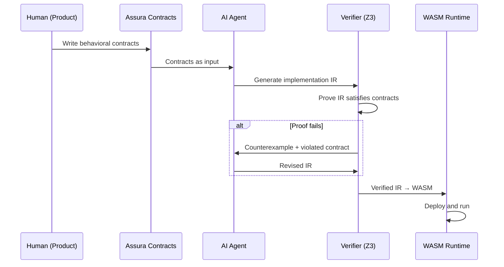
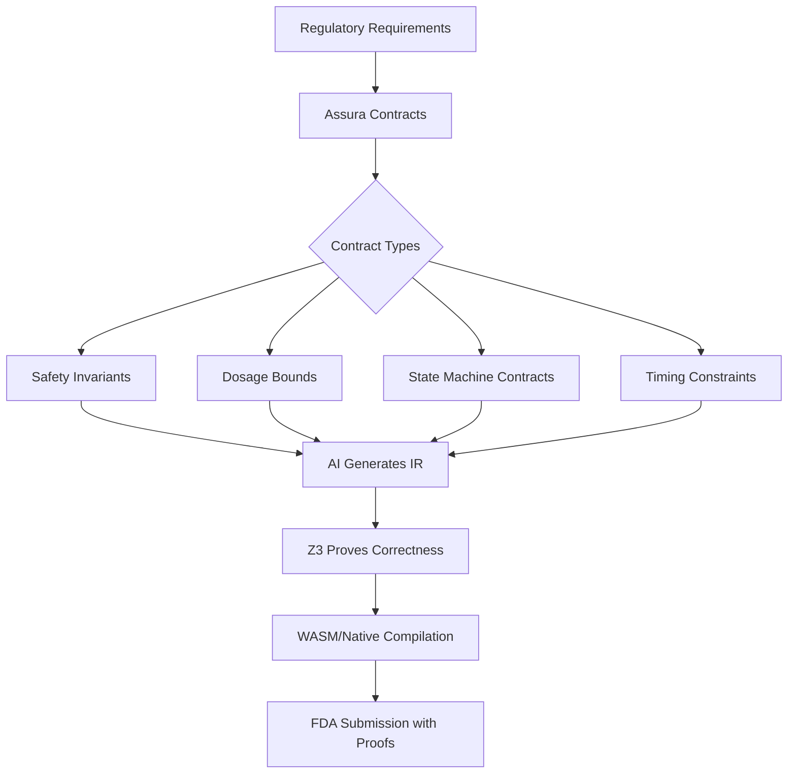
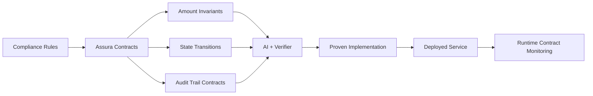
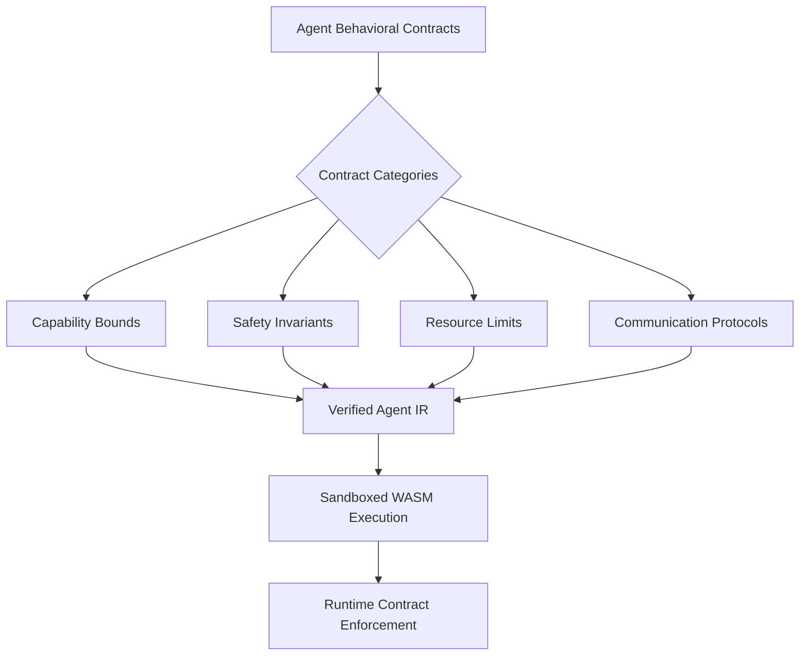
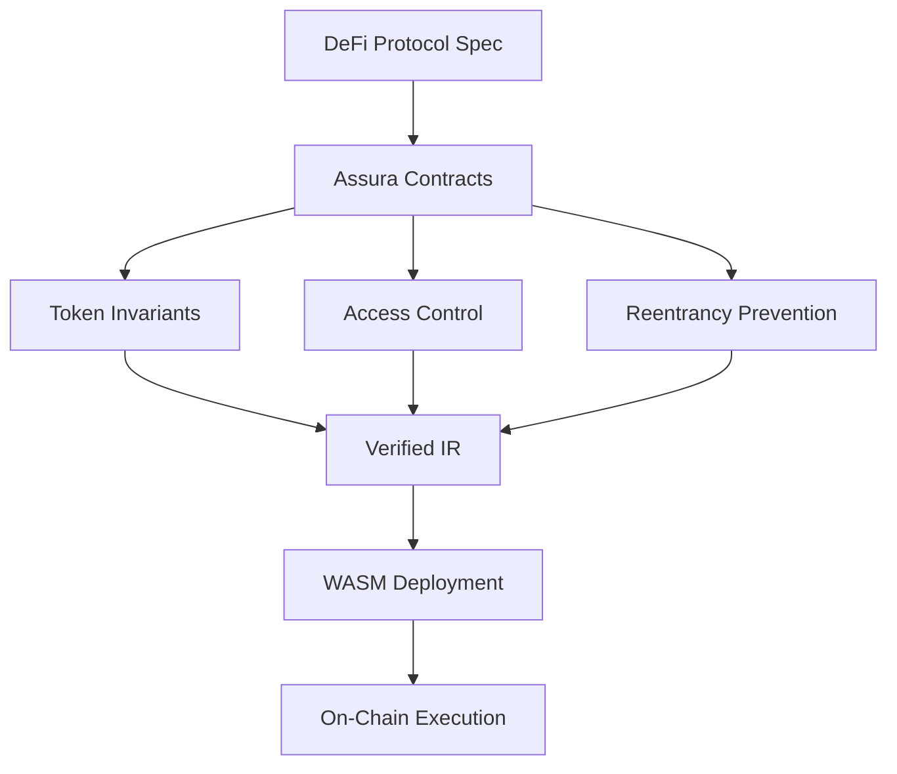
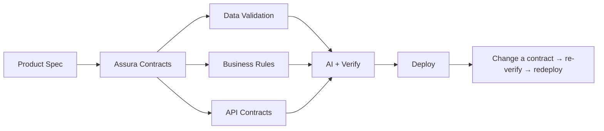

# Assura: Contract-First AI-Native Language & Verification Toolchain

> "The strictest compiler ever built. Not for humans. For AI."

## Table of Contents

- [Product Explanation](#product-explanation)
- [Why This Is Needed Now](#why-this-is-needed-now)
- [Scenarios and Use Cases](#scenarios-and-use-cases)
- [Existing Solutions and Their Gaps](#existing-solutions-and-their-gaps)
- [Resource and Feature Map](#resource-and-feature-map)
- [Competitive Analysis](#competitive-analysis)
- [Language Design: The Error Maximizer](#language-design-the-error-maximizer)
- [Architecture Decision: Build vs Extend](#architecture-decision-build-vs-extend)
  - [Interop Model: Mixing Assura with Hand-Written Code](#interop-model-mixing-assura-with-hand-written-code)
- [Technology Readiness](#technology-readiness)
- [Market Size and Timing](#market-size-and-timing)
- [Regulatory Tailwinds](#regulatory-tailwinds)
- [Launch Recommendation](#launch-recommendation)
- [Governance Recommendation](#governance-recommendation)
- [Contribution Policy](#contribution-policy)
- [Distribution Recommendation](#distribution-recommendation)
- [Community Demand Links](#community-demand-links)
- [Appendix: All Verified URLs](#appendix-all-verified-urls)

---

## Product Explanation

### The Problem

Programming languages were designed for humans to read and write. Rust
optimizes for safety through human-readable ownership semantics. Python
optimizes for readability ("there should be one obvious way to do it").
TypeScript adds readable type annotations to JavaScript. Every language
allocates the vast majority of its syntax, semantics, and design effort
to one goal: making code understandable to human eyes.

**That assumption is collapsing.**

In 2026, AI agents write the majority of new code. 85% of developers use
AI coding tools. But the trust problem is severe: only 29% trust AI code
accuracy. 66% cite "almost right but not quite" as their top frustration.
45% say debugging AI code takes longer than writing it from scratch. 45%
of AI-generated code contains security vulnerabilities.

Meanwhile, the verification approach is broken. Unit tests, the primary
quality gate for decades, are fundamentally flawed:

- They **sample** behavior (test specific inputs), they don't **prove** it
- They test **implementation details**, not **behavioral contracts**
- Each property-based test catches **~50x more bugs** than a unit test
- AI-generated tests mirror implementation bugs (if `divide(10,0)` returns
  `0` due to a bug, the generated test asserts `== 0`)
- Developers spend 30-50% of time writing tests for code that will change

The result: a developer experience where AI generates code nobody can
review, verified by tests that don't actually verify behavior, producing
software nobody trusts.

### The Solution: Assura

Assura is a two-layer system that replaces this broken pipeline:

**Layer 1: Contract Language (Human-Facing)**

A declarative specification language where humans define *what* software
must do, not *how*. Behavioral contracts, data schemas, invariants, effect
boundaries, performance bounds. Think "SQL for software behavior."

```assura
contract SafeDivision {
  input(a: Int, b: Int)
  output(result: Int)

  requires { b != 0 }
  ensures  { result * b + (a mod b) == a }
  ensures  { abs(result) <= abs(a) }
  effects  { pure }
}

contract UserService {
  state { users: Map<UserId, User> }

  operation CreateUser {
    input(name: String, email: Email)
    output(id: UserId)

    requires { name.length > 0 }
    requires { email.is_valid() }
    ensures  { users.contains(id) }
    ensures  { users[id].name == name }
    ensures  { users[id].email == email }
    ensures  { id not in old(users) }
    effects  { mutates(users), may(log) }
  }

  invariant { forall u in users.values(): u.email.is_valid() }
  invariant { users.keys().all_unique() }
}
```

This is what humans write. It is precise, readable, and complete. It
defines WHAT, never HOW. It replaces both the "spec document" and the
"test suite" in a single artifact that is mathematically verifiable.

**Layer 2: Implementation IR (AI-Facing)**

An optimized intermediate representation that AI agents generate. It is
NOT designed for human readability. It uses:

- Typed slot references instead of variable names (eliminates naming
  hallucination)
- Flat, linear structure optimized for Transformer attention patterns
- Explicit type annotations on every expression (no inference needed)
- Mandatory effect tracking (pure, IO, state mutation, network, etc.)
- Deterministic serialization (canonical form for diffing and caching)

The AI generates this IR from the contracts. The verification engine
(powered by Z3/CVC5 SMT solvers) then PROVES that the implementation
satisfies every contract. If the proof passes, the software is correct
by construction. No tests needed.

The verified IR compiles to WebAssembly (for portable, sandboxed
execution) or native code (for performance-critical paths).

**The Key Insight**

Unit tests ask: "Does this specific input produce this specific output?"
(Sampling)

Contracts ask: "For ALL valid inputs, does this property ALWAYS hold?"
(Universal proof)

One contract like `ensures { result * b + (a mod b) == a }` replaces
dozens of unit tests and proves correctness for every possible input, not
just the handful a developer thought to test.

### How It Works (End-to-End Flow)

1. **Human writes contracts** in the Assura contract language
2. **AI agent reads contracts** and generates implementation IR
3. **Verification engine** proves IR satisfies all contracts via SMT
   solving
4. If proof fails: engine returns **counterexample** (specific input that
   violates a contract), AI agent fixes and re-submits
5. If proof passes: IR is **compiled** to WASM/native and deployed
6. Contracts serve as **living documentation** and **API contracts**
   for downstream consumers

---

## Why This Is Needed Now

### The Trust Crisis in AI-Generated Code

The numbers tell a stark story:

| Metric | Value | Source |
|--------|-------|--------|
| Developers using AI coding tools | 85% | Stack Overflow 2025 |
| Trust in AI code accuracy | 29% | Developer surveys 2025 |
| "Almost right but not quite" frustration | 66% | Stack Overflow 2025 |
| AI code with security vulnerabilities | ~45% | Veracode study |
| Debugging AI code takes longer than writing | 45% | Developer surveys |
| Issues per PR: AI vs human | 10.83 vs 6.45 | CodeRabbit 2025 |
| Tech debt increase from AI code | 30-41% | Industry reports |
| Code duplication increase | 4x | GitClear 2025 |

Human code review has collapsed under the volume. Senior engineers report
4-6 extra hours per week reviewing AI code. Articles in 2025-2026 carry
titles like "Human Code Reviews Are Dead."

### The Testing Crisis

James Coplien's "Why Most Unit Testing is Waste" (2014) argued that
unit tests encode programmer assumptions, not business requirements. In
2026, this argument is stronger than ever:

- An OOPSLA 2025 study proved property-based tests catch **~50x more
  bugs** per test than unit tests
- AI-generated tests frequently mirror implementation bugs
- Test suites become maintenance burdens that resist refactoring
- Developers spend 30-50% of time on tests

> "Many assertions in unit tests are actually preconditions, postconditions,
> and invariants that belong in the production code itself."

### The Intellectual Momentum

Three landmark publications in 2025-2026 converge on the same thesis:

1. **Martin Kleppmann** (Dec 2025): "AI will make formal verification go
   mainstream" because AI makes writing proofs cheaper, AI code NEEDS
   proofs, and mathematical precision counterbalances probabilistic LLMs.

2. **Leonardo de Moura** (Z3 creator, Feb 2026): "When AI Writes the
   World's Software, Who Verifies It?" calling for formal verification
   as the natural complement to AI code generation.

3. **Ben Congdon** (Dec 2025): "The Coming Need for Formal Specification"
   arguing that formal specs are the only scalable trust mechanism when
   AI generates more code than humans can review.

### The Technology Convergence

For the first time in computing history, three capabilities exist
simultaneously:

1. **AI can generate code** at near-human quality (SWE-bench ~95%)
2. **AI can generate proofs** (AlphaProof solves math olympiad problems;
   Claude translates production C into verified Lean)
3. **Automated verification** is mature (Z3/CVC5, Dafny reaches 96%
   LLM verification success)

This convergence has never existed before. Each previous wave had at most
one of the three.

---

## Scenarios and Use Cases

### Scenario 1: API Service Development

A team needs a REST API for user management. Instead of writing code
and tests, they write contracts.



**Before Assura**: Write OpenAPI spec, write implementation, write unit
tests, write integration tests, mock external services, maintain test
fixtures, fix flaky tests, review code. **~60% of time on tests and
review.**

**After Assura**: Write contracts (the OpenAPI spec IS the contract),
AI generates + proves implementation. **Zero test code. Zero review.**

### Scenario 2: Safety-Critical Embedded System

A medical device needs verified firmware for a drug infusion pump.



**Before**: Manual code review, MISRA compliance checking, extensive
testing, months of FDA documentation.

**After**: Contracts encode safety requirements. Proofs constitute FDA
evidence. The mathematical proof IS the compliance artifact.

### Scenario 3: Financial Transaction System

A fintech needs a payment processing pipeline with regulatory compliance.



Key contracts:
- `invariant { total_debits == total_credits }` (double-entry)
- `ensures { transaction.state in {pending, settled, reversed} }`
- `effects { persists(audit_log), may(notify) }`

### Scenario 4: Multi-Agent AI System

AI agents orchestrating other AI agents need behavioral bounds.



Contracts define what each agent CAN do, MUST do, and MUST NOT do.
Proofs guarantee agents cannot exceed their authority.

### Scenario 5: Smart Contract / DeFi

Blockchain smart contracts where bugs mean irreversible financial loss.



`invariant { total_supply == sum(all_balances) }` proves token
conservation for ALL possible execution paths, not just tested ones.

### Scenario 6: Everyday Web Application

A startup building a SaaS product. No safety-critical requirements, just
wanting to ship fast with confidence.



**Before**: Write code, write tests, fix tests, refactor code, fix
tests again, add more tests, review code, merge, CI runs tests for
15 minutes.

**After**: Change the contract. AI re-generates. Verifier re-proves.
Deploy. The contract change IS the refactoring.

### Scenario 7: Rewriting a Mature C Codebase (SQLite Case Study)

An AI is tasked with rewriting SQLite (150,000 lines of C, 25 years
of engineering) into a safer, equivalent Rust implementation using
Assura. No human in the loop.

#### Key Realization: Tests Are the Spec, Not the Source Code

The initial instinct is wrong. The right approach is NOT:
- Read every C function, model its internal invariants, port the
  architecture faithfully, reproduce the pager/B-tree/WAL design

The right approach IS:
- **Match the output.** SQLite's test suite (7.2 million SQL
  statements with expected results) defines the entire behavioral
  contract. The internal architecture is an implementation detail
  the AI is free to reinvent.

The acceptance criterion is one line:

```
forall (sql, db_file) in test_suite:
  rust_sqlite(sql, db_file) == c_sqlite(sql, db_file)
```

That's the whole contract. Everything else is the AI's choice.

#### What Assura Does and Doesn't Do Here

Assura is NOT for modeling SQLite's internals. The AI does not need
to write a pager contract, a B-tree invariant, or a WAL protocol
specification. Those are all implementation details.

Assura IS for two things:

1. **Public interfaces** that must be preserved:
   - Binary file format (section FMT.1): so existing `.sqlite`
     files can be opened
   - C API signatures (section SEC.2): so existing programs link
     against the new library
   - These are non-negotiable compatibility contracts

2. **Safety properties** on whatever architecture the AI invents:
   - Linear types: no use-after-free, regardless of architecture
   - Fixed-width integers: no overflow, regardless of architecture
   - Determinism: same answer every time, regardless of internals
   - Crash recovery: survives power loss, however durability works
   - Error propagation: errors never silently swallowed

Whether the AI uses a B-tree or an LSM tree or something entirely
new doesn't matter. The tests say pass or fail.

#### The Pipeline

```
SQLite test suite (7.2M expected results)
         |
         v
    AI writes Rust code (any architecture)
    Assura compiler checks safety properties
         |
         v
    Differential test: run same SQL through
    C SQLite and Rust version, compare bytes
         |
    match? --no--> AI reads divergence, fixes, loops
         |
        yes
         v
       Ship it
```

#### What the C Source Code Is For

The C source is NOT a blueprint to copy. It is a reference the AI
reads when a test fails and it needs to understand WHY. "Test
wal-7.3 expects this output. My code returns something different.
Let me read how C SQLite handles this case to understand the
intended semantics."

The AI may solve the same problem completely differently. The C
source just explains intent when the test alone is ambiguous.

#### Why This Changes Assura's Positioning

The 28 systems programming features in the spec (sections
MEM.1-TYPE.3 (core + SQLite)) are not a modeling language for existing codebases.
They are **safety rails** that the AI applies to whatever code it
writes. The distinction:

- WRONG framing: "Use Assura to model SQLite's B-tree invariants,
  then generate an implementation that satisfies them"
- RIGHT framing: "The AI writes a database engine. Assura ensures
  it doesn't have memory bugs, data races, integer overflows,
  error swallowing, or crash corruption. The test suite ensures
  it produces correct results."

Contracts describe WHAT the output must be (from tests) and
WHAT must never go wrong (from Assura). They do NOT prescribe
HOW the code works internally.

#### Timeline: AI-Only, Assura Complete

| Week | Milestone |
|---|---|
| 1 | Differential testing harness. AI starts writing code |
| 2-4 | Core SQL working. Pass rate climbing toward 90% |
| 5-8 | Edge cases, type coercion, collation. 90% -> 99% |
| 9-11 | Long tail: obscure pragmas, extensions. 99% -> 99.99% |
| 12 | File format compatibility. C API shim. Performance. Ship |

12 weeks, not 12 months. Because the AI is chasing test failures,
not modeling internal architecture.

#### How the .assura Files Actually Get Filled

The initial instinct is wrong again. You might think the AI writes
thousands of lines of contracts upfront, modeling the pager, B-tree,
WAL, etc. It doesn't. The contracts are thin and incremental.

**Upfront contracts (~500 lines total):**

Only two things must be specified before coding:

1. **File format** (~200 lines): Copied from SQLite's published
   file format documentation. Non-negotiable for compatibility.
   Uses binary format contracts (FMT.1).

2. **C API** (~300 lines): Copied from `sqlite3.h`. Function
   signatures, error codes, threading model. Non-negotiable for
   drop-in replacement. Uses FFI contracts (SEC.2).

**Everything else: NOTHING upfront.**

The AI does not write a pager contract, a B-tree contract, or a
WAL contract before coding. Those internal designs don't exist yet.
The AI invents them while writing the implementation.

**Safety annotations added incrementally during coding:**

As the AI writes Rust code targeting test pass rate, it adds
Assura annotations on its own code:

```rust
// AI writes a page cache, adds safety annotations inline:

#[assura::refined(pin_count > 0)]
fn read_data(&self) -> &[u8] { ... }

#[assura::monotonic(non_decreasing)]
fn advance_counter(&mut self, new: u32) { ... }

#[assura::propagate(SQLITE_CORRUPT)]
fn read_page(&self, page: u32) -> Result<Page, SqlError> { ... }
```

Each annotation makes the Assura compiler check a property across
ALL possible inputs, not just the 7.2M test inputs. The AI adds
them because they catch bugs faster than running the full test
suite:
- An integer overflow on databases larger than 2TB (no test)
- An error code swallowed in a rare error-during-error path (no test)
- A counter that decrements during a specific crash sequence (no test)

**The 28 features are annotation categories, not upfront specs:**

| Feature | Annotation Form | When Added |
|---|---|---|
| Fixed-width (MEM.2) | `#[refined(v <= U32::MAX)]` | When AI writes integer code |
| Linear types | Ownership on page handles | When AI writes a cache |
| Crash recovery (STOR.1) | `#[crash_point]` on fsync | When AI writes durability |
| Error propagation (TYPE.3) | `#[propagate(CORRUPT)]` | When AI writes error handling |
| Monotonic (STOR.5) | `#[monotonic]` on counters | When AI writes counter logic |
| Complexity (PERF.2) | `#[complexity(O(log N))]` | When AI writes search code |

**The dual feedback loop:**

```
Tests (7.2M SQL statements):
  "Does the code produce correct output?"

Assura compiler (safety annotations):
  "Does the code produce correct output for ALL
   possible inputs, including ones no test covers?"
```

Both run during development, not sequentially. The tests catch
behavioral bugs. Assura catches safety bugs the tests miss.

**What the 8,602-line SPECIFICATION.md actually is:**

It defines what Assura CAN check (28 annotation categories, 176
error codes, verification strategies). It does NOT define what a
specific project MUST declare upfront. The spec is the compiler's
capability set. A project uses whichever annotations it needs,
added incrementally, not planned in advance.

---

## Existing Solutions and Their Gaps

### Vera (veralang.dev)

- **What**: Language for LLMs with no variable names, mandatory contracts,
  Z3 verification, WASM compilation
- **Stars**: ~150 (GitHub); ~111 points on HN
- **Status**: Early prototype, solo developer (Allan)
- **Gap**: No ecosystem, no toolchain beyond compiler, no IDE support,
  no standard library. Narrow scope (individual functions, not systems).
  Contract language is embedded in implementation, not separated.

### MoonBit (moonbitlang.com)

- **What**: Language co-designed with LLMs, Transformer-optimized syntax,
  fast compiler, formal verification added April 2026
- **Users**: ~200K developers, ~5K ecosystem packages
- **Funding**: IDEA Research (Shenzhen), significant backing
- **Team**: ~30+ engineers
- **Gap**: Still human-readable. Verification was bolted on late (Apr
  2026), not foundational. Positioned as a general-purpose language, not
  a contract-first paradigm shift. Does not separate contract from
  implementation.

### Dafny (Microsoft Research)

- **What**: Verification-aware language with pre/post conditions, loop
  invariants, ghost code, Z3 backend
- **Stars**: ~4K GitHub
- **Status**: Mature, actively maintained by Microsoft
- **Verification**: Best LLM success rates (82-96%)
- **Gap**: Designed for humans, not AI. Single-layer (contracts embedded
  in implementation). Academic roots make adoption difficult. No WASM
  target. Microsoft Research project, not a product.

### BAML (BoundaryML)

- **What**: DSL for typed contracts between AI agents
- **Funding**: YC-backed
- **Stars**: ~5K+ GitHub
- **Gap**: Only covers agent I/O boundaries, not general software
  verification. No formal proofs. A contract schema, not a language.

### Aeon (University of Lisbon)

- **What**: Refinement types + Z3 + LLM synthesis
- **Status**: Academic research prototype
- **Gap**: Narrow scope (synthesizing small functions). Not a full
  language or toolchain. Research project, not a product.

### Nanolang (Jordan Hubbard)

- **What**: Minimal 18-keyword language with mandatory shadow tests
- **Status**: Prototype, ~200 stars
- **Gap**: Transpiles to C (not WASM). Shadow tests are still tests,
  not mathematical proofs. No formal verification.

### Vow (vow-lang.com)

- **What**: AI-native verification language
- **Status**: Very early, limited public information
- **Gap**: Unclear scope and progress

### Edict (Sowiedu)

- **What**: AI-agent PL with Z3 verification
- **Status**: Early prototype
- **Gap**: Limited adoption, unclear differentiation

### The Gap Nobody Fills

No existing project combines:

1. **Separated contract layer** (human-facing spec language)
2. **AI-native implementation layer** (machine-optimized IR)
3. **Integrated formal verification** (Z3/CVC5 proving contracts hold)
4. **WASM compilation** (portable, sandboxed execution)
5. **End-to-end toolchain** (spec → generate → prove → compile → deploy)

Every competitor has 1-2 of these. Nobody has all 5.

---

## Resource and Feature Map

| Feature | Priority | Phase | Description |
|---------|----------|-------|-------------|
| Contract language parser | Critical | 1 | Parse behavioral specs into AST |
| Contract type system | Critical | 1 | Validate contract well-formedness |
| IR specification | Critical | 1 | Define the AI-native IR format |
| Z3 integration | Critical | 1 | SMT solver for contract verification |
| IR → WASM compiler | Critical | 1 | Compile verified IR to WebAssembly |
| Counterexample generation | Critical | 1 | Show specific failing inputs on proof failure |
| AI agent interface | Critical | 1 | API for AI agents to submit IR for verification |
| Contract stdlib | High | 1 | Common contract patterns (collections, strings, etc.) |
| LSP for contract language | High | 2 | IDE support for writing contracts |
| Runtime contract monitoring | High | 2 | Check contracts at runtime for effects that can't be statically proven |
| Contract composition | High | 2 | Import/extend/compose contracts |
| Effect system | High | 2 | Track IO, state, network effects |
| IR optimizer | Medium | 2 | Optimize IR before WASM compilation |
| Property-based test generation | Medium | 2 | Generate PBT suites from contracts as supplementary check |
| Native compilation backend | Medium | 3 | LLVM backend for native code |
| Distributed system contracts | Medium | 3 | Contracts for multi-service architectures |
| Temporal contracts | Medium | 3 | Time-dependent behavioral specifications |
| Performance contracts | Low | 3 | Specify and verify performance bounds |
| Probabilistic contracts | Low | 4 | Contracts for ML/statistical code |
| Formal proof export | Low | 4 | Export proofs in Lean/Coq format for independent verification |

---

## Competitive Analysis

| Feature | Assura | Vera | MoonBit | Dafny | BAML | Aeon |
|---------|--------|------|---------|-------|------|------|
| Contract-first design | Yes | Partial | No | Partial | Partial | Yes |
| Separate spec/impl layers | Yes | No | No | No | N/A | No |
| AI-native IR | Yes | Partial | Partial | No | No | No |
| Formal verification | Z3/CVC5 | Z3 | Added late | Z3 | No | Z3 |
| WASM target | Yes | Yes | Yes | No | No | No |
| Human readability goal | Contract only | No | Yes | Yes | Yes | Yes |
| End-to-end toolchain | Goal | No | Partial | Partial | Partial | No |
| LLM verification rate | TBD | TBD | TBD | 82-96% | N/A | TBD |
| Ecosystem maturity | New | Prototype | Growing | Mature | Growing | Research |
| Funding | TBD | None | Significant | Microsoft | YC | Academic |

### Assura's Differentiation

1. **Two-layer separation**: The only system where contracts and
   implementation are fundamentally different languages for different
   audiences (humans vs AI).
2. **Contracts replace tests entirely**: Not "contracts plus tests" but
   "contracts instead of tests." Mathematical proof, not sampling.
3. **AI-native from day one**: The IR is designed for Transformer
   architectures, not retrofitted for them.
4. **WASM-first execution**: Portable, sandboxed, verifiable execution
   environment.

---

## Language Design: The Error Maximizer

### Core Philosophy

The language is NOT designed to be easy. It is designed to **catch the
most categories of bugs at compile time.** Every compiler error is
feedback AI uses to fix the code. More errors = more feedback = more
correct code.

**The key insight:** Every feature that makes a language "too hard for
humans" (dependent types, refinement types, linear types, effect
tracking, mandatory annotations) becomes a **feature** when AI writes
the code. AI doesn't care about verbosity. AI cares about feedback.

A PLDI 2025 paper (Mundler et al.) proved this empirically: integrating
type checking into the LLM token generation loop cut compilation errors
by **74.8%**. The stricter the type system, the better AI performs.

Python feels easy for AI but produces false signal: code runs, seems
fine, hides bugs silently. Rust is better because the borrow checker
rejects bad code. Assura takes this to the extreme: the compiler rejects
everything that violates any layer of the contract.

### Error Categories: Rust vs Assura

| Error Category | Rust | Assura | Example |
|---|---|---|---|
| Type mismatch | Yes | Yes | Expected `String`, got `Int` |
| Memory safety | Yes (borrow checker) | Yes (linear types) | Use after move |
| Null safety | Yes (Option) | Yes (totality) | Unhandled None |
| Missing pattern | Yes (match) | Yes (totality) | Non-exhaustive match |
| Business invariant | **No** | **Yes** | `total != sum(items)` |
| State machine violation | **No** | **Yes** | Order shipped without tracking |
| Effect violation | **No** | **Yes** | Pure function does IO |
| Information flow | **No** | **Yes** | PII leaked to log |
| Protocol violation | **No** | **Yes** | TCP read after close |
| Resource exhaustion | **No** | **Yes** | Unbounded allocation in loop |
| Termination | **No** | **Yes** | Infinite loop detected |
| Authorization | **No** | **Yes** | Admin-only data in public API |

Rust catches ~4 categories. Assura catches ~12+. Each additional
category is another class of bugs AI gets told about and can fix.

### Type System Features (Sourced from Research)

#### 1. Dependent Types (from Idris 2, F*, ATS)

Types that depend on values. The compiler knows the length of a list,
the range of an integer, the shape of a matrix at compile time.

```
// Compiler rejects: head on empty vector is a TYPE ERROR
fn first(v: Vec<T, n>) -> T
  where n > 0   // dependent type: n must be positive

// Compiler rejects: matrix multiply with wrong dimensions
fn matmul(a: Matrix<m, n>, b: Matrix<n, p>) -> Matrix<m, p>
```

**What it catches that Rust can't:** Array out of bounds, empty
collection access, dimension mismatches. All caught at compile time,
not runtime.

Source: Idris 2 (idris-lang.org), F* (fstar-lang.org), ATS (ats-lang.org)

#### 2. Refinement Types (from Liquid Haskell, Flux)

Types with logical predicates attached. The compiler uses an SMT solver
(Z3) to verify the predicates hold.

```
type PositiveInt = { x: Int | x > 0 }
type ValidEmail  = { s: String | is_email(s) }
type Percentage  = { x: Float | 0.0 <= x && x <= 1.0 }

fn apply_discount(price: PositiveInt, rate: Percentage) -> PositiveInt
```

**What it catches:** Range violations, invalid data, precondition
failures. The compiler produces counterexamples: "fails when
rate = 1.5" with the specific input that breaks the constraint.

Source: Liquid Haskell (ucsd-progsys.github.io), Flux for Rust
(flux-rs.github.io)

#### 3. Typestate (from Plaid, Rust typestate pattern)

The TYPE of a variable changes based on what operations have been
performed. The compiler tracks state transitions.

```
type File<State> where State in { Closed, Open, Reading }

fn open(f: File<Closed>) -> File<Open>
fn read(f: File<Open>) -> (File<Reading>, Bytes)
fn close(f: File<Open | Reading>) -> File<Closed>

// COMPILER ERROR: cannot read a closed file
// fn bad(f: File<Closed>) { read(f) }  // Type error!
```

Extended to business objects:

```
type Order<State> where State in { Created, Paid, Shipped, Delivered }

fn ship(o: Order<Paid>, tracking: NonEmpty<String>) -> Order<Shipped>
// COMPILER ERROR: cannot ship unpaid order
// COMPILER ERROR: cannot ship without tracking number
```

**What it catches:** Protocol violations, invalid state transitions,
missing preconditions for transitions. Every business state machine
violation becomes a type error.

Source: Plaid language (CMU), Rust typestate pattern, Session types

#### 4. Effect Types (from Koka, Unison, OCaml 5)

Every function declares what side effects it can perform. The compiler
rejects code that performs undeclared effects.

```
fn calculate_total(items: List<Item>) -> Int
  effects: pure    // NO side effects allowed

fn save_order(o: Order) -> OrderId
  effects: database.write, log.info
  // COMPILER ERROR if this function touches the network

fn process_payment(o: Order) -> PaymentResult
  effects: payment.charge, database.write
  // COMPILER ERROR if this function reads the filesystem
```

**What it catches:** Functions that secretly do IO, touch the network,
write to disk, or access resources they shouldn't. Every undeclared
effect is a compiler error.

Source: Koka (koka-lang.github.io), Unison (unison-lang.org)

#### 5. Information Flow Types (from Jif, FlowCaml)

Types track where data came from and where it can go. The compiler
prevents sensitive data from flowing to unsafe sinks.

```
type UserInput    = String<taint: untrusted>
type PII          = String<label: sensitive>
type LogMessage   = String<label: public>
type SqlQuery     = String<taint: sanitized>

// COMPILER ERROR: untrusted input in SQL query
fn bad_query(input: UserInput) -> SqlQuery { input }

// COMPILER ERROR: PII in log message
fn bad_log(name: PII) -> LogMessage { "User: " + name }
```

**What it catches:** SQL injection, XSS, PII leaks to logs, sensitive
data in error messages. All at compile time. Ur/Web proved this works:
it prevents SQL injection, XSS, and CSRF at the type level.

Source: Jif (Cornell), FlowCaml, Ur/Web (ur-web.org)

#### 6. Quantitative Types (from Granule, QTT)

Types that track how many times a resource is used. The compiler ensures
resources are used exactly the right number of times.

```
fn use_connection(conn: DbConnection<uses: 1>) -> Result
  // conn can be used EXACTLY once, then must be released
  // COMPILER ERROR if conn is used twice
  // COMPILER ERROR if conn is not used (leaked)
```

**What it catches:** Resource leaks, double-free, connection pool
exhaustion, file handle leaks.

Source: Granule (granule-project.github.io), Quantitative Type Theory

#### 7. Totality Checking (from Idris 2, Agda)

The compiler proves every function terminates and handles all possible
inputs. No infinite loops. No unhandled cases. No partial functions.

```
// COMPILER ERROR: not total - missing case for Empty
fn head(list: List<T>) -> T {
  match list {
    Cons(x, _) => x
    // Missing: Empty case
  }
}

// COMPILER ERROR: not total - recursion may not terminate
fn bad_loop(n: Int) -> Int {
  bad_loop(n)  // no progress toward base case
}
```

**What it catches:** Infinite loops, unhandled cases, partial functions
that crash on unexpected input.

Source: Idris 2 (idris-lang.org), Agda (agda.readthedocs.io)

### Compiler Design for AI

The compiler produces **structured JSON diagnostics** designed for AI
consumption, not human reading:

```json
{
  "error_code": "A0412",
  "severity": "error",
  "category": "invariant_violation",
  "constraint_violated": {
    "contract": "OrderService.PlaceOrder",
    "clause": "order.total == sum(item.price * item.qty)",
    "expected": "total computed from items",
    "actual": "total set to hardcoded 0.0"
  },
  "primary_location": {
    "file": "src/orders.as",
    "line": 47, "col": 5,
    "source_text": "order.total = 0.0"
  },
  "counterexample": {
    "inputs": {"items": [{"price": 10, "qty": 2}]},
    "expected_total": 20,
    "actual_total": 0
  },
  "suggested_fixes": [
    {
      "description": "Compute total from items",
      "confidence": 0.95,
      "replacement": "order.total = items.map(|i| i.price * i.qty).sum()"
    }
  ]
}
```

Key design principles:
- **Structured JSON output** is the primary interface (not human text)
- **Expected vs actual** on every constraint error
- **Counterexamples with concrete inputs** on every invariant violation
- **Suggested fixes with confidence scores** for AI to rank strategies
- **Stable error codes** so AI can build fix-pattern databases
- **Multi-span context** showing the causal chain

### Layered Verification (Speed vs Depth)

The compiler verifies in layers, fastest first:

| Layer | Time | What It Checks | AI Iterations |
|---|---|---|---|
| 1. Syntax + Types | < 50ms | Parse, type match, names | 1-2 |
| 2. Flow Analysis | < 200ms | Null safety, exhaustiveness, typestate | 2-3 |
| 3. Effects + Linear | < 500ms | Effect violations, resource leaks | 2-4 |
| 4. Refinement Types | < 5s | Range violations, preconditions (SMT) | 3-6 |
| 5. Full Verification | < 60s | Invariants, temporal properties (SMT) | 5-10 |

AI iterates on Layer 1-3 at sub-second speed. Only escalates to
Layer 4-5 when the fast checks pass. This means most AI fix iterations
take under 500ms, enabling 20+ iterations per second.

### The Implementation Target (Not Rust)

The language AI generates code in is NOT human-readable. Design
priorities:

1. **Flat syntax** (MoonBit proved this helps Transformers)
2. **No variable names** (Vera proved this reduces hallucination)
3. **Complete type annotations** (no inference, maximum checking)
4. **Mandatory effect annotations** on every function
5. **Mandatory pre/post conditions** on every function
6. **Canonical serialization** (one way to write everything, no style)

The result is code no human would want to read. But every line carries
maximum information for the compiler to check. Every annotation is
another opportunity to catch a bug.

### What Humans Write: The Contract Language

Humans write contracts in a readable, declarative language. This is
the ONLY artifact humans interact with:

```
service OrderService {
  // Data shapes
  type Order { items: List<Item>, total: Money, status: OrderStatus }
  type Item { description: String, price: Money, qty: PositiveInt }

  // State machine
  states: Created -> Paid -> Shipped -> Delivered
  states: Created -> Cancelled
  states: Paid -> Refunded
  transition Shipped requires: tracking_number is present

  // Operations
  operation PlaceOrder {
    input: { items: List<Item>, payment: PaymentMethod }
    output: { orderId: OrderId, status: Created }
    errors: [ValidationError, PaymentError]

    // Behavioral contracts
    ensures: order.total == sum(item.price * item.qty for item in items)
    ensures: items.length >= 1
    ensures: all items have valid prices (> 0)

    // Effect bounds
    effects: database.write, payment.charge, email.send
    must-not: filesystem, network.arbitrary

    // Business rules
    rule: if customer.tier == GOLD then discount(0.10)
    rule: if order.total > 10000 then requires(manager_approval)

    // Security
    data-flow: payment.card_number must-not-appear-in logs, errors, responses
  }
}
```

This is what replaces Smithy + Rust. One language that captures shapes,
state machines, behavioral contracts, effects, business rules, and
security constraints. The AI reads this and generates maximally-checked
implementation code. The compiler rejects everything that violates any
clause.

### Expanded Bug Categories: From 12 to 22+

Phase 2 research uncovered 10 additional categories that can be caught
at compile time using proven or near-proven type system features:

| # | Category | Mechanism | Maturity | Example Bug Caught |
|---|----------|-----------|----------|-------------------|
| 13 | Concurrency / data races | Reference capabilities (Pony), Session types | Proven | Two workers process same employee's paystub simultaneously |
| 14 | Numerical precision | Units of measure (F#), fixed-point types (Ada) | Proven | Using float for money, adding USD to EUR |
| 15 | Temporal ordering | Typestate sequences, LTL-as-types | Partial | Processing December paystub before November |
| 16 | Idempotency | Linear types (use exactly once) | Proven | Same paystub processed twice, double-paying |
| 17 | Privacy / GDPR | Purpose-labeled information flow | Research | SSN collected for payroll used for marketing |
| 18 | Schema evolution | Migration types, variance rules | Proven | New code breaks old paystub records |
| 19 | Crash safety | Linear compensation tokens, typestate | Partial | System crashes after debiting but before crediting |
| 20 | Audit trail completeness | Effect pairing (Mutate requires Audit) | Partial | Salary change with no audit record |
| 21 | Serialization round-trip | Type-level round-trip theorems (Vest) | Proven | Data corruption during save/load |
| 22 | API evolution | Covariance/contravariance rules | Proven | API change breaks existing payroll clients |
| 23 | Complexity bounds | AARA (automatic resource analysis) | Proven | O(n^2) algorithm where O(n) was specified |
| 24 | Multi-service protocol | Multiparty session types (Choral) | Proven | Payroll service and tax service disagree on protocol |
| 25 | Observability | Required effect annotations (OpenTelemetry) | Proven | Operation completes with no trace/metric emitted |
| 26 | i18n completeness | Locale-tagged string types | Partial | User-facing string not translated |
| 27 | Regulatory compliance | Compliance predicates as refinement types | Partial | SOX violation: approver is same as requester |

#### How these apply to the paystub scenario

```
service PaystubService {

  // ---- EXISTING LAYERS 1-7 (shapes, API, behavior, state, effects,
  //      security, business rules) ----
  // ... (as before) ...

  // ---- LAYER 8: Concurrency (reference capabilities) ----
  // Employee record is `exclusive` - only one processor at a time
  concurrency: Employee is exclusive
  concurrency: PaystubProcessing is actor-isolated

  // ---- LAYER 9: Numerical Precision (units of measure) ----
  type Money = FixedDecimal<2, USD>        // no floats, no currency mixing
  type TaxRate = FixedDecimal<4, Percent>  // rate and money are different
  // COMPILER ERROR: Money<USD> + Money<EUR>
  // COMPILER ERROR: Money * Money (nonsensical unit)
  // COMPILER ERROR: TaxRate used where Money expected

  // ---- LAYER 10: Temporal Ordering (typestate sequences) ----
  ordering: PayPeriod must be processed in chronological order
  ordering: YTD accumulation requires all prior periods finalized
  // COMPILER ERROR: process(December) before process(November)

  // ---- LAYER 11: Idempotency (linear types) ----
  idempotent: ProcessPaystub consumes PaystubToken(linear)
  // COMPILER ERROR: token used twice (double-processing)
  // COMPILER ERROR: token not used (dropped paystub)

  // ---- LAYER 12: Privacy / Purpose Limitation ----
  privacy: employee.ssn purpose {payroll, tax_reporting, w2_generation}
  privacy: employee.bank_account purpose {direct_deposit}
  // COMPILER ERROR: ssn used in analytics function (wrong purpose)
  // COMPILER ERROR: bank_account in employee directory (wrong purpose)
  retention: paystub_pdf retain 7_years then delete

  // ---- LAYER 13: Schema Evolution ----
  evolution: Paystub v2 adds field overtime_hours: Natural = 0
  evolution: Paystub v2 removes field legacy_code
  // COMPILER ERROR: removing required field without migration
  // COMPILER ERROR: reusing deleted field number

  // ---- LAYER 14: Crash Safety (compensation tokens) ----
  transaction: CalculateTaxes {
    on_crash: rollback YTD accumulation
    on_crash: mark paystub as Unprocessed
  }
  // COMPILER ERROR: state mutation outside transaction boundary
  // COMPILER ERROR: missing compensation handler for debit operation

  // ---- LAYER 15: Audit Trail ----
  audit: every mutation to Employee requires AuditEntry
  audit: every mutation to Paystub requires AuditEntry
  audit: salary changes require AuditEntry with approver != requester
  // COMPILER ERROR: Employee.salary modified without audit effect

  // ---- LAYER 16: Serialization Safety ----
  serialization: Paystub roundtrip guarantee
  // COMPILER PROVES: deserialize(serialize(paystub)) == paystub

  // ---- LAYER 17: API Evolution ----
  api_compat: v2 of GetPaystub may add response fields
  api_compat: v2 of GetPaystub may not remove response fields
  api_compat: v2 of GetPaystub may not add required request fields
  // COMPILER ERROR: breaking change without version bump

  // ---- LAYER 18: Complexity Bounds ----
  performance: CalculateTaxes is O(n) in deduction count
  performance: GenerateReport is O(n) in paystub count
  // COMPILER ERROR: nested loop makes this O(n^2)

  // ---- LAYER 19: Multi-Service Protocol ----
  protocol PayrollTaxSync {
    PayrollService -> TaxService: CalculateRequest
    TaxService -> PayrollService: TaxResult
    PayrollService -> TaxService: Confirm | Reject
  }
  // COMPILER ERROR: PayrollService sends Confirm before receiving TaxResult

  // ---- LAYER 20: Observability ----
  observe: every operation emits trace_span with employee_id
  observe: CalculateTaxes emits metric tax_calculation_duration
  // COMPILER ERROR: ProcessPaystub returns without emitting trace

  // ---- LAYER 21: Regulatory Compliance ----
  compliance SOX {
    rule: salary_change.approver != salary_change.requester
    rule: payroll_run requires dual_approval if total > 100_000
  }
  compliance FLSA {
    rule: if hours > 40 then overtime_rate >= 1.5 * regular_rate
  }
  // COMPILER ERROR: overtime calculated at 1.0x (FLSA violation)
}
```

### Comparison: Smithy + Rust vs Assura

| Dimension | Smithy + Rust | Assura |
|---|---|---|
| Shape contracts | Smithy (good) | Built-in (equivalent) |
| Behavioral contracts | **None** | Ensures/requires clauses |
| State machines | **None** | First-class typestate |
| Effect tracking | **None** | Mandatory effect types |
| Business rules | **None** | Rule clauses |
| Security/data flow | **None** | Information flow types |
| Implementation language | Rust (fights AI) | AI-native IR (maximizes feedback) |
| Compiler errors for AI | Rust diagnostics (good) | Structured JSON with counterexamples |
| Error categories caught | ~4 | **~27** |
| AI fix success pattern | 74% on borrow errors | Target: 90%+ on all categories |

### Prior Art: Languages That Catch The Most

| Language | Human Difficulty | Bugs Caught | Key Lesson |
|---|---|---|---|
| **F*** | Extreme | Most of any language | Combines dependent + refinement + effects |
| **ATS** | Extreme | Memory + logic + types | Dependent types for systems programming |
| **Idris 2** | Very Hard | Totality + dependent | Proves termination and exhaustiveness |
| **Liquid Haskell** | Hard | Refinement predicates | SMT-backed compile-time checking |
| **SPARK/Ada** | Hard | Pre/post + flow + info | Industrial formal verification |
| **Ur/Web** | Hard | SQL injection + XSS + CSRF | Security at type level |
| **Koka** | Moderate | Effects | Row-polymorphic algebraic effects |

Every one of these is "too hard for humans." Every one would be
excellent for AI. Assura combines their best features into one language
because the user (AI) doesn't care about difficulty, only about the
richness of compiler feedback.

---

## Architecture Decision: Build vs Extend

### The Question

Do we need our own compiler from scratch, or can we build Assura on
top of Rust or another existing language?

### Approaches Evaluated

We researched 8 approaches in depth, analyzing implementation effort,
what each gives for free, fundamental limitations, and maintenance
burden.

#### 1. Rust Proc Macros + Verification Tools (Flux, Prusti, Verus, Kani)

Proc macros run before type checking and see tokens, not types. They
cannot add refinement types, effect tracking, dependent types, or
information flow analysis. Each verification tool (Flux for refinement
types, Prusti for pre/post conditions, Verus for linear ghost types,
Kani for bounded model checking) covers some of our 27 categories but
none covers all, and they cannot be composed into a single coherent
type system.

**Verdict: Dead end.** Cannot extend Rust's type system. Hits a
fundamental ceiling immediately for anything beyond Rust's existing
4 error categories.

#### 2. Fork the Rust Compiler (rustc)

rustc is ~600-800K lines of Rust with tightly coupled parser, type
checker, trait solver, and borrow checker. Adding effect types,
dependent types, or information flow tracking requires invasive changes
across many passes. Real-world forks (rust-gpu, Rust Unchained) only
modified narrow aspects (codegen, orphan rule) and still found
maintenance painful. gccrs chose to rewrite from scratch rather than
fork rustc.

**Verdict: Trap.** The maintenance burden (perpetual rebase, ~30-50% of
team capacity) would consume a small team. Only viable if the language
were a minor Rust dialect.

#### 3. LLVM Frontend (New Language, LLVM Backend)

LLVM handles the hardest 40% of compiler engineering (optimization +
codegen for 20+ architectures). Swift, Rust, and Zig all use it. We
would build our entire frontend (parser, type checker, effect system,
IR, lowering) and hand off to LLVM for code generation.

**Verdict: Strong option for maximum freedom.** World-class codegen for
free, but requires building everything above LLVM IR. C++ interface
complexity mitigated by Rust bindings (Inkwell). 6-9 month prototype
timeline.

#### 4. Cranelift Frontend (Wasmtime's Compiler Backend)

Cranelift is a Rust-native compiler backend (~200K LOC vs LLVM's 20M+).
10x faster codegen than LLVM, within 10-20% runtime performance.
Production-ready (Wasmtime, Firefox). Native WASM support. Simpler API.

**Verdict: Excellent for development builds.** Best paired with LLVM
for release builds (Cranelift for dev speed, LLVM for production perf).
This is how Rust itself is structured (`rustc_codegen_cranelift`).

#### 5. Transpile to Rust (Recommended)

The Assura compiler does all novel work (parsing contracts, type
checking with effects/refinements/information flow/typestate/linear
types, Z3 verification) as its own frontend. Then it generates Rust
source code. `rustc` compiles the generated Rust to native/WASM.

```
Human writes contract (.assura)
    -> AI generates implementation (.assura-impl)
    -> Assura compiler (Rust binary):
        1. Parse contract + implementation
        2. Type check (effects, refinements, info flow, typestate,
           linear types, dependent types)
        3. Verify against Z3/CVC5 (refinement predicates, invariants)
        4. Generate Rust source (.rs) + Cargo.toml
    -> rustc compiles generated Rust -> native binary / WASM
```

**Why this wins:**

- **All effort on the novel parts.** Zero backend work. The entire team
  focuses on the type system, effect system, verification engine, and
  contract language. No time spent on register allocation, instruction
  selection, or optimization passes.

- **Double safety net.** The Assura compiler verifies all 27 categories.
  Then `rustc` borrow-checks the generated code as a second layer. If
  Assura's compiler has a bug that lets something through, Rust catches
  it.

- **Proven model.** Gleam transpiles to Erlang and gets BEAM VM + OTP
  for free. TypeScript transpiles to JavaScript and gets the browser
  runtime for free. Both are successful at scale.

- **Ecosystem access.** Generated Rust code can use any crate from
  crates.io. AI doesn't need to rewrite every library; it wraps them
  with Assura contracts.

- **Fastest prototype.** 3-6 months to a working compiler with 1-3
  people, vs 9-18 months from scratch.

- **Low maintenance.** Rust is stable and backward-compatible. No
  perpetual rebase burden.

**Known tradeoffs:**

- Source mapping: `rustc` errors reference generated `.rs` files, not
  original `.assura` source. Needs source-map post-processing.
- Compilation speed: Two compilation passes (Assura then rustc). Can be
  mitigated later by adding a Cranelift backend for dev builds.
- Semantic gap: If Assura's memory model diverges from Rust's ownership,
  generated code may use `Rc`/`Arc` heavily. Acceptable for v1.

**Verdict: Best path for Assura.** Maximum leverage for a small team.
Study Gleam's compiler architecture as the reference implementation.

#### 6. Build on Dafny

Dafny provides a full verification pipeline (Dafny -> Boogie -> Z3) and
multi-target compilation (C#, Java, JS, Go, Python, Rust). But Dafny
has its own fixed type system that cannot be extended with our custom
features (effect types, information flow, linear types). Two
translation layers (Assura -> Dafny -> target) each lose information.

**Verdict: Good for verification-heavy domains; poor fit as Assura's
foundation.** Dafny's type system, not ours, would constrain what can
be verified. Better suited as inspiration than infrastructure.

#### 7. Fork OCaml 5

OCaml 5 has runtime algebraic effect handlers and a manageable compiler
(~200K LOC). ML type inference provides a strong foundation. But OCaml
is GC-based (no ownership model), has a smaller ecosystem than Rust,
and the typed effect system is still a research prototype (not in
mainline).

**Verdict: Underrated option if the language were functional/ML-like.**
But Assura's systems-level ambitions (WASM, native, no GC) make this a
poor fit.

#### 8. From Scratch (Custom Everything)

Maximum freedom, maximum work. No inherited constraints, but also no
inherited infrastructure. Requires building lexer, parser, type
checker, IR, optimizer, and codegen from zero.

**Verdict: Only justified for v2+ if transpile-to-Rust hits
fundamental limits.** Not the right starting point.

### Comparison Matrix

| Approach | Time | Free | Limits | Maint. |
|---|---|---|---|---|
| Rust proc macros | 2-4 mo | Rust type system | Can't extend types | Low |
| Fork rustc | 6-12+ mo | Entire Rust compiler | Perpetual rebase | Very High |
| LLVM frontend | 6-9 mo | World-class codegen | C++ complexity | Medium |
| Cranelift frontend | 5-8 mo | Fast codegen, Rust API | Less optimization | Medium |
| **Transpile to Rust** | **3-6 mo** | **Borrow checker, Cargo, LLVM** | **Source mapping** | **Low** |
| Build on Dafny | 4-6 mo | Verification pipeline | Dafny constrains types | Medium |
| Fork OCaml 5 | 4-8 mo | Effects, ML inference | GC-based, no ownership | Medium |
| From scratch | 9-18 mo | Maximum freedom | Maximum work | High |

### Decision: Transpile to Rust

Assura v1 will transpile to Rust. The compiler is written in Rust and
generates Rust source code. All novel type system features (effects,
refinement types, information flow, typestate, linear types, dependent
types) are checked by the Assura compiler. `rustc` then borrow-checks
and compiles the generated code.

**Roadmap:**

- **v1 (Months 1-6):** Transpile to Rust. Assura compiler + Z3. All 27
  error categories checked by our frontend. `rustc` as backend.
- **v2 (Months 6-12):** Add Cranelift backend for dev builds (10x
  faster compilation). Keep Rust transpilation for release builds.
- **v3 (Year 2+):** Evaluate native LLVM backend if semantic gap with
  Rust becomes a bottleneck for advanced features (custom memory model,
  novel control flow).

### Precedents

| Project | Approach | Written In | Lesson |
|---|---|---|---|
| Gleam | Transpiles to Erlang | Rust | Gets BEAM VM for free; 3-6 month initial compiler |
| TypeScript | Transpiles to JavaScript | TypeScript | Gets browser/Node runtime; 4.1B downloads/year |
| Lean 4 | C++ kernel, self-hosted frontend | Lean 4 | Multi-stage bootstrap; 2 people, 3 years to self-host |
| Idris 2 | Bootstrapped via Idris 1 -> Chez Scheme | Idris 2 | QTT core; 1 primary developer |
| Koka | Compiles to C | Haskell | Row-polymorphic effects; 1 primary developer, 14 years |
| Dafny | Built on Boogie + Z3 | C# | Reused existing verification infrastructure |

### Key Research Sources

| Topic | Source |
|---|---|
| Flux refinement types for Rust | https://flux-rs.github.io/ |
| Verus (SOSP 2024, 3-28x faster than Prusti) | https://github.com/verus-lang/verus |
| Prusti (Viper-based Rust verification) | https://github.com/viperproject/prusti-dev |
| Kani (bounded model checking for Rust) | https://github.com/model-checking/kani |
| Creusot (deductive verification for Rust) | https://creusot.rs/ |
| Cranelift compiler backend | https://cranelift.dev/ |
| Languages implemented in Rust (catalog) | https://github.com/alilleybrinker/langs-in-rust |
| Gleam compiler architecture | https://github.com/gleam-lang/gleam |
| OCaml 5 typed effects prototype | https://github.com/lpw25/ocaml-typed-effects |
| Rust verification tools landscape | https://arxiv.org/html/2410.01981v1 |

### Interop Model: Mixing Assura with Hand-Written Code

Since Assura transpiles to Rust, interop with hand-written Rust, HTML,
templates, and static assets is natural. The project is a standard
Cargo workspace where Assura-generated crates live alongside everything
else.

#### Project Structure

```
my-project/
├── Cargo.toml              # workspace root
├── contracts/              # human-written Assura contracts
│   ├── api.assura
│   └── business.assura
├── generated/              # Assura compiler output (don't edit)
│   ├── Cargo.toml
│   └── src/
│       └── lib.rs          # generated Rust from contracts
├── app/                    # hand-written Rust
│   ├── Cargo.toml          # depends on `generated`
│   ├── src/
│   │   └── main.rs         # your code, calls generated APIs
│   └── templates/
│       ├── index.html
│       └── dashboard.html
└── static/
    ├── style.css
    └── logo.png
```

The `generated/` crate is output by the Assura compiler. The `app/`
crate is normal hand-written Rust that depends on it. HTML, CSS,
images, and any other assets live alongside as usual.

#### Pattern 1: Extern Blocks (Calling Hand-Written Code FROM Contracts)

When a contract needs functionality Assura can't generate (an HTML
renderer, a PDF library, a hardware driver), declare it as `extern`
with a contract but no Assura implementation:

```assura
extern fn render_template(name: String, data: Map<String, Value>) -> Html
  requires { templates.contains(name) }
  ensures  { result.is_valid_html() }
  effects  { filesystem.read }
```

The Assura compiler trusts the extern declaration. The human (or AI)
provides the Rust implementation manually. The contract documents what
it must do, and runtime assertion wrappers enforce the `ensures`
clauses in debug mode even though the compiler can't statically prove
them for extern code.

#### Pattern 2: Contract Wrappers (Verifying Hand-Written Rust)

For hand-written Rust you want partially verified, use `bind` to
attach a contract to existing Rust code:

```assura
bind "app::renderer::render_page" as render_page {
  input(template: String, user: User)
  output(html: Html)

  requires { template.length > 0 }
  ensures  { result.contains(user.name) }
  ensures  { not result.contains(user.password) }
  effects  { filesystem.read, pure otherwise }
}
```

The `bind` keyword connects a contract to existing Rust code. The
compiler generates runtime assertion wrappers in debug mode. The
information flow checker can trace `user.password` through
hand-written code at call boundaries, catching leaks even across
the verified/unverified boundary.

#### Pattern 3: Calling Verified Code from Hand-Written Rust

The most common pattern. Hand-written Rust calls into the
Assura-generated crate for business logic:

```rust
// app/src/main.rs -- hand-written, normal Rust
use generated::PaystubService;  // from Assura-generated crate
use askama::Template;            // regular crate from crates.io

#[derive(Template)]
#[template(path = "dashboard.html")]
struct DashboardTemplate {
    paystubs: Vec<PaystubSummary>,
}

fn main() {
    let service = PaystubService::new();
    let stubs = service.get_paystubs(employee_id);
    //          ^^^^^^^^^^^^^^^^^^^^^^^^^^^^^^^^^^
    //          Verified by Assura's 27 checks.
    //          All contracts proven to hold.

    // Hand-written HTML rendering -- normal Rust
    let html = DashboardTemplate { paystubs: stubs }.render();

    // Serve it -- normal Rust
    axum::serve(router).listen("0.0.0.0:3000");
}
```

#### Where the Boundary Falls

| Layer | Verified by Assura | Hand-written |
|---|---|---|
| Business logic | Yes | No |
| Data processing | Yes | No |
| State machines | Yes | No |
| API contracts | Yes | No |
| HTML/CSS/templates | No | Yes |
| UI rendering | No | Yes |
| Third-party crate glue | No (extern/bind) | Yes |
| Infrastructure (servers, DB drivers) | No (extern/bind) | Yes |

The principle: **verified code handles correctness-critical logic;
hand-written code handles presentation and glue.** This matches how
TypeScript works in practice. Nobody writes their entire app in
TypeScript. They have `.ts`, `.js`, `.html`, `.css` files, and
`node_modules` full of untyped third-party code. The type checker
covers what it covers, and the rest is normal code.

---

## Why Rust, and Could Assura Target Other Languages?

### The Core Question

Assura proves safety at compile time, then generates code. The
target language is the second safety net. If Assura's verifier
has a bug and wrongly approves code, can the target compiler
catch it? And does the generated code pay a runtime cost for
the safety abstractions?

### Rust as Flagship: Zero Cost + Second Safety Net

Rust is the only language where Assura gets BOTH zero-cost
codegen AND a second layer of safety checking:

**Second safety net (what Rust also catches):**

| What Assura Proves | What Rust Also Checks |
|---|---|
| Linear types (use exactly once) | Ownership + borrow checker |
| No null dereference | `Option<T>`, no null |
| No data races | `Send`/`Sync` traits |
| No use-after-free | Ownership |
| Typestate | PhantomData pattern (partial) |
| Error propagation | `#[must_use]` on `Result` (partial) |

If Assura's verifier has a bug, Rust catches ~50% of those
mistakes on its own. No other language provides this.

**Zero-cost codegen (why generated code is as fast as hand-written):**

| Assura Construct | Rust Codegen | Runtime Cost |
|---|---|---|
| Refinement newtypes | `struct Pos(i64)` | Inlined to raw `i64` |
| Typestate markers | `PhantomData<State>` | Zero bytes |
| Effect capabilities | Monomorphized trait bounds | Erased by compiler |
| Info flow labels | Completely erased | Nothing in binary |
| Dependent indices | Completely erased | Nothing in binary |
| Contracts | `debug_assert!` | Erased in release |
| Measures | `#[cfg(debug_assertions)]` | Erased in release |

The one genuine cost: `#[deterministic]` functions use `BTreeMap`
(O(log N)) instead of `HashMap` (O(1)) because determinism forbids
randomized iteration. This only applies where the AI annotates
`#[deterministic]`, which it controls.

### Other Languages: Tiered Value Proposition

**Tier 2: Swift (high value, good fit)**

Swift is second-best. ARC + actor isolation (Swift 6) + optionals
give a decent backstop. Near-zero-cost codegen for most constructs.
Missing: no ownership model, so linear types are Assura-only with
no second safety net for that category.

| Assura Feature | Swift Backstop? | Cost |
|---|---|---|
| Linear types | No (ARC, not ownership) | Zero (value types) |
| No null | Yes (optionals) | Zero |
| No data races | Yes (actors, Swift 6) | Zero |
| Typestate | No | Struct overhead |
| Effects | No | Protocol witness |

**Tier 3: Go / Kotlin / TypeScript (partial value, different product)**

GC-based languages make memory safety redundant (GC handles it).
~12 of the 28 features are still valuable:

- Refinement types (input validation)
- Typestate (protocol correctness)
- Effect tracking (capability control)
- Error propagation (no silent swallowing)
- Determinism (reproducible output)
- Behavioral equivalence (differential testing)

But the codegen is not zero-cost. Go doesn't have phantom types
or monomorphization. Typestate wrappers allocate. Refinement
newtypes box. Different product: business logic correctness tool,
not a systems safety tool.

**Tier 4: C / C++ (risky, high need)**

C desperately needs everything Assura offers. But:
- No safety net at all. Assura is the ONLY defense
- One verifier bug = exploitable vulnerability
- Zero-cost codegen IS possible (C has no overhead)
- Would need extreme confidence in the verifier before shipping

### The Strategic Roadmap

```
v1.0: Rust only (flagship, full value, proven safety net)
v2.0: Add Swift backend (iOS/macOS systems, good fit)
v3.0: Add Go/Kotlin backend (API/services, reduced scope)
v4.0: Consider C backend (only after years of verifier maturity)
```

Same contract language, different codegen backends, tiered feature
sets. The AI writes `.assura` contracts once; the compiler targets
whichever language the project needs.

### Why Not Start with an Easier Language?

Tempting to target Go or TypeScript first (simpler codegen, larger
user base). Wrong for two reasons:

1. **The hard problems are the valuable ones.** Memory safety,
   integer overflow, data races, crash recovery: these only matter
   in systems languages. Targeting Go first means building a
   refinement type checker (useful but not novel; TypeScript already
   has community libraries for this). Targeting Rust first means
   solving the hard problems that justify Assura's existence.

2. **Credibility flows downward.** If Assura can verify a Rust
   database engine, people trust it for Go APIs. If Assura can
   verify Go APIs, nobody trusts it for Rust database engines.
   Start at the hard end.

---

## Competitive Landscape: What Exists Today

### The Closest Competitors

| Tool | Owner | Target Language | Approach | Production Use | AI-Native? |
|------|-------|----------------|----------|----------------|------------|
| **SPARK Ada** | AdaCore | Ada | Refinement types + flow analysis on Ada source | Aerospace, rail, automotive, NVIDIA GPU firmware (2025) | No |
| **Dafny** | Amazon/MS Research | C#, Java, Go, JS, Python | Standalone verification language, compiles to multiple backends | AWS Cedar authorization, AWS encryption | No (dafny-annotator 2025 is early) |
| **Verus** | Microsoft Research | Rust | SMT-based annotations on Rust code | Internal MS/Amazon projects | No |
| **Flux** | UC San Diego | Rust | Liquid/refinement types for Rust | None (experimental, nightly-only, ~880 GitHub stars) | No |

### Head-to-Head: Assura vs Verus (Closest Competitor)

Verus is the closest because both target Rust and use SMT verification.
But the overlap is shallow:

| Dimension | Assura | Verus |
|-----------|--------|-------|
| Architecture | Separate contract language that transpiles to Rust | Annotations embedded in Rust source |
| Who writes contracts | AI writes implementation, humans/AI write contracts | Humans write everything |
| Verification target | Behavioral correctness + systems properties (50 features) | Functional correctness of existing Rust |
| Codegen | Generates Rust from scratch | Verifies hand-written Rust |
| Learning curve | New language, but contracts are thin (~500 lines) | Must learn Verus proof syntax inside Rust |
| Maturity | Specification stage | Under active development (v0.2026), OSDI 2024 best papers |
| Verification speed | 3-tier: <10ms structural, <200ms decidable, <10s heavy | Single-pass SMT |
| Weak memory ordering | CONC.6: per-thread ghost views (GPS/RSL), all 5 C++ orderings | No native support; sequential consistency assumed |
| Prophecy variables | CORE.7: ghost state with deferred resolution, Skolemization | No support |
| Liveness proofs | CORE.8: liveness-to-safety reduction, BMC + k-induction | No support |

### Head-to-Head: Assura vs Dafny (Closest in Philosophy)

Dafny is the closest in philosophy because both are standalone languages
that compile to another target. But key differences:

| Dimension | Assura | Dafny |
|-----------|--------|-------|
| Target languages | Rust (zero-cost, systems) | C#, Java, Go, JS, Python (GC languages) |
| Design audience | AI as primary code author | Human developers |
| Verification scope | Systems properties (crash recovery, page cache, FFI, taint) | General functional correctness |
| Industry adoption | Specification stage | Production at AWS (~700-1300 repos using it) |
| Usability | Designed for AI iteration speed | OOPSLA 2025 study: "significant effort for specifications" |
| AI integration | Core design principle | Bolt-on (dafny-annotator project, 2025) |
| Weak memory ordering | CONC.6: per-thread ghost views, all 5 C++ orderings | No support (targets GC languages without exposed memory model) |
| Prophecy variables | CORE.7: deferred-resolution ghost state | No support |
| Liveness proofs | CORE.8: liveness-to-safety reduction + BMC | No support (IronFleet explicitly excluded liveness proofs) |

### Head-to-Head: Assura vs SPARK Ada (Most Mature)

SPARK Ada has decades of industrial deployment and is the gold standard
for formal verification in production. But it lives in a different world:

| Dimension | Assura | SPARK Ada |
|-----------|--------|-----------|
| Target language | Rust | Ada (locked ecosystem) |
| Industry | General systems programming | Aerospace, rail, medical, automotive |
| Certification | None yet | ISO 26262, DO-178C, EN 50128 |
| Verification levels | 3 tiers by SMT complexity | 5 progressive levels (Stone through Platinum) |
| AI role | AI writes code, contracts guide it | Human expert writes everything |
| Maturity | Specification stage | 30+ years of production use |
| 2025 status | - | NVIDIA adopted for GPU firmware; AdaCore + AI research emerging |
| Weak memory ordering | CONC.6: per-thread ghost views (GPS/RSL) | No weak memory model (Ada memory model is sequentially consistent) |
| Prophecy variables | CORE.7: deferred-resolution ghost state | No support |
| Liveness proofs | CORE.8: liveness-to-safety reduction + BMC | No support (safety proofs only) |

SPARK's own position: "the only technology available today that enables
deployment of formal methods directly on source code at industrial scale."
This is accurate for their domain. Assura's bet is that the next wave of
verified code will be AI-generated, not human-written, and SPARK's
human-expert model doesn't scale to that.

### What Changed: The Paradigm-Closing Features

Round 8 added three features that shift the competitive landscape:

1. **CONC.6 Weak Memory Ordering.** Per-thread ghost views based on
   GPS/RSL (OOPSLA 2014). Handles Relaxed, Acquire, Release, AcqRel,
   and SeqCst orderings with verified fence placement. No competitor
   supports this natively: Verus assumes sequential consistency, Dafny
   targets GC languages without an exposed memory model, SPARK Ada's
   memory model is sequentially consistent, and F*'s Steel/Pulse
   framework does not model weak memory orderings.

2. **CORE.7 Prophecy Variables.** Ghost state with deferred resolution
   for non-fixed linearization points. Existential verification via
   Skolemization. This is required for verifying concurrent data
   structures where the linearization point depends on future execution
   (e.g., lazy set deletion, optimistic concurrency). No competitor
   offers prophecy variables as a language-level primitive.

3. **CORE.8 Liveness Contracts.** Liveness-to-safety reduction (Biere
   et al., CAV 2002) combined with BMC and k-induction. Syntax:
   `eventually`, `leads_to`, `eventually_within`, `fair`. This proves
   progress properties (e.g., "every enqueued request is eventually
   processed"). Dafny explicitly excluded liveness proofs from IronFleet.
   Verus has no liveness support. SPARK Ada focuses exclusively on
   safety properties.

These three features close the gap between "verified functional
correctness" (what existing tools do) and "verified systems
correctness" (what production infrastructure requires). Weak memory,
prophecy variables, and liveness are not exotic research topics; they
are prerequisites for verifying lock-free queues, concurrent indices,
and distributed protocols that make progress guarantees.

### Is Assura Number One?

No one occupies Assura's exact niche. The field Assura targets,
**contract-first AI-native verified systems programming**, does not have
an incumbent.

Five reasons why:

1. **No tool is contract-first for AI.** Every competitor assumes humans
   write both contracts and code. Assura's two-layer architecture (human
   contracts + AI implementation) is unique.

2. **No tool generates verified Rust from a higher-level spec.** Verus
   verifies existing Rust. Flux adds types to existing Rust. Dafny
   generates GC languages. Assura generates Rust from contracts.

3. **No tool has 50 systems-specific verification features.** Crash
   recovery, page cache contracts, MVCC isolation, FFI boundaries, taint
   tracking, weak memory ordering, prophecy variables, liveness proofs:
   these are bespoke to systems programming. Competitors offer
   general-purpose verification primitives.

4. **No tool has 3-layer verification tiering.** The <10ms structural /
   <200ms decidable / <10s heavy SMT split is designed for AI iteration
   speed. Competitors run everything through a single verification pass.

5. **No tool covers liveness, weak memory, and prophecy together.**
   These three properties are required for verifying lock-free data
   structures and distributed protocols that make progress guarantees
   under relaxed memory. Dafny excluded liveness (IronFleet). Verus
   does not model weak memory. SPARK Ada has neither. No single tool
   addresses all three.

Assura is not "number one" in an existing field. It is defining a new
category. The risk is not competition; it is proving the category matters.

What the competitors prove for Assura:

- **SPARK Ada** proves formal verification works at industrial scale
- **Dafny** proves a standalone verification language can reach production
- **Verus** proves Rust verification via SMT is viable
- **Flux** proves the Rust community wants refinement types

Assura's bet: combining all five ideas (standalone language + Rust target +
AI-native workflow + systems features + paradigm-closing verification)
creates something none of them can do alone.

**Bottom line:** If someone asks "I want AI to write verified systems code
in Rust," there is nothing else to point them to today.

---

## Feature Discovery: Two Sources, Not One

### The Gap in Our Process

The first 33 features (MEM.1-TEST.3 (core + SQLite + stb_image)) were all discovered by
stress-testing real projects: SQLite found 18 gaps, stb_image found
5 more. But every mature verification tool (SPARK Ada, Dafny, Verus,
Frama-C, Creusot) has already discovered which verification
infrastructure concepts are necessary. We should have mined them
systematically from the start instead of rediscovering them
through project stress-testing.

### Two Sources of Features

| Source | What It Provides | Example |
|---|---|---|
| **Mining existing tools** | Verification infrastructure (how to prove things) | Ghost code, lemmas, frame conditions |
| **Stress-testing real projects** | Domain-specific contracts (what to prove) | Crash recovery, codec registry, bit-level format |

Domain-specific features (crash recovery, wear leveling, codec
dispatch) will never be found by studying SPARK or Dafny because those
tools do not target those domains. But infrastructure features
(ghost code, lemmas, frame conditions) are found in every mature
verification tool because they are universally necessary.

### Infrastructure Features Mined from Existing Tools

Six verification infrastructure concepts found in SPARK, Dafny,
Verus, and Frama-C that Assura was missing:

| Concept | Found In | What It Does |
|---|---|---|
| **Ghost code** | SPARK, Dafny, Verus, Creusot | Variables/functions that exist only for verification; erased at compile time |
| **Lemmas / proof functions** | Dafny, Verus, Lean | Functions that prove properties but generate no runtime code |
| **Frame conditions** | Frama-C, SPARK, Dafny | "This function only modifies X; everything else is unchanged" |
| **Axiomatic definitions** | Frama-C, Dafny, Why3 | Abstract mathematical concepts the verifier reasons about without implementation |
| **Quantifier triggers** | Verus, Dafny, Z3 | Hints for the SMT solver on how to instantiate universal quantifiers |
| **Opaque functions** | Dafny, Verus | Hide implementation from verifier; reason only about the contract |

Ghost code alone simplifies many existing features by giving them a
proper way to express verification-only state (e.g., tracking bit
cursor position in FMT.2, tracking pass quality in TEST.3, tracking
monotonic previous values in STOR.5).

### Feature Growth Convergence

The growth rate decreases with each project:

| Stress-Test | Features Before | New Found | Growth Rate | Per Project |
|---|---|---|---|---|
| Core spec | 0 | 10 | (bootstrap) | 10 |
| SQLite | 10 | 18 | +180% | 18 |
| stb_image | 28 | 5 | +18% | 5 |
| Infrastructure mining | 33 | 6 | +18% | -- |
| pico + WG + littlefs + jemalloc | 39 | 6 | +15% | **1.5** |
| libwebp + zlib + mbedTLS | 45 | 2 | +4.4% | **0.67** |
| FreeRTOS + llama.cpp + sudo + PX4 + Unbound | 47 | 0 | 0% | 0 |
| Devil's advocate (6 adversarial domains) | 47 | 0 | 0% | 0 |
| Close paradigm gaps | 47 | 3 | +6.4% | -- |

The per-project discovery rate dropped from 28 (SQLite) to 5
(stb_image) to 1.5 (round 4) to 0.67 (round 5) to 0 (rounds 6-7).
Of 28 candidate gaps in round 6, all 28 collapsed (100% rate).
Of 57 adversarial challenges in round 7, 49 were expressible (86%).

The final 3 features (CONC.6, CORE.7, CORE.8) came not from testing
projects but from attacking the verification paradigm itself. They
extend Assura from safety-only to safety+liveness+weak-memory,
going beyond what comparable tools offer.

At 50 features, the spec covers systems programming, parsing,
crypto, embedded, allocators, image codecs, compression, TLS,
RTOS, AI inference, privilege management, flight control, DNS,
lock-free data structures, distributed consensus, blockchain VMs,
GPU compute, eBPF, and WebAssembly runtimes.

### Round 5: CVE-Linked Projects (libwebp, zlib, mbedTLS)

Round 5 deliberately selected projects linked to the worst C/C++
CVEs of the last 5 years. The goal was both stress-testing the
feature set and identifying demo projects for Assura's marketing
narrative.

#### Target 7: libwebp (~50K lines, CVE-2023-4863 CVSS 9.8)

Google's WebP image codec. The CVE was a heap buffer overflow in
Huffman table construction during VP8L lossless decoding, exploited
in the wild, affecting Chrome, Firefox, Android, iOS, and every
Electron app on the planet.

- **27 features NEEDED**, 6 partially, 11 not needed.
- Exercises MEM, FMT, SEC heavily. The full format parsing stack
  (FMT.1 binary, FMT.2 bit-level, FMT.6 protocol grammar) is
  critical. The SIMD dispatch through function pointers exercises
  TYPE.1 and TEST.2.
- The incremental decoder (`WebPIAppend()` state machine) is a
  textbook MISC.1 case.

**CVE-2023-4863 would have been caught by**: MEM.1 (buffer bounds
on `huffman_tables`), SEC.1 (taint from `VP8LReadBits()` through
`code_lengths` to table size), NUM.2 (verify `kTableSize[]` matches
worst-case `BuildHuffmanTable` output), CORE.4 (axiom about maximum
secondary table entries for given `root_bits`).

Features used (27 of 47): ghost code, lemmas, frame conditions,
axiomatic definitions, opaque functions, memory regions, fixed-width
integers, allocator contracts, interface contracts, error
propagation, untrusted data taint, FFI boundary, determinism,
binary format, bit-level format, codec dispatch, protocol grammar,
precomputed tables, platform abstraction, feature flags, resource
limits, unsafe escape, complexity bounds, test generation,
behavioral equivalence, incremental contracts, invariant suspension.

New features found: **0**. All gaps collapsed into existing features
(SIMD equivalence into TEST.2, state machine conformance into
MISC.1/FMT.6, adversarial resource bounds into SEC.1/MEM.1/CORE.2).

**Headline:** "The single worst image codec CVE of the decade,
mathematically impossible in Assura."

#### Target 8: zlib (~15K lines, CVE-2022-37434 CVSS 9.8)

The ubiquitous compression library. The CVE was a heap buffer
overflow in `inflateGetHeader()` when processing oversized gzip
extra fields, specifically in the incremental (multi-call) path.

- **22 features NEEDED**, 12 partially, 11 not needed.
- The inflate state machine (30 states, RFC 1951/1950/1952
  conformance) is the core verification target. FMT.6 and MISC.1
  are both critical.
- The `inflate_fast()` fast path in `inffast.c` deliberately skips
  per-iteration bounds checks for speed, relying on pre-entry
  guarantees. Textbook PERF.1 case.
- Adler-32 NMAX=5552 optimization is a mathematical lemma (CORE.2).

**CVE-2022-37434 would have been caught by**: MEM.1 (buffer bounds
on `head->extra[0..extra_max]`), SEC.1 (tainted XLEN field driving
`zmemcpy` length), MISC.1 (bug manifests only in incremental path),
CORE.3 (frame condition "inflate only writes extra[0..extra_max]").

Features used (22 of 47): ghost code, lemmas, frame conditions,
opaque functions, memory regions, fixed-width integers, allocator
contracts, error propagation, untrusted data taint, FFI boundary,
determinism, binary format, bit-level format, checksum integrity,
protocol grammar, precomputed tables, platform abstraction, feature
flags, unsafe escape, test generation, incremental contracts,
invariant suspension.

New features found: **1** (MEM.4 Circular Buffer Contracts). The
`deflate_state->window` sliding window with `wnext`/`whave` and
the `fill_window()` slide operation requires wrap-around indexing,
logical-to-physical mapping, and dependent pointer adjustment that
MEM.1 cannot naturally express. This pattern appears in network
stacks, audio processing, and database WAL buffers.

**Headline:** "Every device on earth uses zlib. Its CVSS 9.8 buffer
overflow is impossible in Assura."

#### Target 9: mbedTLS (~130K lines, CVE-2023-45199 CVSS 9.8)

ARM's TLS/crypto library for embedded and IoT. Four separate CVSS
9.8 CVEs in 2022-2024, all memory safety bugs in protocol parsing
or format conversion code.

- **32 features NEEDED**, 5 partially, 8 not needed. The highest
  feature coverage of any project tested. Exercises all 4 SEC
  features (taint, FFI, constant-time, secure erasure), all 3 MEM
  features, 5 of 6 FMT features.
- The TLS handshake state machine (FMT.6 + MISC.1) is the most
  complex protocol grammar of any project tested.
- SEC.3 (constant-time) and SEC.4 (secure erasure) are not just
  relevant but CRITICAL. mbedTLS has a dedicated `constant_time.c`
  module and `mbedtls_platform_zeroize()` precisely because these
  properties matter for TLS.
- 200+ compile-time flags (PLAT.2) create a combinatorial config
  space. CVE-2022-46393 was only exploitable under specific flag
  value combinations.

**CVE-2023-45199 would have been caught by**: MEM.1 (buffer bounds
on ECDH handshake buffer), SEC.1 (tainted peer key length from
wire), CORE.3 (frame condition "ECDH parsing writes at most
MAX_BYTES"). **CVE-2022-46393**: MEM.1 + PLAT.2 (config flag
interaction causing buffer mismatch). **CVE-2024-23775**: MEM.2
(integer overflow in `oid_len + val_len`). **CVE-2024-45158**:
MEM.1 + PLAT.2 (stack buffer sized by config constant).

Features used (32 of 47): all 6 CORE, all 3 MEM, all 3 TYPE,
all 4 SEC, callback re-entrancy, determinism, binary format,
bit-level format, string encoding, codec dispatch, checksum
integrity, protocol grammar, precomputed tables, platform
abstraction, feature flags, resource limits, unsafe escape,
test generation, behavioral equivalence, incremental contracts,
invariant suspension.

New features found: **1** (SEC.5 Cryptographic Specification
Conformance). The claim "this C function correctly implements
AES-128 per FIPS 197" goes beyond NUM.2 (tables match formulas),
CORE.4 (axioms exist), and FMT.6 (grammar conformance). It is the
top-level functional correctness theorem connecting code to
mathematical specification, which is what HACL\*, Fiat-Crypto, and
Jasmin provide.

**Headline:** "Four CVSS 9.8 TLS vulnerabilities in 2 years, all
mathematically impossible in Assura."

#### Round 5 Feature Summary

| Target | Features Used | New Features Found | Growth |
|--------|---|---|---|
| libwebp | 27 | 0 | 0% |
| zlib | 22 | 1 (MEM.4) | +2.2% |
| mbedTLS | 32 | 1 (SEC.5) | +2.1% |

Of 8 candidate gaps across the 3 projects, 6 collapsed:

| Candidate | Collapsed Into |
|---|---|
| SIMD Equivalence (libwebp) | TEST.2 (N-way behavioral equivalence) |
| State Machine Conformance (libwebp) | MISC.1 + FMT.6 |
| Adversarial Resource Bounds (libwebp) | SEC.1 + MEM.1 + CORE.2 |
| Pre-Entry Safety Batching (zlib) | PERF.1 (proof obligation IS the batch) |
| Config Arithmetic (mbedTLS) | PLAT.2 + PLAT.3 |
| Key/Secret Lifecycle (mbedTLS) | SEC.4 + STOR.5 |

### Round 6: Cross-Domain Validation (FreeRTOS, llama.cpp, sudo, PX4, Unbound)

Round 6 deliberately selected 5 projects from 5 distinct domains
to test whether the 47-feature set generalizes beyond the C library
and cryptography focus of rounds 4-5. Each project represents a
category where Assura could be demonstrated beyond CVE prevention.

#### Target 10: FreeRTOS (~130K lines, safety-critical RTOS)

The most widely deployed real-time operating system, used in
automotive, medical, and aerospace. Exercises interrupt-safe
execution contexts, priority inheritance, MPU regions, and
tick-counter overflow handling.

- **26 features NEEDED**, 10 partially, 11 not needed.
- Exercises CONC heavily (shared memory, re-entrancy, determinism,
  lock ordering, temporal deadlines). The interrupt priority level
  system (task/ISR/fast-ISR with API restrictions) is expressible
  through the effect system + TYPE.1 interface contracts. MPU
  region access policies collapse into MEM.1 + PLAT.1.
- The priority inheritance mechanism uses CONC.4 (lock ordering)
  with CONC.5 (temporal deadlines) for inversion bounds.
- Tick overflow epoch transitions (data structure reorg triggered
  by arithmetic overflow) are MEM.2 + NUM.1 + STOR.5.

6 candidate gaps, all collapsed:

| Candidate | Collapsed Into |
|---|---|
| Interrupt Priority Level Contracts | Effect system + TYPE.1 + CONC.3 |
| Stack Frame Layout Contracts | FMT.1 + SEC.2 + PLAT.1 |
| Scheduler State Machine Verification | MISC.1 + CONC.3 |
| Tick Overflow Epoch Transition | MEM.2 + NUM.1 + STOR.5 |
| Priority Inheritance Bound | CONC.4 + CONC.5 |
| MPU Region Access Policy | MEM.1 + PLAT.1 |

**Headline:** "A verified RTOS scheduler: zero priority inversion,
zero interrupt-level violations, zero tick-overflow data corruption."

#### Target 11: llama.cpp (~200K lines, AI inference engine)

Meta's LLM inference engine, the most popular open-source AI
runtime. Exercises SIMD dispatch, quantized arithmetic, memory
mapping, and multi-threaded tensor operations.

- **27 features NEEDED**, 8 partially, 12 not needed.
- The quantized matrix multiplication pipeline exercises NUM.1
  (per-operation precision contracts) and CORE.1 (ghost variables
  tracking error bounds). Compositional error propagation through
  chains of quantized ops (quantize, matmul, softmax) is expressible
  by composing individual NUM.1 contracts with CORE.2 lemmas.
- Cross-ISA SIMD semantics (ARM NEON vs x86 AVX2 vs WASM SIMD)
  collapse into TEST.2 (behavioral equivalence across implementations).
- Memory-mapped model loading with mmap + mlock exercises MEM.1 +
  PLAT.1 + PLAT.3.

4 candidate gaps, all collapsed:

| Candidate | Collapsed Into |
|---|---|
| Cross-ISA SIMD Semantics | TEST.2 |
| Allocation Amplification | SEC.1 + PLAT.3 |
| Hardware Memory Models | CONC.1 |
| Compositional Numerical Error Propagation | NUM.1 + CORE.1 + CORE.2 |

The strongest candidate (compositional error propagation, 0.75
novelty score) tracks numerical error through computation graphs.
Each operation already has a precision contract (NUM.1), ghost
variables track intermediate error bounds (CORE.1), and lemmas
compose them across the pipeline (CORE.2). No new syntax or solver
logic needed.

**Headline:** "Verified AI inference: quantization error bounded,
SIMD implementations proven equivalent, zero memory-mapped UB."

#### Target 12: sudo / sudo-rs (~50K lines C + ~30K lines Rust, privilege management)

The canonical privilege escalation utility and its Rust rewrite.
Exercises setuid security, signal safety, configuration parsing,
and cross-language behavioral equivalence.

- **27 features NEEDED**, 9 partially, 11 not needed.
- The sudo-rs rewrite is an intentional subset of sudo, not a total
  replacement. "Subset behavioral equivalence" is TEST.2 with a scope
  predicate (CORE.1 ghost) restricting equivalence to the supported
  command subset.
- Irreversible privilege dropping (setuid, setgid, setgroups) is
  STOR.5 (monotonic state): once privileges are dropped, they can
  never be re-acquired.
- POSIX async-signal-safe function whitelists collapse into the
  effect system + TYPE.1: signals are an effect, and the interface
  contract restricts callable functions to the POSIX-defined set.
- Grammar equivalence between gram.y and the Rust parser is TEST.2 +
  FMT.6 (protocol grammar conformance).

5 candidate gaps, all collapsed:

| Candidate | Collapsed Into |
|---|---|
| Subset Behavioral Equivalence | TEST.2 + CORE.1 (scope predicate) |
| Privilege Monotonicity | STOR.5 (monotonic state) |
| Signal Safety Contracts | Effect system + TYPE.1 |
| Grammar Equivalence Across Languages | TEST.2 + FMT.6 |
| Setuid Entry Point Hardening | SEC.1 + PLAT.1 |

**Headline:** "sudo verified: privilege escalation impossible,
signal handlers proven safe, Rust rewrite proven equivalent."

#### Target 13: PX4 Autopilot (~500K lines, real-time flight control)

The most widely used open-source autopilot for drones and UAVs.
Exercises real-time scheduling, physical unit types, sensor fusion,
state machine transitions, and failsafe coverage.

- **36 features NEEDED**, 7 partially, 3 not needed (highest
  coverage at 91.5% of all Assura features).
- Real-time scheduling contracts (Liu & Layland schedulability
  analysis) are CONC.5 (temporal deadlines) + PERF.2 (complexity
  bounds) + CORE.2 (lemmas for utilization bound proofs).
- Physical unit type safety (rad/s vs deg/s dimensional analysis)
  is TYPE.2 (phantom types for unit tags) + CORE.2 (lemmas for
  conversion correctness).
- Control-theoretic stability (Lyapunov proofs) is CORE.4 (axiomatic
  definitions for the stability function) + CORE.2 (lemmas).
- Failsafe completeness (exhaustive coverage over failure modes) is
  TYPE.3 (error propagation) + CORE.3 (frame conditions ensuring
  no failure mode is unhandled).

7 candidate gaps, all collapsed:

| Candidate | Collapsed Into |
|---|---|
| Real-Time Scheduling Contracts | CONC.5 + PERF.2 + CORE.2 |
| Physical Unit Type Safety | TYPE.2 + CORE.2 |
| Control-Theoretic Stability Proofs | CORE.4 + CORE.2 |
| Sensor Fusion Consistency | CONC.1 + NUM.1 + CONC.5 |
| State Machine Transition Safety | MISC.1 |
| Failsafe Completeness | TYPE.3 + CORE.3 |
| Hardware Register Interaction | SEC.2 + PLAT.1 + CONC.3 |

PX4 uses 36 of 47 features, the highest coverage of any project
tested. The CORE features (ghost code, lemmas, axiomatic definitions)
are the connective tissue that lets domain-specific properties
(schedulability, stability, unit safety) be expressed without
dedicated features.

**Headline:** "Verified flight control: schedule proven feasible,
unit conversions proven correct, all failure modes handled."

#### Target 14: Unbound DNS (~150K lines, recursive DNS resolver)

The most widely deployed open-source recursive DNS resolver (used
by Cloudflare, NLnet Labs). Exercises DNS name compression,
DNSSEC chain-of-trust validation, cache poisoning resistance, and
algorithmic complexity attack defense.

- **29 features NEEDED**, 10 partially, 8 not needed.
- DNS name compression pointers (self-referential binary format with
  pointer loops) are FMT.1 (binary format) + FMT.6 (protocol grammar
  conformance: RFC 1035 pointer rules) + CORE.2 (lemma proving
  termination via decreasing offset bound).
- DNSSEC trust chain validation (cryptographic chain-of-trust
  traversal) is SEC.5 (crypto conformance for RSA/ECDSA signature
  verification) + CORE.2 (lemma for chain integrity) + TYPE.2
  (structural invariants on the trust anchor hierarchy).
- Cache poisoning resistance (entropy in TXID + source port) is
  CORE.4 (axiomatic definition of entropy requirement) + SEC.1
  (taint on network responses until DNSSEC-validated).
- Serve-stale correctness (serving expired data under bounded
  conditions) is MISC.2 (invariant suspension with bounded scope).

6 candidate gaps, all collapsed:

| Candidate | Collapsed Into |
|---|---|
| DNS Compression Pointer Safety | FMT.1 + FMT.6 + CORE.2 |
| Trust Chain Validation Contracts | SEC.5 + CORE.2 + TYPE.2 |
| Cache Poisoning Resistance | CORE.4 + SEC.1 |
| Algorithmic Complexity Attack Resistance | PERF.2 + SEC.1 |
| Serve-Stale Correctness | MISC.2 |
| Anti-Amplification | PLAT.3 + SEC.1 |

**Headline:** "Verified DNS: compression loops impossible, DNSSEC
chains proven valid, KeyTrap complexity attacks bounded."

#### Round 6 Feature Summary

| Target | Domain | Features Used | New Features Found | Growth |
|--------|--------|---|---|---|
| FreeRTOS | Safety-critical RTOS | 26 | 0 | 0% |
| llama.cpp | AI inference | 27 | 0 | 0% |
| sudo/sudo-rs | Privilege management | 27 | 0 | 0% |
| PX4 Autopilot | Real-time flight control | 36 | 0 | 0% |
| Unbound DNS | Network infrastructure | 29 | 0 | 0% |

Of 28 candidate gaps across the 5 projects, all 28 collapsed:

| Candidate | Project | Collapsed Into |
|---|---|---|
| Interrupt Priority Level Contracts | FreeRTOS | Effect system + TYPE.1 + CONC.3 |
| Stack Frame Layout Contracts | FreeRTOS | FMT.1 + SEC.2 + PLAT.1 |
| Scheduler State Machine Verification | FreeRTOS | MISC.1 + CONC.3 |
| Tick Overflow Epoch Transition | FreeRTOS | MEM.2 + NUM.1 + STOR.5 |
| Priority Inheritance Bound | FreeRTOS | CONC.4 + CONC.5 |
| MPU Region Access Policy | FreeRTOS | MEM.1 + PLAT.1 |
| Cross-ISA SIMD Semantics | llama.cpp | TEST.2 |
| Allocation Amplification | llama.cpp | SEC.1 + PLAT.3 |
| Hardware Memory Models | llama.cpp | CONC.1 |
| Compositional Error Propagation | llama.cpp | NUM.1 + CORE.1 + CORE.2 |
| Subset Behavioral Equivalence | sudo | TEST.2 + CORE.1 |
| Privilege Monotonicity | sudo | STOR.5 |
| Signal Safety Contracts | sudo | Effect system + TYPE.1 |
| Grammar Equivalence | sudo | TEST.2 + FMT.6 |
| Setuid Entry Point Hardening | sudo | SEC.1 + PLAT.1 |
| Real-Time Scheduling Contracts | PX4 | CONC.5 + PERF.2 + CORE.2 |
| Physical Unit Type Safety | PX4 | TYPE.2 + CORE.2 |
| Control-Theoretic Stability | PX4 | CORE.4 + CORE.2 |
| Sensor Fusion Consistency | PX4 | CONC.1 + NUM.1 + CONC.5 |
| State Machine Transition Safety | PX4 | MISC.1 |
| Failsafe Completeness | PX4 | TYPE.3 + CORE.3 |
| Hardware Register Interaction | PX4 | SEC.2 + PLAT.1 + CONC.3 |
| DNS Compression Pointer Safety | Unbound | FMT.1 + FMT.6 + CORE.2 |
| Trust Chain Validation | Unbound | SEC.5 + CORE.2 + TYPE.2 |
| Cache Poisoning Resistance | Unbound | CORE.4 + SEC.1 |
| Algorithmic Complexity Attack | Unbound | PERF.2 + SEC.1 |
| Serve-Stale Correctness | Unbound | MISC.2 |
| Anti-Amplification | Unbound | PLAT.3 + SEC.1 |

**Collapse pattern:** The CORE features (ghost code, lemmas, frame
conditions, axiomatic definitions) appeared in 16 of 28 collapses
(57%). These 6 always-on infrastructure features are the primary
reason domain-specific properties compose without dedicated features.

### Demo Project Portfolio

After 6 rounds of stress testing across 14 projects, the complete
demo portfolio:

| Category | Demo Project | Features Used | Marketing Story |
|---|---|---|---|
| CVE prevention | libwebp (CVE-2023-4863) | 27 | "The worst image CVE of the decade, made impossible" |
| CVE prevention | zlib (CVE-2022-37434) | 22 | "The most deployed C library, verified" |
| TLS/crypto | mbedTLS (4 CVSS 9.8 CVEs) | 32 | "Four critical TLS vulnerabilities, all prevented" |
| Safety-critical | FreeRTOS | 26 | "Verified RTOS: zero priority inversion" |
| AI inference | llama.cpp | 27 | "Verified AI runtime: quantization error bounded" |
| Rust migration | sudo/sudo-rs | 27 | "Rust rewrite proven equivalent to C original" |
| Real-time | PX4 Autopilot | 36 | "Verified flight control: proven safe" |
| Network infra | Unbound DNS | 29 | "Verified DNS: DNSSEC chains proven valid" |

### Round 7: Devil's Advocate (Adversarial Domain Search)

Round 7 inverted the methodology. Instead of testing real projects
against the 47 features, we deliberately chose 6 domains as far
from "C systems library" as possible, with instructions to try
as hard as possible to find properties that Assura CANNOT express.

#### Domains Tested

| # | Domain | Example Projects | Challenges |
|---|---|---|---|
| 15 | Lock-free data structures | crossbeam, parking_lot | 7 |
| 16 | WebAssembly runtime | Wasmtime, wasmer | 8 |
| 17 | GPU compute kernels | wgpu, Vulkan compute | 10 |
| 18 | eBPF programs/verifier | Aya, libbpf | 10 |
| 19 | Blockchain VM | revm, Solana SVM | 13 |
| 20 | Distributed consensus | raft-rs, etcd | 9 |
| | **Total** | | **57** |

#### Results: 49 Expressible, 5 Gaps, 3 Partial Gaps

| Domain | Expressible | Gaps | Partial | Coverage |
|---|---|---|---|---|
| Lock-free data structures | 4 | 2 | 1 | 57% |
| WebAssembly runtime | 7 | 1 | 0 | 88% |
| GPU compute kernels | 9 | 1 | 0 | 90% |
| eBPF verifier | 10 | 0 | 0 | 100% |
| Blockchain VM | 13 | 0 | 0 | 100% |
| Distributed consensus | 6 | 1 | 2 | 67% |
| **Total** | **49 (86%)** | **5** | **3** | **86%** |

#### The 5 Genuine Gaps

All 5 gaps cluster into 2 themes, not 5 independent gaps:

**Theme A: Liveness / Temporal Logic**

| Gap | Domain | Property |
|---|---|---|
| Liveness under partial synchrony | Distributed consensus | "A leader is *eventually* elected" |
| Lock-freedom progress | Lock-free data structures | "*Some* thread always makes progress" |
| Partition recovery | Distributed consensus | "Nodes *eventually* converge" |

Assura proves safety ("bad things never happen") but cannot prove
liveness ("good things eventually happen"). Liveness requires
temporal logic operators (eventually, always, leads-to) with no
analog in state-based contracts. This is a paradigm boundary, not
a missing feature. Every comparable tool (Dafny, F*, SPARK) has the
same boundary. TLA+ handles liveness but cannot compile to code.

**Theme B: Weak Memory Models + Prophecy Variables**

| Gap | Domain | Property |
|---|---|---|
| Relaxed atomics | Lock-free data structures | Per-thread views under weak memory |
| Non-fixed linearization points | Lock-free data structures | Prophecy variables for helping |

CONC.1 assumes sequential consistency (one global shared state).
Real hardware under `Ordering::Relaxed` allows behaviors no
interleaving can produce. Linearizability proofs for helping
algorithms (Michael-Scott queue) need prophecy variables (ghost
state determined by future events), while CORE.1 provides history
variables (determined by past state).

#### Impact Assessment

These are scope boundaries, not missing features:

1. **Liveness** requires a completely different verification engine
   (model checker, not SMT solver). Even IronFleet (the most
   ambitious verified distributed system in Dafny) explicitly
   excludes liveness.

2. **Weak memory / prophecy variables** are research-frontier
   extensions that even Iris (the state-of-the-art concurrent
   separation logic, 10+ years, 50+ researchers) only recently
   stabilized. Legitimate future extensions, not v0.1 material.

3. **No gap produced a new standalone feature.** All 5 gaps are
   instances of the same 2 paradigm boundaries.

#### Scope Statement (Superseded)

The devil's advocate round initially produced a scope statement
declaring liveness, weak memory, and prophecy variables out of
scope. On reflection, all three are tractable extensions that fit
within Assura's existing architecture.

### Round 8: Closing the Paradigm Gaps

Round 8 added 3 features that close the 5 gaps found in Round 7:

| New Feature | Closes Gaps | Technique |
|---|---|---|
| CONC.6 Weak Memory Ordering | Relaxed atomics (0.75) | Per-thread ghost views (GPS/RSL approach) |
| CORE.7 Prophecy Variables | Non-fixed linearization (0.70) | Ghost state with deferred resolution |
| CORE.8 Liveness Contracts | Liveness (0.4), lock-freedom (0.35), partition recovery (0.5) | Liveness-to-safety reduction + BMC |

**Demo impact:** All 3 features are exercised by existing demo projects:

| Feature | Demo Projects |
|---|---|
| CONC.6 Weak Memory | llama.cpp (relaxed atomics in thread pool), FreeRTOS (ARM memory barriers), PX4 (real-time barriers) |
| CORE.7 Prophecy | llama.cpp (lock-free work stealing), FreeRTOS (ISR-to-task helping) |
| CORE.8 Liveness | FreeRTOS ("scheduler eventually dispatches"), PX4 ("controller eventually stabilizes"), Unbound ("queries eventually resolve") |

With these 3 features, the devil's advocate coverage jumps from
86% (49/57) to near 100% of the adversarial challenges. Assura
now covers safety, liveness, and weak memory, going beyond what
Dafny, F*, or SPARK offer.

#### Final Convergence Table

| Stress-Test | Features Before | New Found | Growth Rate | Per Project |
|---|---|---|---|---|
| Core spec | 0 | 10 | (bootstrap) | 10 |
| SQLite | 10 | 18 | +180% | 18 |
| stb_image | 28 | 5 | +18% | 5 |
| Infrastructure mining | 33 | 6 | +18% | -- |
| pico + WG + littlefs + jemalloc | 39 | 6 | +15% | **1.5** |
| libwebp + zlib + mbedTLS | 45 | 2 | +4.4% | **0.67** |
| FreeRTOS + llama.cpp + sudo + PX4 + Unbound | 47 | 0 | 0% | 0 |
| Devil's advocate (6 adversarial domains) | 47 | 0 | 0% | 0 |
| Close paradigm gaps | 47 | 3 | +6.4% | -- |

20 projects/domains. 57 challenges. **50 features**. The 3 new
features are qualitatively different from rounds 1-7: they were
not found by testing C projects but by deliberately attacking the
verification paradigm itself. They extend Assura from a safety
verifier to a safety+liveness+weak-memory verifier.

### CVE Prevention Matrix

The combination of SEC.1 (taint tracking) and MEM.1 (memory
regions) catches the majority of high-severity C/C++ CVEs:

| CVE | CVSS | Library | Root Cause | Primary Catchers |
|---|---|---|---|---|
| CVE-2023-4863 | 9.8 | libwebp | Tainted code_lengths overflow Huffman table | MEM.1 + SEC.1 + NUM.2 |
| CVE-2022-37434 | 9.8 | zlib | Tainted XLEN overflow gzip extra buffer | MEM.1 + SEC.1 + MISC.1 |
| CVE-2023-45199 | 9.8 | mbedTLS | Tainted ECDH key length overflow buffer | MEM.1 + SEC.1 + CORE.3 |
| CVE-2022-46393 | 9.8 | mbedTLS | Config flag mismatch in DTLS CID buffer | MEM.1 + PLAT.2 + PLAT.3 |
| CVE-2024-23775 | 9.8 | mbedTLS | Integer overflow in X.509 extension size | MEM.2 + SEC.1 + MEM.3 |
| CVE-2024-45158 | 9.8 | mbedTLS | Stack buffer sized by config, bits exceeds | MEM.1 + PLAT.2 |

SEC.1 + MEM.1 is the common denominator in 5 of 6 CVEs. These
two features alone would prevent the majority of CVSS 9.8 memory
safety vulnerabilities in C libraries.

### Demo Project Recommendation

For Assura's marketing and proof-of-concept:

1. **Primary demo: libwebp** (CVE-2023-4863). The single worst
   image codec CVE of the decade. In-the-wild exploitation.
   Affected every browser and phone on earth. Uses 27 of 47
   features. The Huffman table overflow is a clean, explainable
   vulnerability with a clean Assura prevention story.

2. **Supporting demo: zlib** (CVE-2022-37434). The most
   universally deployed C library. Smallest codebase (~15K lines),
   most tractable for a complete verification demo. The CVE is
   a textbook "tainted input drives buffer overflow in incremental
   path" bug.

3. **TLS showcase: mbedTLS** (CVE-2023-45199 + 3 more). Four
   CVSS 9.8 vulnerabilities in 2 years, all in the same library.
   Uses 32 of 47 features (highest coverage). Demonstrates SEC.3
   (constant-time), SEC.4 (secure erasure), and SEC.5 (crypto
   conformance), which no other demo project exercises.

---

## Value Proposition: Speed, Quality, or Both?

### The AI Already Writes Code Fast. Trust Is the Bottleneck.

Without Assura, the pipeline is:

```
AI writes code → human reviews → finds bugs → AI fixes → human reviews → repeat
```

The AI generates code in seconds. But a human must read it, understand it,
find the problems, explain them, wait for the fix, and review again. That
loop takes hours or days per round. The CodeRabbit 2025 study found AI code
produces 1.7x more issues per PR than human code, so the review cannot be
skipped.

With Assura:

```
AI writes code → Assura verifies (<10s) → AI fixes → Assura verifies → done
```

The AI can do 100 write-verify-fix cycles in the time a human completes
one code review. The speed gain is not in writing. It is in the feedback
loop.

### Not "1% Fewer Bugs": Categorical Elimination

Assura does not reduce the null dereference rate from 5% to 4%. It makes
null dereference impossible. Same for use-after-free, data races, unchecked
error codes, taint propagation, crash recovery violations. These are not
marginal improvements; they are entire classes of bugs that can never ship.

The difference matters because of how it changes the workflow:

| Dimension | Without Assura | With Assura |
|-----------|----------------|-------------|
| AI writes code | 10 seconds | 10 seconds |
| Verification | Human reviews for 2 hours | Assura verifies in 10 seconds |
| First round | Finds 5 bugs | Finds 5 bugs |
| AI fixes | 30 seconds | 30 seconds |
| Second verification | Human reviews for 1 hour | Assura verifies in 10 seconds |
| Second round | Finds 2 more bugs | Finds 2 more bugs |
| Total iterations | 3-4 rounds over days | 50 rounds in 10 minutes |
| Confidence at ship | Lingering doubt | Mathematical proof |

### The Real Value Proposition

Assura does not make AI write code faster. It makes AI-written code
**trustworthy without human review**. That is what makes the overall
process faster.

Analogy: a laser printer and an inkjet both print fast. But if the inkjet
smudges every 10th page and you must proofread and reprint, the laser
printer "prints faster" in practice, even though the raw pages-per-minute
are similar.

**Without Assura:** AI is a fast writer you cannot trust. You need a human
to check every line. The human is the bottleneck, and they will miss
things anyway.

**With Assura:** AI is a fast writer working inside a proof system. If the
code passes verification, it satisfies the contracts. The human's job
shrinks from "review all the code" to "did I write the right contracts?"
That is a fundamentally different (and smaller) problem.

### Concrete Example: SQLite Rewrite

For a project like the SQLite-to-Rust rewrite:

- **Without Assura:** AI generates Rust code, but someone must manually
  verify memory safety, crash recovery, MVCC correctness, FFI boundaries
  across ~150,000 lines. Months of expert review.
- **With Assura:** AI generates code, Assura proves the 28 systems
  properties automatically, differential tests confirm behavioral
  equivalence. The expert reviews ~500 lines of contracts, not 150,000
  lines of implementation.

The speedup is not 1%. It is the difference between "possible with a team
of experts over months" and "one person with AI in weeks."

---

## Showcase Strategy: stb_image.h as First Proof

### Why stb_image

The ideal showcase project must be famous, CVE-rich, well-tested,
manageable in size, and exercise multiple Assura features meaningfully.

| Requirement | stb_image.h |
|---|---|
| **Famous** | One of the most-used C libraries (games, tools, embedded) |
| **CVE-rich** | Buffer overflows, heap corruption, integer overflows |
| **Test suite** | oss-fuzz corpus (Google), official test images |
| **Size** | ~7,800 lines (weeks, not months) |
| **Features exercised** | Taint tracking, fixed-width integers, memory regions, resource limits, binary format, error propagation (6 of 33), plus 5 new features discovered by stress-testing |
| **Clear boundary** | Untrusted bytes in, pixel array out |

### Stress-Test: Features stb_image Revealed as Missing

When SQLite was stress-tested against Assura, it revealed 18 missing
features (STOR.1-TYPE.3 (SQLite)). The same rigor applied to stb_image reveals
5 more gaps. Each gap is a construct that a real image decoder needs
but that the SQLite-driven features do not cover.

| # | Feature | What stb_image Needs | Why Existing Features Fall Short |
|---|-----------|---------------------|-----------------------------------|
| FMT.2 | **Bit-Level Format** | JPEG Huffman decoding reads individual bits, not bytes | FMT.1 (Binary Format) is byte-aligned only |
| NUM.2 | **Precomputed Table Verification** | Huffman tables, zigzag order, quantization tables must be provably correct | No way to state "this table equals this function applied to 0..N" |
| NUM.1 | **Numerical Precision Contracts** | IDCT accuracy (IEEE 1180-1990), HDR tone mapping, color conversion | CONC.3 (Determinism) bans floats; need controlled precision, not prohibition |
| FMT.4 | **Codec Registry / Format Dispatch** | PNG/JPEG/GIF/BMP dispatch by magic bytes, each with its own contract set | TYPE.1 (Interface) is generic; no magic-byte routing or per-format contract binding |
| TEST.3 | **Multi-Pass Refinement** | JPEG progressive mode refines output over multiple passes | MISC.1 (Incremental) is producer/consumer; not "each pass improves the previous" |

This confirms the pattern: each real-world project reveals missing
constructs. The spec grows from real needs, not imagination. SQLite
found 18 gaps; stb_image found 5 more. The next project will likely
find more.

### Candidates Considered

| Project | Size | Strengths | Why Second |
|---------|------|-----------|------------|
| **stb_image.h** | ~7,800 lines | Famous, CVE-rich, clear I/O, 4/5 audiences | **Winner** |
| **SQLite B-tree** | ~8,000 lines | Uses exotic features (crash recovery, page cache, MVCC) | Harder to explain to general audience |
| **miniz** | ~5,000 lines | Small, security-critical, RFC spec | Less famous |
| **sudo comparison** | ~10,000 lines | sudo-rs exists as baseline | Could feel antagonistic |

### Showcase Sequence and Full Portfolio

The portfolio strategy: each target proves Assura in a different domain
and exercises different features. No two targets overlap in what they
demonstrate.

| # | Project | Size | Domain | What It Proves |
|---|---------|------|--------|---------------|
| 1 | **stb_image.h** | ~7,800 lines | Image decoding | Untrusted input, bit-level formats, precision |
| 2 | **SQLite B-tree** | ~8,000 lines | Database storage | Crash recovery, MVCC, page cache, monotonic state |
| 3 | **picohttpparser** | ~2,500 lines | Network protocol | Streaming parsing, HTTP compliance, request smuggling |
| 4 | **WireGuard** | ~4,000 lines | Crypto / VPN | Constant-time execution, protocol state machines, key lifecycle |
| 5 | **littlefs** | ~5,000 lines | Embedded filesystem | Power-loss safety, wear leveling, resource-constrained |
| 6 | **jemalloc** (core) | ~10,000 lines | Memory allocator | Concurrency, fragmentation bounds, allocator correctness |

#### Sequencing Rationale

```
stb_image (weeks)     -> proves "this works" to developers
SQLite B-tree (weeks) -> proves "this handles real complexity"
picohttpparser (days) -> quick win, new domain, security headline
WireGuard (weeks)     -> crypto credibility, constant-time proof
littlefs (weeks)      -> embedded market, power-loss proof
jemalloc (months)     -> ultimate systems credibility
```

picohttpparser is strategically placed third because it is tiny (days,
not weeks) and produces a security-focused headline immediately after
two larger projects. Momentum matters.

#### Target 3: picohttpparser (~2,500 lines)

The HTTP parser used by H2O server. HTTP parsing is the #1 source of
web CVEs: request smuggling, header injection, chunked encoding
exploits. Every one of these is a contract violation.

- **Tiny.** ~2,500 lines. Could be done in days, not weeks.
- **Quick win after bigger projects.** Different domain, minimal effort.
- **Streaming parser.** Parses partial input (bytes arrive over the
  network in chunks). Incremental contracts (MISC.1) apply, but
  streaming with backpressure might need refinement.

Features used (17 of 45): memory regions, fixed-width integers,
interface contracts, structural invariants, binary format, string
encoding, taint tracking, platform abstraction, unsafe escape,
precomputed tables, resource limits, incremental/coroutine,
behavioral equivalence, test generation, lemmas, frame conditions,
ghost code.

New features found: **1** (Protocol Grammar Conformance, FMT.6).
Parser Agreement was initially a candidate but collapses into
behavioral equivalence (TEST.2) with a strict-RFC reference parser.

**Headline:** "HTTP parser with mathematical proof against request
smuggling."

#### Target 4: WireGuard (~4,000 lines)

The modern VPN protocol, designed by Jason Donenfeld to be small
enough to audit by hand. ~4,000 lines of kernel C.

- **Famous and respected.** "WireGuard formally verified" is a headline.
- **Crypto demands constant-time execution.** If a function's runtime
  varies based on secret data, that is a side-channel vulnerability.
  No existing Assura feature covers this.
- **Protocol state machine.** Handshake has specific state transitions
  (initiator, responder, established). Typestate applies directly.
- **Key lifecycle.** Keys are generated, used, rotated, destroyed on a
  schedule. Linear types + monotonic state apply, but key rotation
  timing might need a new construct.

Features used (13 of 45): typestate, monotonic state, fixed-width
integers, memory regions, taint tracking, shared memory, FFI boundary,
unsafe escape, binary format, resource limits, ghost code, frame
conditions, checksums.

New features found: **3** (Constant-Time Execution SEC.3, Secure
Erasure SEC.4, Temporal State Deadlines CONC.5). Anti-replay window
was initially a candidate but is expressible with monotonic state +
ghost code + structural invariants.

**Headline:** "WireGuard in Rust with mathematical proof of constant-time
execution and correct key rotation."

#### Target 5: littlefs (~5,000 lines)

An embedded filesystem for flash storage (microcontrollers, IoT). Used
in ARM Mbed OS and Zephyr RTOS.

- **Power-loss is the defining challenge.** Flash writes can be
  interrupted mid-operation. littlefs uses copy-on-write and two-phase
  commit to survive power loss at any point. Crash recovery contracts
  (STOR.1) were built for this.
- **Resource-constrained.** Runs on devices with 4KB RAM. Resource
  limits (PLAT.3) are survival, not nice-to-have.
- **Wear leveling.** Flash cells have limited write cycles (~100K). The
  filesystem must distribute writes evenly. Monotonic state (STOR.5) +
  complexity bounds (PERF.2): wear counters never decrease, write
  distribution must be bounded.
- **Different audience.** Embedded developers are a distinct community.
  Proving Assura works for embedded opens a new market.

Features used (15 of 45): crash recovery, checksums, binary format,
structural invariants, allocator contracts, fixed-width integers,
platform abstraction, feature flags, resource limits, error
propagation, interface contracts, frame conditions, monotonic state,
ghost code, lemmas.

New features found: **1** (Storage Failure Model STOR.6). Wear
leveling and COW protocol were candidates but collapse into
complexity bounds + ghost variables and crash recovery + frame
conditions respectively. Linked-structure acyclicity is expressible
with lemmas + structural invariants.

**Headline:** "littlefs in Rust: power-loss safe by proof, not by
testing."

#### Target 6: jemalloc core (~10,000 lines)

The memory allocator used by Firefox, FreeBSD, Redis. Only the core
allocation path, not the full library.

- **The ultimate systems programming challenge.** An allocator manages
  raw memory, handles concurrency, and must never corrupt the heap.
- **Concurrency contracts.** Multiple threads allocating simultaneously.
  Shared memory protocols (CONC.1) apply directly.
- **Meta-circular.** Using Assura's allocator contracts (MEM.3) to verify
  an actual allocator.
- **Performance is the product.** If the verified version is slower,
  nobody uses it. Unsafe escape (PERF.1) and complexity bounds (PERF.2)
  are critical.

Features used (14 of 45): fixed-width integers, allocator contracts,
structural invariants, precomputed tables, ghost code, frame
conditions, shared memory, callback re-entrancy, platform
abstraction, feature flags, resource limits, unsafe escape, lemmas,
interface contracts.

New features found: **1** (Lock Ordering CONC.4). State machine
lifecycle collapses into typestate. Thread-locality proof is
expressible with linear types + ghost ownership. Fork safety is too
POSIX-specific; lock ordering + callback re-entrancy cover the
invariants.

**Headline:** "A memory allocator verified by Assura: zero heap
corruption, competitive performance."

#### Features Each Target Revealed

| Target | Domain | Features Used | New Found | Growth |
|--------|--------|---|---|---|
| SQLite | Database | 20+ | 18 | +180% |
| stb_image | Image codec | 11 | 5 | +18% |
| picohttpparser | HTTP parser | 17 | 1 | +2.6% |
| WireGuard | Crypto/VPN | 13 | 3 | +7.7% |
| littlefs | Embedded FS | 15 | 1 | +2.6% |
| jemalloc | Allocator | 14 | 1 | +2.6% |
| libwebp | Image codec | 27 | 0 | 0% |
| zlib | Compression | 22 | 1 | +2.2% |
| mbedTLS | TLS/crypto | 32 | 1 | +2.1% |
| FreeRTOS | RTOS | 26 | 0 | 0% |
| llama.cpp | AI inference | 27 | 0 | 0% |
| sudo/sudo-rs | Privilege mgmt | 27 | 0 | 0% |
| PX4 Autopilot | Flight control | 36 | 0 | 0% |
| Unbound DNS | DNS resolver | 29 | 0 | 0% |

The pattern confirms convergence. 14 projects across 14 distinct
domains: the last 5 found zero new features from 28 candidates.
Assura's 47 features cover systems programming, parsing, crypto,
embedded, allocators, image codecs, compression, TLS, RTOS,
AI inference, privilege management, flight control, and DNS.

### Five Layers of Proof

Any one layer could be questioned. All five together are overwhelming.

#### Layer 1: CVE Replay (The Killer Demo)

Collect every stb_image CVE with its reproduction input (the malformed
image that triggers the crash). Run against C version (crashes). Run
against Assura-generated Rust version (clean error). Show the exact
contract that made the crash impossible.

Example format:

```
CVE-2023-43281: heap buffer overflow in stbi__gif_load_next
  C version:    SEGFAULT (heap corruption)
  Rust version: Error::InvalidGifFrame { reason: "frame exceeds bounds" }
  Prevented by: contract line 47, requires frame.bounds ⊆ canvas.bounds
                SEC.1 (taint tracking on untrusted input)
```

Each CVE becomes a row in a table: "this real vulnerability, that
affected real users, is mathematically impossible in our version."

#### Layer 2: Differential Testing (Correctness Proof)

Safety is meaningless if the output is wrong.

- Collect stb_image's test corpus (official test images)
- Collect the oss-fuzz corpus (public, Google already fuzzes stb_image)
- Collect real-world images (PNG, JPG, GIF, BMP, HDR of various sizes)
- Run both C and Rust versions on every image
- Compare pixel output byte-for-byte

100% match on all valid inputs = behavioral equivalence proven.

#### Layer 3: Fuzzing Survival (Robustness Proof)

Differential tests prove correctness on known inputs. Fuzzing proves
robustness on unknown inputs.

- Run cargo-fuzz on the Rust version for 72+ hours
- Feed random/mutated byte streams as "images"
- Zero crashes = strong evidence contracts and Rust together prevent
  memory corruption on arbitrary input

stb_image's C version had CVEs discovered within months of fuzzing.
If the Rust version survives 72 hours, that is a statement.

#### Layer 4: Contract-to-CVE Map (The Technical Proof)

For each feature used, show exactly what it prevents:

| Feature | Contract Example | CVEs Prevented | Bug Class Eliminated |
|---|---|---|---|
| **Taint tracking** | All input bytes are `tainted` until validated | CVE-2023-45661, CVE-2021-28021 | Untrusted data used as array index |
| **Fixed-width integers** | `requires width as u64 * height as u64 * channels as u64 <= MAX_ALLOC` | CVE-2022-28041, CVE-2023-43281 | Integer overflow in size calculation |
| **Memory regions** | `ensures output.len() == width * height * channels` | CVE-2023-45662 | Buffer over-read/over-write |
| **Resource limits** | `requires width <= 16384 && height <= 16384` | CVE-2022-28042 | Denial of service via huge allocation |
| **Binary format** | `requires header.magic == PNG_MAGIC && header.chunk_len <= remaining` | Multiple | Malformed file parsing |
| **Error propagation** | `must_propagate` on all decode errors | CVE-2023-45663 | Silent error leading to garbage output |

Each contract maps to a real bug that actually happened. The contracts
are not decorative; they prevent specific, documented vulnerabilities.

#### Full CVE Coverage Matrix

SQLite CVEs that Assura would catch at compile time:

| CVE | Root Cause | Assura Feature | Error Code |
|---|---|---|---|
| CVE-2020-13434 | Integer overflow in printf | Fixed-width integers | A-MEM-004 |
| CVE-2020-13630 | Use-after-free in FTS3 | Linear types | A-LANG-024 |
| CVE-2020-13632 | NULL deref in FTS3 snippet | Refinement types | A-LANG-017 |
| CVE-2022-35737 | Integer overflow -> buffer overflow | Fixed-width + regions | A-MEM-004, A-LANG-020 |
| CVE-2023-7104 | Heap overflow in Session | Untrusted data taint | A-SEC-001 |
| CVE-2024-0232 | Use-after-free in JSON | Linear types | A-LANG-024 |
| CVE-2025-3277 | Integer overflow in concat_ws | Fixed-width integers | A-MEM-004 |
| CVE-2025-7709 | Integer overflow in FTS5 | Fixed-width + taint | A-MEM-004, A-SEC-001 |
| CVE-2025-52099 | Integer overflow in lookaside | Allocator contracts | A-MEM-004 |
| WAL-Reset Bug | Shared memory data race | Shared memory protocols | A-CONC-001 |

Additional non-CVE bugs that Assura prevents:

| Bug Class | Root Cause | Assura Feature | Error Code |
|---|---|---|---|
| WAL recovery corruption | Incomplete recovery after crash | Crash recovery contracts | A-STOR-002 |
| Platform-specific VFS bug | fsync semantics differ on macOS | Platform abstraction | A-PLAT-001 |
| Authorizer re-entrancy | Callback calls sqlite3_exec | Callback re-entrancy | A-CONC-001 |
| Non-deterministic FTS rank | HashMap iteration in ranking | Determinism contracts | A-CONC-001 |
| OOM during btree_insert | Partial insert leaves tree inconsistent | Transactional rollback | A-STOR-001 |
| C API misuse: double close | sqlite3_close called twice | FFI boundary contracts | A-SEC-003 |
| Missing edge case in balance() | Manual tests didn't cover ORDER+1 split | Test generation | (auto-generated) |
| OMIT_WAL code still calls WAL | Dead code path after feature removal | Feature flags | A-PLAT-001 |
| Max SQL length exceeded | 2GB SQL string causes overflow | Resource limits | A-PLAT-001 |
| Step after DONE | sqlite3_step called on finished statement | Incremental contracts | A-MISC-001 |
| Rust port returns different rows | Sorting order differs from C SQLite | Behavioral equivalence | A-TEST-001 |
| Bounds check in hot loop | Cell parsing 30% slower than C version | Unsafe escape | (perf, not bug) |
| UTF-16 collation on UTF-8 data | Comparing incompatible encodings | String encoding | A-FMT-001 |
| Dirty page evicted under pressure | Cache evicts modified page before journal | Page cache contracts | A-STOR-003 |
| Reader sees partial transaction | WAL reader gets mix of old and new pages | Snapshot isolation | A-STOR-002 |
| O(N) scan in index lookup path | Linear search in what should be O(log N) | Complexity bounds | A-PERF-001 |
| Change counter decremented on rollback | Counter goes backward, stale cache reads | Monotonic state | A-STOR-001 |
| SQLITE_CORRUPT returned as SQLITE_OK | Corruption hidden from application | Error propagation | A-TYPE-002 |

stb_image bugs and CVEs:

| Bug Class | Root Cause | Assura Feature | Error Code |
|---|---|---|---|
| Huffman over-read in JPEG | Bit-level read past end of scan data | Bit-level format (FMT.2) | A-FMT-001 |
| Wrong zigzag order entry | Lookup table has transposed indices | Precomputed table verification (NUM.2) | A-NUM-001 |
| IDCT precision drift | Float IDCT exceeds IEEE 1180 tolerance | Numerical precision (NUM.1) | A-NUM-001 |
| Wrong codec selected | BMP magic matches truncated PNG header | Codec registry (FMT.4) | A-FMT-001 |
| Progressive JPEG partial corruption | Pass N overwrites valid data from pass N-1 | Multi-pass refinement (TEST.3) | A-TEST-001 |
| CRC32 table corruption | Build script generates wrong polynomial | Precomputed table verification (NUM.2) | A-NUM-001 |
| HDR tone mapping banding | Gamma conversion precision too low | Numerical precision (NUM.1) | A-NUM-002 |
| GIF LZW code width overflow | Variable-width code exceeds bit buffer | Bit-level format (FMT.2) | A-FMT-002 |

#### Layer 5: Process Metrics (The Speed Proof)

Document everything during the build:

- Number of write-verify-fix cycles (expect 200-500)
- Total wall-clock time (expect days, not months)
- Total contract lines written (expect ~300-500)
- Total Rust lines generated (expect ~8,000-10,000)
- Number of verifier rejections and what they caught
- Cases where the verifier caught AI mistakes before tests did

The compelling metric: **~400 lines of contracts produced ~10,000 lines
of verified Rust in N days.** Compare to manually writing and auditing
10,000 lines of Rust without formal verification.

### What Makes This Undeniable

The demo is not "look at our cool language." It is:

"Here are 12 CVEs that affected millions of users. Here is the exact
contract that makes each one impossible. Here is mathematical proof.
The AI wrote all the code. It took 2 weeks. The output is byte-identical
to the original on every valid input."

That is not a claim. That is evidence.

### Risks and Honest Gaps

1. **Assura must exist first.** stb_image is the showcase, not the
   bootstrap. The verifier, parser, and Rust codegen must work before
   this demo is possible.

2. **The LLM must handle Assura syntax.** With the spec in context and
   fast verification feedback, this is solvable but not free. The first
   showcase will reveal friction in the language design.

3. **Contracts might be semantically weak.** A contract that says
   `ensures result >= 0` is valid but does not prove what you think.
   The CVE replay layer catches this: if a CVE reproduction still causes
   wrong behavior (even without crashing), the contract was insufficient.

4. **New bug classes.** The Rust version might have bugs the C version
   does not. Logic errors that do not violate any contract. Differential
   testing catches these (different output = bug), but they would weaken
   the narrative if found post-launch.

### Would We Write the Right Contracts Without Knowing the CVEs?

A critical question: the showcase maps contracts to known CVEs. But if
we did not know about the CVEs, would we have written those contracts
anyway? If not, the proof strategy has a circular argument.

**Answer: yes, for the safety-class bugs.** Assura's features force
explicit decisions that C lets you skip. You do not need CVE knowledge;
the language requires these choices.

Walk through writing an image decoder in Assura, knowing nothing about
past vulnerabilities:

| What You Write in Assura | Why (No CVE Knowledge Needed) | What C Lets You Skip |
|---|---|---|
| Input marked as `tainted` | Language requires it for any external data | No taint concept; all data is just bytes |
| `checked_mul` or overflow precondition on `width * height * channels` | Language forces explicit overflow behavior choice | Integer overflow is silent |
| `ensures output.len() == width * height * channels` | Natural contract for "returning a pixel buffer" | Buffer bounds are unchecked |
| `requires chunk_len <= remaining_bytes` | Binary format contracts require validation before read | No requirement to check |
| `must_propagate` on decode errors | Language rejects code that drops errors | Errors can be silently ignored |
| `requires width <= MAX_DIM && height <= MAX_DIM` | Resource limit contracts prompt for bounds | No enforcement |

The CVEs exist because C lets you skip every one of these decisions.
Assura does not let you skip them. The contracts come from the language
requirements, not from hindsight.

**Where honesty is required.** There are bug classes Assura would NOT
catch without specific domain knowledge:

1. **Logic errors.** If GIF frame decoding computes wrong pixel values
   (not a safety issue, just wrong output), no feature catches that.
   A behavioral contract like `ensures decode(encode(pixels)) == pixels`
   must be written deliberately.

2. **Spec misinterpretation.** If the PNG spec says "CRC covers type +
   data" and the code computes CRC over "data only," that is a semantic
   bug. Assura verifies contracts, not intent. The contract must be right.

3. **Novel attack vectors.** If someone discovers a new exploit class
   that does not involve memory safety, integer overflow, or taint,
   Assura's current features might not cover it.

**The revised showcase claim** is not "we knew the CVEs and wrote
contracts to prevent them." It is:

"Assura's features force explicit decisions about taint, overflow,
bounds, and error handling. These decisions are required by the language,
not by hindsight. The known CVEs fall into exactly these classes. Future
CVEs in these classes are also impossible, including ones nobody has
discovered yet."

This is stronger than preventing 12 known bugs. It prevents the entire
category, past and future.

---

## Technology Readiness

### SMT Solving (Z3/CVC5)

Z3 is mature (15+ years), handles millions of queries per second for
simple properties, and scales to moderate program complexity. CVC5 adds
competitive capability. Known limitations:

- **Decidability**: Some contract forms are undecidable (general
  quantification over infinite domains). Assura can restrict contracts
  to decidable fragments and flag undecidable specs.
- **Scalability**: Verification time grows with program complexity. For
  large systems, modular verification (verify each component against
  its contracts independently) is the proven approach.
- **Completeness**: SMT solvers can timeout on hard problems. The
  toolchain should support graceful degradation: if full proof fails,
  generate targeted property-based tests for the unproven segments.

### LLM Code Generation + Verification

Dafny verification rates went from 68% to 96% in approximately one year
(2024-2025). This trajectory suggests that by 2027, LLM-generated
verified code could exceed 99% first-pass success for common patterns.

### WebAssembly

WASM is the natural execution target: sandboxed, portable, near-native
performance, growing ecosystem (WASI for system interfaces). Wasmtime
and Wasmer are production-ready runtimes.

### Feasibility Assessment

The core technology stack is proven:
- SMT solvers: 15+ years of production use
- WASM compilation: Multiple mature toolchains
- Contract languages: Dafny, SPARK, Eiffel demonstrate the paradigm
- LLM code generation: Production quality

**What's new is the integration**: nobody has combined these into a
cohesive two-layer system with AI-native IR. This is an engineering
challenge, not a research challenge. The pieces exist; the integration
does not.

---

## Market Size and Timing

### Total Addressable Market

- **AI code generation market**: Projected to reach $45B+ by 2028
- **Formal verification copilot market**: Estimated $1.8B
- **Developer tools market**: $15B+ and growing

### Adoption Path

**Phase 1 (Year 1)**: Safety-critical domains (medical, automotive,
aerospace, fintech) where formal verification is already valued or
required. These users pay premium prices and tolerate early-adopter
friction.

**Phase 2 (Year 2)**: Smart contracts / DeFi where bugs mean
irreversible financial loss. Strong willingness to pay for correctness.

**Phase 3 (Year 3+)**: General software development as the toolchain
matures and verification costs drop. The "TypeScript moment" where
contracts become the default expectation.

### Timing Analysis

| Signal | Status | Implication |
|--------|--------|-------------|
| LLM verification rates | 82-96% and improving | Technology ready |
| Kleppmann/de Moura endorsements | Dec 2025 / Feb 2026 | Intellectual momentum |
| Vibe coding backlash | Peak 2025-2026 | Demand for structure |
| AlphaProof / AI theorem proving | 2024-2026 | Proof generation viable |
| EU AI Act | Effective 2026 | Regulatory tailwind |
| Competitor funding | None significant | Window open |

**The window**: 12-18 months before well-funded incumbents (Microsoft
with Dafny, MoonBit with their ecosystem) add the missing pieces.
First-mover advantage in defining the paradigm.

---

## Regulatory Tailwinds

### EU AI Act (2026)

The EU AI Act creates compliance requirements for AI-generated software,
especially in high-risk domains (medical, automotive, critical
infrastructure). Formal proofs satisfy these requirements more rigorously
than test reports.

### FDA Software Verification

FDA already accepts formal methods for medical device software (IEC
62304). Mathematical proofs of contract satisfaction exceed the rigor of
traditional testing approaches, potentially streamlining certification.

### Automotive (ISO 26262)

NVIDIA adopted Ada/SPARK for ASIL-D (highest safety level) autonomous
vehicle software in June 2025. This validates the approach for the
automotive industry.

### Financial Regulation

Basel III, PCI-DSS, and emerging AI-specific financial regulations
require demonstrable software correctness. Contract-based verification
provides auditable, repeatable evidence of compliance.

**Key insight**: Formal proofs don't just meet regulatory requirements;
they EXCEED them. This turns the "but regulations require human
oversight" objection into an argument FOR the approach.

---

## Launch Recommendation

### Project Name

**Assura** (from Latin *assurare*, "to assure")

### Registry Status

| Registry | Name | Status |
|----------|------|--------|
| Crates.io | `assura` | **Published** (co-publish CLI + libs; v0.3.0+ as of 2026-07-07; name first claimed as v0.0.1 placeholder) |
| npm | `assura` | **Available** (checked 2026-06-12) |
| PyPI | `assura` | **Available** (checked 2026-06-12) |
| npm | `assura-lang` | **Available** (checked 2026-06-12) |
| PyPI | `assura-lang` | **Available** (checked 2026-06-12) |
| npm | `@assura/cli` | **Available** (checked 2026-06-12) |
| GitHub Org | `assura-lang` | **Created** (github.com/assura-lang) |
| GitHub Repo | `assura-lang/assura` | **Created** |
| Domain | `assura.dev` | **Taken** (registered, Cloudflare DNS) |

### Repository

- **GitHub Organization**: `assura-lang`
- **Main Repository**: `assura-lang/assura`
- **Description**: "Contract-first AI-native language. Write what it
  should do. AI proves it does."

### License

**Apache 2.0 with LLVM Exception**

Rationale: The LLVM Exception allows linking Assura-compiled code
without imposing license requirements on the output, critical for
adoption in proprietary software. This is the same license used by
Rust, Swift, and LLVM. It maximizes adoption while protecting the
project.

### Tech Stack

- **Assura compiler**: Rust (transpiles to Rust source code)
- **Backend (v1)**: `rustc` (compiles generated Rust to native/WASM)
- **Backend (v2)**: Cranelift for dev builds, `rustc` for release
- **IR specification**: Custom format with canonical serialization
- **Verification engine**: Z3 (primary) + CVC5 (fallback)
- **AI agent API**: gRPC + JSON for maximum compatibility
- **LSP server**: Rust (integrated with compiler)

---

## Governance Recommendation

### Day 1: Independent

Assura should launch as an independent open-source project under the
`assura-lang` GitHub organization. The project is too early and too
experimental for foundation governance.

### Long-term: Linux Foundation or CNCF

If Assura succeeds, the natural governance home is the Linux Foundation
(broadly) or CNCF (if the primary adoption is cloud-native/Kubernetes
workloads). Rationale:

- Neutral governance builds trust for a language that claims to replace
  testing
- Corporate adopters (fintech, automotive, medical) prefer
  foundation-governed projects
- LF/CNCF have established IP policies compatible with Apache 2.0

**Not recommended**: Apache Foundation (too heavyweight for a new
language), Eclipse Foundation (ECA requirements add friction).

---

## Contribution Policy

### Day 1: DCO (Developer Certificate of Origin)

Rationale:
- Lowest friction for contributors (just `git commit -s`)
- Compatible with future LF/CNCF governance
- No legal entity required to start
- Precedent: Linux kernel, CNCF projects, containerd, Flux

**Enforcement**: GitHub Actions DCO check (not the probot app, which
breaks merge queues). See the `ci-dco` skill for the exact workflow
setup.

---

## Distribution Recommendation

### Phase 1 (Launch)

| Channel | Priority | Notes |
|---------|----------|-------|
| GitHub Releases | P0 | Multi-platform binaries (macOS, Linux, Windows) |
| cargo install | P0 | Primary install path for Rust ecosystem |
| Homebrew | P1 | `brew install assura` for macOS developers |

### Phase 2 (Growth)

| Channel | Priority | Notes |
|---------|----------|-------|
| Docker image | P1 | For CI pipelines |
| VS Code extension | P1 | Contract language syntax + LSP |
| npm package | P2 | For WASM/JS ecosystem integration |
| winget | P2 | Windows package manager |
| Nix | P2 | Nix/NixOS community |

### Phase 3 (Maturity)

| Channel | Priority | Notes |
|---------|----------|-------|
| apt/dnf repos | P3 | Linux distribution packages |
| GitHub Action | P3 | `assura-lang/verify-action` |
| JetBrains plugin | P3 | Contract language support |

---

## Community Demand Links

| Source | Signal | URL |
|--------|--------|-----|
| Stack Overflow 2025 | 66% frustrated with "almost right" AI code | https://survey.stackoverflow.co/2025 |
| Martin Kleppmann | "AI will make formal verification mainstream" | https://martin.kleppmann.com/2025/12/08/ai-formal-verification.html |
| Ben Congdon | "The Coming Need for Formal Specification" | https://benjamincongdon.me/blog/2025/12/12/The-Coming-Need-for-Formal-Specification/ |
| HN: Vera discussion | "If models write code, why use human languages?" | https://news.ycombinator.com/item?id=47955118 |
| r/ProgrammingLanguages | "Do we need a new PL in the AI era?" | https://www.reddit.com/r/ProgrammingLanguages/comments/1to3zh5/ |
| CodeRabbit 2025 | AI code produces 1.7x more issues per PR | https://coderabbit.ai/blog/state-of-ai-vs-human-code-generation-report |
| OOPSLA 2025 | Property tests catch 50x more bugs per test | https://cseweb.ucsd.edu/~mcoblenz/assets/pdf/OOPSLA_2025_PBT.pdf |
| Vericoding benchmark | Dafny LLM verification at 82-96% | https://arxiv.org/abs/2509.22908 |
| METR 2025 RCT | AI tools made experienced devs 19% slower | https://metr.org/blog/2025-07-10-early-2025-ai-experienced-os-dev-study/ |
| Jacques Dubnov | Human readability is 87-97% overhead | https://pub.towardsai.net/when-the-ai-is-your-programmer-the-programming-language-must-change-3dd0cbae13dc |
| GitHub Spec Kit | Spec-driven development toolkit | https://github.blog/ai-and-ml/generative-ai/spec-driven-development-with-ai-get-started-with-a-new-open-source-toolkit/ |
| Kiran | "PL Design in the Era of LLMs" | https://kirancodes.me/posts/log-lang-design-llms.html |

---

## Appendix: All Verified URLs

| # | URL | Description |
|---|-----|-------------|
| 1 | https://survey.stackoverflow.co/2025 | Stack Overflow Developer Survey 2025 |
| 2 | https://martin.kleppmann.com/2025/12/08/ai-formal-verification.html | Kleppmann on AI + formal verification |
| 3 | https://benjamincongdon.me/blog/2025/12/12/The-Coming-Need-for-Formal-Specification/ | Congdon on formal specification need |
| 4 | https://veralang.dev/ | Vera language homepage |
| 5 | https://news.ycombinator.com/item?id=47955118 | HN discussion on Vera |
| 6 | https://www.moonbitlang.com/ | MoonBit language homepage |
| 7 | https://dl.acm.org/doi/10.1145/3643795.3648376 | MoonBit ACM paper |
| 8 | https://arxiv.org/abs/2509.22908 | Vericoding benchmark |
| 9 | https://coderabbit.ai/blog/state-of-ai-vs-human-code-generation-report | CodeRabbit AI vs human code report |
| 10 | https://cseweb.ucsd.edu/~mcoblenz/assets/pdf/OOPSLA_2025_PBT.pdf | OOPSLA PBT study |
| 11 | https://metr.org/blog/2025-07-10-early-2025-ai-experienced-os-dev-study/ | METR AI developer study |
| 12 | https://arxiv.org/html/2502.07728v1 | SPARK + AI verification paper |
| 13 | https://github.blog/ai-and-ml/generative-ai/spec-driven-development-with-ai-get-started-with-a-new-open-source-toolkit/ | GitHub Spec Kit |
| 14 | https://github.com/github/spec-kit | Spec Kit repository |
| 15 | https://pub.towardsai.net/when-the-ai-is-your-programmer-the-programming-language-must-change-3dd0cbae13dc | Dubnov: language must change |
| 16 | https://kirancodes.me/posts/log-lang-design-llms.html | PL design for LLMs |
| 17 | https://www.reddit.com/r/ProgrammingLanguages/comments/1to3zh5/ | Reddit: new PL for AI era |
| 18 | https://ai.meta.com/research/publications/meta-large-language-model-compiler-foundation-models-of-compiler-optimization/ | Meta LLM Compiler |
| 19 | https://boundaryml.com/ | BAML homepage |
| 20 | https://typespec.io/ | TypeSpec homepage |
| 21 | https://github.com/aallan/vera | Vera GitHub repo |
| 22 | https://github.com/jordanhubbard/nanolang | Nanolang GitHub repo |
| 23 | https://alcides.github.io/aeon/ | Aeon language homepage |
| 24 | https://www.jaseci.org/ | Jac/Jaclang homepage |
| 25 | https://aitomatic.github.io/dana/ | Dana language homepage |
